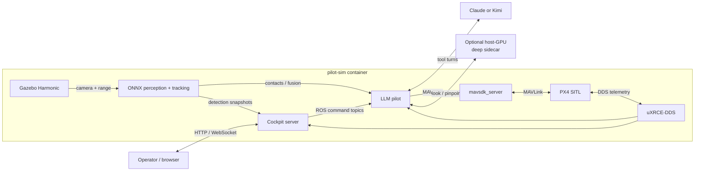

# squawd — LLM-piloted UAV simulation

Squawd is a research system for operating a simulated UAV with natural-language
commands. The active implementation is a **single-drone** stack: one LLM pilot
selects high-level flight and perception tools, while PX4 and classical
controllers execute the real-time work.

The current runtime combines Gazebo Harmonic, PX4 SITL, ROS 2 Jazzy, MAVSDK, a
forward camera and ToF rangefinder, a browser cockpit, deterministic evaluation,
and Claude or Kimi through a backend seam. A fast ONNX perception lane tracks
moving contacts continuously; an optional host-GPU sidecar adds open-vocabulary
`look` and prompted `pinpoint` tools.

> **Project scope:** the Commander-led multi-drone system is historical. The
> simulator can still start multiple PX4 instances, and swarm benchmarks remain
> in the repository, but the active pilot, cockpit, and supported demo path are
> single-drone. The old `scripts/run_swarm_demo.sh` path is not runnable because
> its Commander/assembler modules were removed during the rebuild.

## Start here

| Need | Read |
|---|---|
| Understand the current product | [Architecture](docs/architecture.md) |
| Run the supported cockpit demo | [Demo runbook](docs/RUN-DEMO.md) |
| See active work, blockers, and evidence | [Project state](docs/PROJECT-STATE.md) |
| Navigate design and benchmark records | [Documentation index](docs/README.md) |
| Review known engineering and safety gaps | [Codebase review](gpt-review/ISSUES.md) |

## What works today

- Natural-language operation through one persistent pilot agent.
- High-level flight tools for takeoff, relative and named-target movement,
  orbiting, facing, hovering, landing, and moving-target pursuit.
- A 10 Hz classical `track` controller: the LLM chooses the target and behavior;
  the LLM is not in the fast control loop.
- Continuous camera inference with ONNX segmentation, world projection,
  CV-EKF contact tracking, and optional fixed-beam ToF fusion.
- A browser cockpit with live POV video, detections/masks, telemetry, contact
  locking, orbit/standoff controls, chat, and emergency hold/land.
- Optional deep perception through a host-GPU sidecar: YOLO-World vocabulary
  detection, SAM 2.1 pinpoint segmentation, and a low-rate advisory lane.
- Declarative evaluation tasks with deterministic simulator-truth grading,
  scripted no-LLM baselines, transcript capture, and statistical reports.

## Runtime at a glance



## Prerequisites

This repository is not yet a clean-clone, one-command installation. The
supported local setup currently requires:

- Linux with Docker.
- A local `PX4-Autopilot/` checkout containing a built
  `build/px4_sitl_default/bin/px4`. The checkout is intentionally git-ignored;
  the Docker image does **not** fetch or compile PX4.
- The `squawd:dev` container image.
- Intel or NVIDIA rendering for camera-dependent runs. The current CPU launcher
  selects a camera-less PX4 model and therefore does not pass the demo camera
  preflight.
- Either a logged-in Claude CLI (`~/.claude/.credentials.json`) or
  `SQUAWD_BACKEND=kimi` with `KIMI_API_KEY`.
- Provisioned ONNX model artifacts in `models/`; see
  [models/README.md](models/README.md).

The cockpit binds to all container interfaces and the Docker launcher publishes
port 8000 on all host interfaces. It has no authentication. Treat it as a
**local trusted-workstation interface only**; do not expose it to an untrusted
network or a real vehicle.

## Build and run the supported demo

Build the container image:

```bash
docker build -f docker/Dockerfile.swarm -t squawd:dev .
```

The PX4 checkout and model artifacts are bind-mounted/runtime prerequisites;
they are not produced by this image build.

Then follow the complete [demo runbook](docs/RUN-DEMO.md). The short form is:

```bash
set -a; . ./.env; set +a
VISION_MODEL=coco-nano-seg-v2-640.onnx SQUAWD_BACKEND=kimi \
  ./scripts/run_single_demo.sh demo
```

`run_single_demo.sh` starts the simulator and pilot. The cockpit is a separate
process; the runbook includes its command, readiness checks, deep-sidecar setup,
logs, and teardown.

## Test lanes

The repository has cheap host-side tests and expensive live simulation/eval
lanes. Do not conflate them.

```bash
# Host-side suite. Some integration tests need local sockets or a live sidecar.
uv run --extra dev --with pyyaml --with numpy \
  pytest tests/ --ignore=tests/integration -q

# Integration lane: may need loopback sockets, Docker context, weights, or a
# running deep sidecar. Run deliberately, not as an implicit unit prerequisite.
uv run --extra dev --with pyyaml --with numpy pytest tests/integration -q

# Fast syntax/whitespace checks.
git diff --check
bash -n scripts/*.sh sim/launch/*.sh evals/scripts/*.sh
```

The current worktree is under active development; consult
[PROJECT-STATE.md](docs/PROJECT-STATE.md) for the last verified result instead
of assuming every historical “green” count describes HEAD. Live Gazebo, PX4,
GPU, and LLM evaluations are intentionally run as explicit bounded campaigns.

## Project layout

```text
agents/
  core/          ROS bridge, stores, camera/range inputs, telemetry history
  world/         world geometry, coordinate conversion, trajectories
  perception/    scan text and camera/world projection geometry
  vision/        detector backends, tracking, ToF fusion, deep sidecar
  flight/        MAVSDK operations, pursuit controller, tools, safety envelope
  pilot/         active single-drone assembly, LLM loop, estop, operator arbiter
  observatory/   cockpit server, video, state shaping, overlays, static UI
  swarm/         legacy residue; no supported Commander assembly
sim/             PX4/Gazebo launcher, models, worlds, mover plug-in
evals/           task specs, runners, truth sampler/oracle, reports
bench/           historical simulator/render-capacity benchmark
models/          manifests and local git-ignored model weights
docs/            current guides plus design and benchmark evidence
gpt-review/      2026-08-01 static review and prioritized engineering findings
```

## Known boundaries

- Single-drone operation is the supported product; swarm orchestration is not.
- Fixed-beam ToF availability is physically intermittent for small, distant,
  moving targets. Vision-only tracking remains the normal fallback.
- PX4 SITL estimator drift and preflight behavior are sensitive to host load and
  long-lived containers; use fresh containers for controlled gates.
- `run_mission` executes model-authored Python inside the pilot process and is
  outside the fixed-tool software envelope. It is an experimental escape hatch,
  not a safe production interface.
- Some envelope validators are not yet connected to every movement tool. PX4's
  own geofence is not a substitute for completing that integration.
- Model weights and the PX4 checkout are local prerequisites rather than
  reproducibly bootstrapped dependencies.

For the complete list, rationale, and recommended remediations, see
[gpt-review/ISSUES.md](gpt-review/ISSUES.md).

## Historical swarm material

The repository name, `agents/swarm/`, `bench/`, several task files, and older
benchmark reports preserve the earlier Commander-plus-N-drones research path.
They remain useful evidence, but they are not current run instructions. Restore
or redesign the missing Commander and assembly entry point before presenting
the swarm launcher as supported again.
