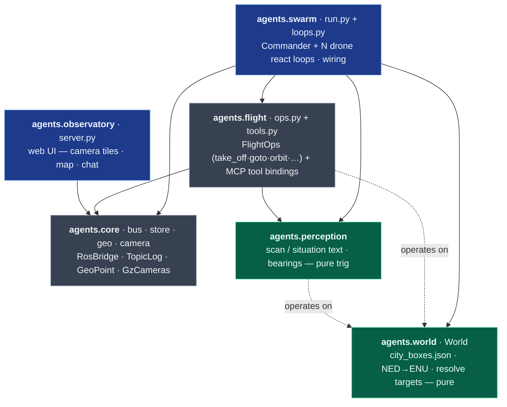
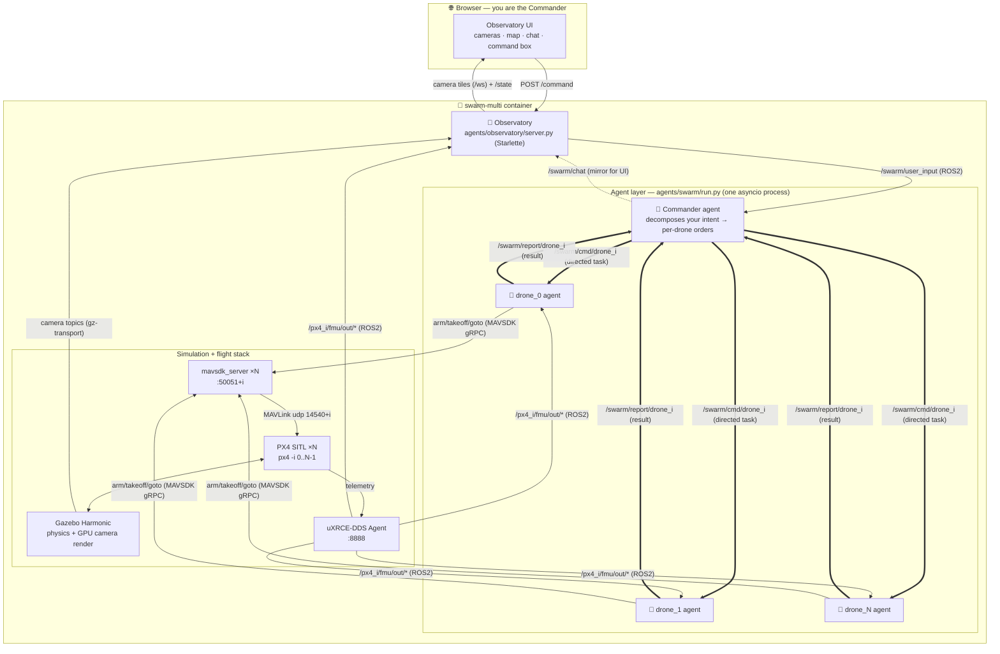
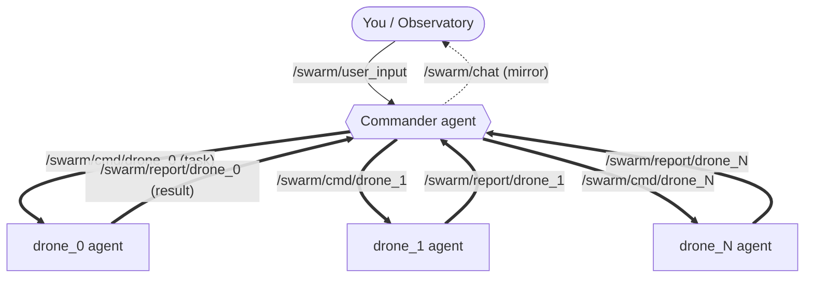

# dronebot — LLM-piloted UAV swarm

A swarm of drones you command in **plain language**. You are the *Commander*: you
type into a browser ("everyone take off and spread out", "drone_1 climb to 20m",
"all return and land") and an LLM **Commander agent** decomposes your intent into
**directed per-drone tasks**. Each drone is its own LLM agent — its own onboard
thinking, able to run on its own hardware — that carries out the task it is given
and **reports back** to the Commander.

Everything runs self-contained in one Docker container: **Gazebo Harmonic** +
**PX4 SITL** (N flight controllers) + **ROS 2 Jazzy** + per-drone **onboard
cameras** + a web **Observatory**.


The Observatory (above) shows, live: each drone's **onboard camera POV** (top),
a **top-down map** of the swarm, and the **swarm feed** where the Commander's
dispatches and the drones' reports scroll by. Type a command at the bottom and
watch the Commander delegate.

---

## What you get

- **Natural-language command** of an N-drone swarm — no waypoints, no scripting.
- **Hierarchical agents**: one Commander that dispatches directed tasks to N
  autonomous drone agents — each with its own thinking — which report back.
- **Per-drone onboard cameras** rendered on the GPU, streamed to the browser.
- **A populated "city" world** (buildings) so the drones and their cameras have
  something to fly through and see.
- **Scales with N** — `./scripts/run_swarm_demo.sh 5` just works; ports, namespaces,
  camera tiles, and agents are all derived from the drone index.

---

## Architecture

The code is **six small Python packages** with a one-directional dependency graph,
so each layer reads — and unit-tests — on its own.

### Code modules



*Solid arrows = imports; dotted = used at runtime. The **green** packages are pure
(no sim dependencies) and are covered by host-side unit tests.*

- **`agents.core`** — primitives only: the ROS bridge + QoS (`bus`), thread-safe
  holders (`store`: `LatestStore`, `TopicLog`), GPS offset math (`geo`), and the one
  camera reader (`camera`: `GzCameras`).
- **`agents.world` + `agents.perception`** — ground truth + telemetry → the drone's
  sense of place (positions, bearings, "what's in view", scan/situation text).
- **`agents.flight`** — `FlightOps` is the flight logic; `tools.py` binds it to
  Claude-Agent-SDK `@tool`s. Logic and SDK plumbing are separable.
- **`agents.swarm`** — wires everything into the Commander + N drone loops (`run.py`
  bootstraps, `loops.py` is the react loops). **`agents.observatory`** is the web UI
  and depends only on `core`.

### Runtime & data flow

One container, several cooperating processes. The simulator and flight stack are
classic PX4/Gazebo; the novel part is the **agent layer** and how it reads/acts on
the sim.



### Data buses

| Bus | Carries | Transport / QoS |
|-----|---------|-----------------|
| `/swarm/user_input` | **You → Commander** (your typed commands) | ROS 2, RELIABLE + TRANSIENT_LOCAL |
| `/swarm/cmd/drone_<i>` | **Commander → drone_i** — a directed task | ROS 2, RELIABLE + TRANSIENT_LOCAL |
| `/swarm/report/drone_<i>` | **drone_i → Commander** — its result | ROS 2, RELIABLE + TRANSIENT_LOCAL |
| `/swarm/chat` | Read-only mirror (dispatches + reports) for the UI feed | ROS 2, RELIABLE + TRANSIENT_LOCAL |
| `/px4_<i>/fmu/out/*` | PX4 telemetry (position, status…) | ROS 2, BEST_EFFORT (via uXRCE-DDS) |
| gz camera topic | Per-drone camera frames | gz-transport13 (read directly, no ros_gz) |
| MAVSDK gRPC / MAVLink | Flight commands (arm, takeoff, goto) | gRPC `:50051+i` ⇄ MAVLink `udp:14540+i` |

### Why these choices

- **uXRCE-DDS** bridges PX4 ⇄ ROS 2 so agents and the Observatory read telemetry as
  normal ROS topics, namespaced per drone (`/px4_0/...`, `/px4_1/...`).
- **MAVSDK** (one `mavsdk_server` per drone) gives the drone agents clean
  arm/takeoff/`goto_location` calls. The server is **version-matched** to the pip
  client (a mismatch silently hangs `connect()`).
- **gz-transport read directly** for cameras — `ros_gz` was dropped because its
  vendored Gazebo broke the system `gz sim`; the Observatory subscribes to the gz
  image topics itself and re-encodes to MJPEG.
- **One world named `city`** generated from PX4's `default.sdf` with injected
  building boxes. The world name, the file name, and `PX4_GZ_WORLD` are kept
  identical — otherwise the gz-launching PX4 instance calls a `/world/<name>/create`
  service that doesn't exist and dies on a spawn timeout.

---

## Agent organization

The agents are defined in **`agents/swarm/loops.py`** and bootstrapped by
**`agents/swarm/run.py`**, each backed by a persistent **Claude Agent SDK** client.
They run as coroutines in one asyncio process today, but talk **only over ROS
topics** — so a drone can be split onto its own onboard computer with no code
change. The model is a **distributed hub**: the Commander is the one node that
talks to the human and tasks drones; the drones never hear each other.



**Commander** (`commander_loop`)
- Subscribes to `/swarm/user_input` **and** every `/swarm/report/drone_<i>`.
- For each user command, builds a prompt with the live **situation map** (positions,
  facing, nearest buildings — from `agents.perception`) and **dispatches a directed
  task to each drone** that should act.
- For each drone **report**, decides whether a follow-up is needed (otherwise just
  summarizes for you), keeping the loop from re-tasking drones that are already done.
- Tool: `dispatch(drone_id, task)` → publishes the task to `/swarm/cmd/drone_<i>`
  and mirrors `commander→drone_<i>: <task>` to `/swarm/chat` for the UI.

**Drone agents** (`drone_loop`, one per drone, `drone_0 … drone_<N-1>`)
- Subscribe to **their own** `/swarm/cmd/drone_<i>` only — no shared chat, no
  message filtering. Each acts only when the Commander tasks it.
- Tools = `agents.flight.FlightOps` bound as in-process MCP tools (`tools.py`),
  MAVSDK underneath:
  - **move** — `take_off`, `goto` (absolute world point or a named target like
    `bldg_7`/`drone_1`), `orbit` (circle a target, camera on it), `fly` (relative),
    `face`, `hover`, `set_speed`, `land`
  - **sense** — `scan` (nearby buildings + drones with bearing, `agents.perception`),
    `look` (live camera frame via `agents.core.GzCameras`)
  - **report** — `report(message)` → publishes the result to `/swarm/report/drone_<i>`
    (mirrored to `/swarm/chat`)
- System prompt: carry out the task with your tools, then report back; be terse.

**Observatory** (`agents/observatory/server.py`, Starlette + uvicorn)
- Pure consumer of the sim plus the one thing it publishes: your commands.
- Routes: `/` (UI), `/state` (JSON: positions + chat), `/ws` (one WebSocket of all
  camera tiles), `/cam/{i}` + `/frame/{i}` (MJPEG / single JPEG),
  `POST /command` (→ `/swarm/user_input`, and echoes `you: …` into the chat view).

---

## Rendering: with GPU vs without

Camera rendering is the expensive part. The launcher has two paths:

| | **GPU (default, `GPU=1`)** | **No GPU (`GPU=0`)** |
|---|---|---|
| Renderer | Intel iGPU (Iris Xe, `i915`) via **EGL headless** | Software GL (**llvmpipe**) |
| Camera POV tiles | ✅ yes, real-time | ❌ disabled (too slow) |
| Real-time factor (3 cams) | **~1.0** | ~0.004 with cameras → flight only |
| Drone model | `gz_x500_depth` (has camera) | `gz_x500` (no camera) |
| Devices passed in | only `/dev/dri/renderD128` + `card1` | none |

Notes:
- Only **`renderD128`** is exposed to the container on purpose: if Mesa can see an
  NVIDIA node with no Mesa driver, `ogre2` segfaults. Intel iGPU → EGL is the
  reliable headless path here.
- Gazebo always runs **server-only** (`HEADLESS=1`) — no Qt GUI. The GUI aborts
  under offscreen Qt and would take down the gz-launching PX4 instance.
- **NVIDIA dGPU** is a future toggle (install `nvidia-container-toolkit`, run with
  `--gpus all`) for larger/faster feeds. Not required; the iGPU holds 3×640×360 at
  real time.

---

## How to run

### Prerequisites
- **Docker** on Linux.
- **Logged-in Claude CLI** on the host — the agents use your OAuth from `~/.claude`;
  **no API key needed.** (Run `claude` once to log in.) The launcher copies your
  creds to an isolated `/tmp/swarm-claude` and **never writes to the live
  `~/.claude`.**
- For cameras: a usable **GPU** (Intel iGPU works out of the box via `/dev/dri`).

### 1. Build the image (once, slow — compiles PX4 + pulls Gazebo/ROS)
```bash
docker build -f docker/Dockerfile.swarm -t dronebot-swarm:dev .
```

### 2. Launch the swarm
```bash
# 3 drones, GPU cameras (default)
./scripts/run_swarm_demo.sh 3

# more drones
./scripts/run_swarm_demo.sh 5

# software rendering, no cameras (flight + chat only, much slower)
GPU=0 ./scripts/run_swarm_demo.sh 3
```

Then open **http://localhost:8000** and command the swarm:
> *"everyone take off and climb to 12m, then spread out and scout"*
> *"drone_1 climb to 20m"* · *"all return and land"*

The Commander decomposes each command, the drones carry it out and report back in
the chat, and the camera tiles + map update live.

### Logs & stop
```bash
docker exec swarm-multi tail -f /tmp/swarm.log   # agents
docker exec swarm-multi tail -f /tmp/obs.log     # observatory / commands
docker rm -f swarm-multi                          # stop everything
```

### Ports
| Port | Service |
|------|---------|
| `8000` | Observatory web UI |
| `8888` | uXRCE-DDS Agent (UDP) |
| `50051 + i` | `mavsdk_server` gRPC for drone *i* |
| `14540 + i` | PX4 MAVLink (offboard) for drone *i* |

---

## Project layout

```
agents/                     # one package per responsibility; deps flow downward
  core/                     # RosBridge + QoS, GPS offset math, GzCameras (the one camera reader)
  world/                    # World: loads city_boxes.json, maps PX4 NED -> world ENU, resolves targets
  perception/               # pure trig/text: scan + situation readouts over a World
  flight/                   # FlightOps (take_off/goto/orbit/...) + their MCP tool bindings
  swarm/run.py              # Commander + N drone agents on one event loop (the swarm brain)
  swarm/loops.py            # commander/drone react loops + the Commander agent
  observatory/server.py     # web UI backend: state, cameras (MJPEG/WS), command intake
  observatory/static/       # the Observatory single-page UI
sim/
  launch/swarm_sim.sh       # in-container launch: gz + N×PX4 + uXRCE + N×mavsdk
  worlds/make_city_world.py # generate the 'city' world (buildings) from default.sdf
scripts/
  run_swarm_demo.sh         # one-command host launcher (build args, creds, GPU)
docker/Dockerfile.swarm     # Ubuntu 24.04 + Gazebo Harmonic + ROS2 Jazzy + PX4 + uXRCE
docs/superpowers/           # design specs + plans
```

> Dependencies form a clean DAG: `core <- world <- perception <- flight <- swarm`,
> and `observatory -> core`. Each package is importable and testable on its own.

---

## Known limitation / roadmap

- **Drones are commander-driven only.** Each drone acts when the Commander tasks it
  and holds its last command in between — it has its own thinking but no autonomous
  loop. A future option is letting a drone send an *unsolicited* report (e.g. on
  spotting something) that the Commander can react to.
- **Run drones on separate hardware.** The agents already talk only over ROS topics,
  so splitting `run.py` into a `run_commander()` and per-drone `run_drone(i)` (one
  process each, same ROS graph) would put a drone's agent on its own onboard
  computer with no protocol change.
- NVIDIA dGPU path for larger camera feeds.
- Higher-level behaviors (follow, search patterns) as composable tools.
```
