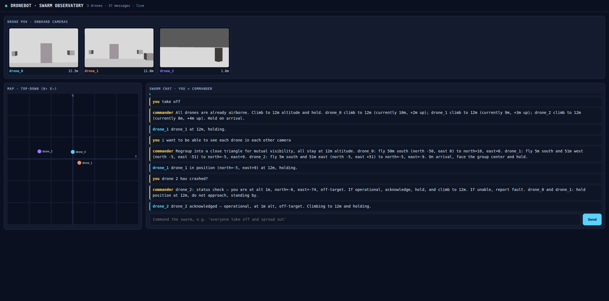
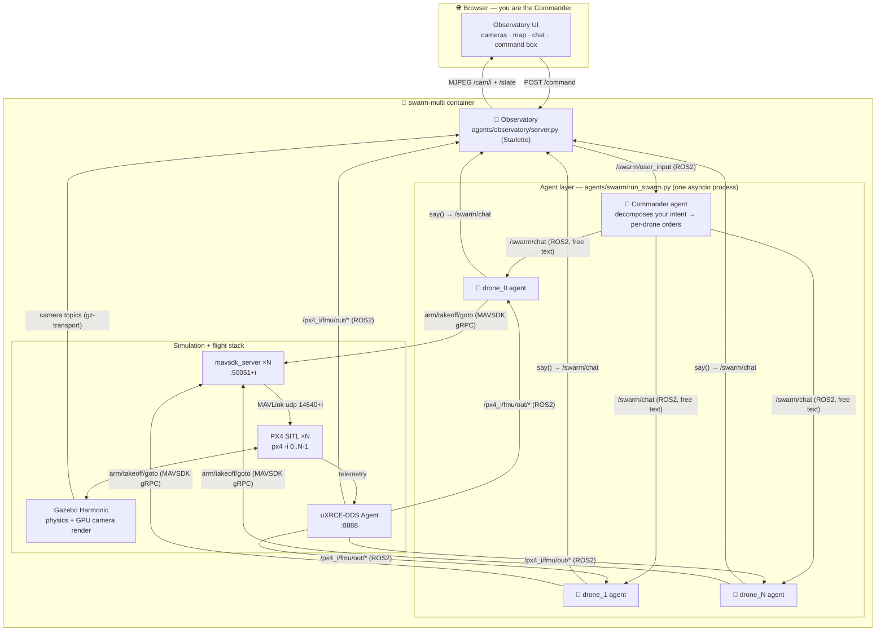

# dronebot — LLM-piloted UAV swarm

A swarm of drones you command in **plain language**. You are the *Commander*: you
type into a browser ("everyone take off and spread out", "drone_1 climb to 20m",
"all return and land") and an LLM **Commander agent** decomposes your intent into
per-drone instructions over a shared chat bus. Each drone is its own LLM agent
that decides whether a message is for it and flies itself accordingly.

Everything runs self-contained in one Docker container: **Gazebo Harmonic** +
**PX4 SITL** (N flight controllers) + **ROS 2 Jazzy** + per-drone **onboard
cameras** + a web **Observatory**.



The Observatory (above) shows, live: each drone's **onboard camera POV** (top),
a **top-down map** of the swarm, and the **swarm chat** where you and the agents
talk. Type a command at the bottom and watch the Commander delegate.

---

## What you get

- **Natural-language command** of an N-drone swarm — no waypoints, no scripting.
- **Hierarchical agents**: one Commander + N autonomous drone agents, coordinating
  over free-text chat (the same bus you talk on).
- **Per-drone onboard cameras** rendered on the GPU, streamed to the browser.
- **A populated "city" world** (buildings) so the drones and their cameras have
  something to fly through and see.
- **Scales with N** — `./scripts/run_swarm_demo.sh 5` just works; ports, namespaces,
  camera tiles, and agents are all derived from the drone index.

---

## Architecture

One container, several cooperating processes. The simulator and flight stack are
classic PX4/Gazebo; the novel part is the **agent layer** and how it reads/acts on
the sim.



### Data buses

| Bus | Carries | Transport / QoS |
|-----|---------|-----------------|
| `/swarm/user_input` | **You → Commander** (your typed commands) | ROS 2, RELIABLE + TRANSIENT_LOCAL |
| `/swarm/chat` | Free natural-language chat among Commander + all drones | ROS 2, RELIABLE + TRANSIENT_LOCAL |
| `/px4_<i>/fmu/out/*` | PX4 telemetry (position, status…) | ROS 2, BEST_EFFORT (via uXRCE-DDS) |
| gz camera topic | Per-drone camera frames | gz-transport13 (read directly, no ros_gz) |
| MAVSDK gRPC / MAVLink | Flight commands (arm, takeoff, goto) | gRPC `:50051+i` ⇄ MAVLink `udp:14540+i` |

### Why these choices

- **uXRCE-DDS** bridges PX4 ⇄ ROS 2 so agents and the Observatory read telemetry as
  normal ROS topics, namespaced per drone (`/px4_0/...`, `/px4_1/...`).
- **MAVSDK** (one `mavsdk_server` per drone) gives the drone agents clean
  arm/takeoff/`goto_location` calls. The server is **version-matched** to the pip
  client (a mismatch silently hangs `connect()`).
- **gz-transport read directly** for cameras — `ros_gz` was dropped because its
  vendored Gazebo broke the system `gz sim`; the Observatory subscribes to the gz
  image topics itself and re-encodes to MJPEG.
- **One world named `city`** generated from PX4's `default.sdf` with injected
  building boxes. The world name, the file name, and `PX4_GZ_WORLD` are kept
  identical — otherwise the gz-launching PX4 instance calls a `/world/<name>/create`
  service that doesn't exist and dies on a spawn timeout.

---

## Agent organization

All agents live in **`agents/swarm/run_swarm.py`** and run in a single asyncio
process, each backed by a persistent **Claude Agent SDK** client.

**Commander** (`commander_loop`)
- Subscribes to `/swarm/user_input` (your commands from the browser).
- For each command, builds a prompt with live drone positions and asks the model to
  **broadcast concrete per-drone instructions**.
- Tool: `broadcast(message)` → publishes `commander: <message>` to `/swarm/chat`.

**Drone agents** (`drone_loop`, one per drone, `drone_0 … drone_<N-1>`)
- Subscribe to `/swarm/chat`; a filter (`relevant_to`) keeps only messages that are
  from the Commander, mention `drone_<i>`, or address everyone/all/swarm — and drops
  the drone's own messages.
- Tools (in-process MCP, MAVSDK underneath):
  - `take_off` — arm, set 10 m takeoff altitude, take off
  - `fly(north, east, up)` — relative move via GPS offset → `goto_location`
  - `land`
  - `say(message)` — post to `/swarm/chat` (how drones report back)
- System prompt: act only on messages meant for you; be terse.

**Observatory** (`agents/observatory/server.py`, Starlette + uvicorn)
- Pure consumer of the sim plus the one thing it publishes: your commands.
- Routes: `/` (UI), `/state` (JSON: positions + chat), `/cam/{i}` (MJPEG),
  `POST /command` (→ `/swarm/user_input`, and echoes `you: …` into the chat view).

---

## Rendering: with GPU vs without

Camera rendering is the expensive part. The launcher has two paths:

| | **GPU (default, `GPU=1`)** | **No GPU (`GPU=0`)** |
|---|---|---|
| Renderer | Intel iGPU (Iris Xe, `i915`) via **EGL headless** | Software GL (**llvmpipe**) |
| Camera POV tiles | ✅ yes, real-time | ❌ disabled (too slow) |
| Real-time factor (3 cams) | **~1.0** | ~0.004 with cameras → flight only |
| Drone model | `gz_x500_depth` (has camera) | `gz_x500` (no camera) |
| Devices passed in | only `/dev/dri/renderD128` + `card1` | none |

Notes:
- Only **`renderD128`** is exposed to the container on purpose: if Mesa can see an
  NVIDIA node with no Mesa driver, `ogre2` segfaults. Intel iGPU → EGL is the
  reliable headless path here.
- Gazebo always runs **server-only** (`HEADLESS=1`) — no Qt GUI. The GUI aborts
  under offscreen Qt and would take down the gz-launching PX4 instance.
- **NVIDIA dGPU** is a future toggle (install `nvidia-container-toolkit`, run with
  `--gpus all`) for larger/faster feeds. Not required; the iGPU holds 3×640×360 at
  real time.

---

## How to run

### Prerequisites
- **Docker** on Linux.
- **Logged-in Claude CLI** on the host — the agents use your OAuth from `~/.claude`;
  **no API key needed.** (Run `claude` once to log in.) The launcher copies your
  creds to an isolated `/tmp/swarm-claude` and **never writes to the live
  `~/.claude`.**
- For cameras: a usable **GPU** (Intel iGPU works out of the box via `/dev/dri`).

### 1. Build the image (once, slow — compiles PX4 + pulls Gazebo/ROS)
```bash
docker build -f docker/Dockerfile.swarm -t dronebot-swarm:dev .
```

### 2. Launch the swarm
```bash
# 3 drones, GPU cameras (default)
./scripts/run_swarm_demo.sh 3

# more drones
./scripts/run_swarm_demo.sh 5

# software rendering, no cameras (flight + chat only, much slower)
GPU=0 ./scripts/run_swarm_demo.sh 3
```

Then open **http://localhost:8000** and command the swarm:
> *"everyone take off and climb to 12m, then spread out and scout"*
> *"drone_1 climb to 20m"* · *"all return and land"*

The Commander decomposes each command, the drones carry it out and report back in
the chat, and the camera tiles + map update live.

### Logs & stop
```bash
docker exec swarm-multi tail -f /tmp/swarm.log   # agents
docker exec swarm-multi tail -f /tmp/obs.log     # observatory / commands
docker rm -f swarm-multi                          # stop everything
```

### Ports
| Port | Service |
|------|---------|
| `8000` | Observatory web UI |
| `8888` | uXRCE-DDS Agent (UDP) |
| `50051 + i` | `mavsdk_server` gRPC for drone *i* |
| `14540 + i` | PX4 MAVLink (offboard) for drone *i* |

---

## Project layout

```
agents/
  swarm/run_swarm.py        # Commander + N drone agents (the swarm brain)
  observatory/server.py     # web UI backend: state, cameras (MJPEG), command intake
  observatory/static/       # the Observatory single-page UI
  common/bus.py             # RosBridge + ROS2 QoS profiles (PX4_QOS, CHAT_QOS)
  common/geo.py             # GPS offset math for relative moves
sim/
  launch/swarm_sim.sh       # in-container launch: gz + N×PX4 + uXRCE + N×mavsdk
  worlds/make_city_world.py # generate the 'city' world (buildings) from default.sdf
scripts/
  run_swarm_demo.sh         # one-command host launcher (build args, creds, GPU)
docker/Dockerfile.swarm     # Ubuntu 24.04 + Gazebo Harmonic + ROS2 Jazzy + PX4 + uXRCE
docs/superpowers/           # design specs + plans
```

> An earlier **single-drone cockpit** (`src/dronebot/`, with a non-bypassable
> `SafetyGuard`) is the v1 of this project and is independent of the swarm above.

---

## Known limitation / roadmap

- **Drones can't yet *see* their own cameras.** Cameras render on the GPU and stream
  to the *human* Observatory, but the drone agents only have flight/chat tools — so
  if you ask *"what can you see?"* a drone honestly answers it has no feed. Next
  step: a per-drone **`look` tool** that passes the live camera frame into the agent
  as an image, turning the swarm from *flies-and-talks* into *flies-sees-and-reports*.
- NVIDIA dGPU path for larger camera feeds.
- Higher-level behaviors (orbit, follow, search patterns) as composable tools.
```
