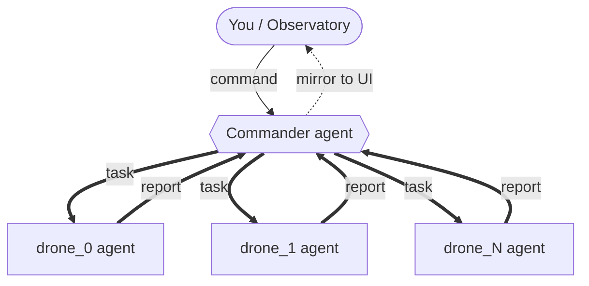

# squawd — LLM-piloted UAV swarm

A swarm of drones you command in **plain language**. You are the *Commander*: you
type into a browser ("everyone take off and spread out", "drone_1 climb to 20m",
"all return and land") and an LLM **Commander agent** decomposes your intent into
**directed per-drone tasks**. Each drone is its own LLM agent — its own onboard
thinking, able to run on its own hardware — that carries out the task it is given
and **reports back** to the Commander.

Everything runs self-contained in one Docker container: **Gazebo Harmonic** +
**PX4 SITL** (N flight controllers) + **ROS 2 Jazzy** + per-drone **onboard
cameras** + a web **Observatory**.


The Observatory (above) shows, live: the selected drone's **onboard camera POV**
with a heads-up overlay (left), a **PPI radar scope** of the whole swarm in the
GPS frame (center), and the **comms feed** where the Commander's dispatches and
the drones' reports scroll by as flight strips (right). Click any blip or camera
tile to focus a drone; type a command at the bottom and watch the Commander
delegate.

---

## What you get

- **Natural-language command** of an N-drone swarm — no waypoints, no scripting.
- **Hierarchical agents**: one Commander that dispatches directed tasks to N
  autonomous drone agents — each with its own thinking — which report back.
- **Drones that see** — the onboard camera frame is fed to Claude's vision, so a
  drone genuinely perceives what's below it (not just telemetry).
- **Per-drone onboard cameras** rendered on the GPU, streamed to the browser.
- **A realistic "baylands" world** (PX4's coastal scene — road, grass, water,
  trees) by default. `WORLD=city` swaps in a procedural building world (the only
  world with building obstacle-`scan`).
- **Scales with N** — `./scripts/run_swarm_demo.sh 5` just works; ports,
  namespaces, camera tiles, and agents are all derived from the drone index.

---

## How it works

squawd runs as one Docker container with three cooperating layers: the
**simulation** (Gazebo + one PX4 flight controller per drone), the **agent layer**
(a Commander and N drone agents, each its own Claude client), and the
**Observatory** web UI.

You type a command in the browser. The **Commander** reads it together with a live
map of where every drone is and what's nearby, then breaks it into a **directed
task for each drone that should act**. Each **drone agent** carries out its task
with its own flight tools — take off, fly to a point, orbit, look through its
camera — and **reports back**. The Commander reads the reports and only follows up
if the goal isn't met. Drones never talk to each other; the Commander is the hub.



Agents talk **only over ROS 2 topics**, so a drone could run on its own onboard
computer with no code change. And because each agent only thinks when something
lands on its channel, an unaddressed drone costs nothing.

### Drones actually see

The `look` tool hands a drone's live camera frame to Claude as an image, so the
same model that plans the flight also perceives the scene. A drone can `look` and,
in its very next thought, write *"open parkland with paved paths and scattered
trees, a parking lot to the south"* — real visual understanding, not OCR or a
bolt-on detector.

> **Go deeper:** [docs/architecture.md](docs/architecture.md) — the full module
> map, data buses, the poll-based comms model, the vision pipeline, and the
> wake/token dynamics that keep idle drones free.

---

## Quickstart

### Prerequisites
- **Docker** on Linux.
- **Logged-in Claude CLI** on the host — the agents use your OAuth from `~/.claude`;
  **no API key needed.** (Run `claude` once to log in.) The launcher copies your
  creds to an isolated `/tmp/swarm-claude` and **never writes to the live
  `~/.claude`.**
- For cameras: a usable **GPU** (Intel iGPU works out of the box via `/dev/dri`).

### 1. Build the image (once, slow — compiles PX4 + pulls Gazebo/ROS)
```bash
docker build -f docker/Dockerfile.swarm -t squawd:dev .
```

### 2. Launch the swarm
```bash
# 3 drones, baylands world, GPU cameras (default)
./scripts/run_swarm_demo.sh 3

# more drones
./scripts/run_swarm_demo.sh 5

# procedural building world (adds building obstacle-scan)
WORLD=city ./scripts/run_swarm_demo.sh 3

# software rendering, no cameras (flight + chat only, much slower)
GPU=0 ./scripts/run_swarm_demo.sh 3
```
> First baylands launch downloads ~400MB of Gazebo Fuel terrain/water models
> (cached in `/tmp/swarm-gz-fuel`, reused after that — needs internet once).

Then open **http://localhost:8000** and command the swarm:
> *"everyone take off and climb to 12m, then spread out and scout"*
> *"drone_1 climb to 20m"* · *"all return and land"*

The Commander decomposes each command, the drones carry it out and report back in
the chat, and the camera tiles + map update live.

### Logs & stop
```bash
docker exec swarm-multi tail -f /tmp/swarm.log   # agents
docker exec swarm-multi tail -f /tmp/obs.log     # observatory / commands
docker rm -f swarm-multi                          # stop everything
```

### Ports
| Port | Service |
|------|---------|
| `8000` | Observatory web UI |
| `8888` | uXRCE-DDS Agent (UDP) |
| `50051 + i` | `mavsdk_server` gRPC for drone *i* |
| `14540 + i` | PX4 MAVLink (offboard) for drone *i* |

> Camera rendering uses the Intel iGPU by default. GPU vs. software vs. NVIDIA
> render paths are covered in [docs/rendering.md](docs/rendering.md).

---

## Project layout

```
agents/                     # one package per responsibility; deps flow downward
  core/                     # RosBridge + QoS, GPS offset math, GzCameras (the one camera reader)
  world/                    # World: loads city_boxes.json, maps PX4 NED -> world ENU, resolves targets
  perception/               # pure trig/text: scan + situation readouts over a World
  flight/                   # FlightOps (take_off/goto/orbit/...) + their MCP tool bindings
  swarm/run.py              # thin assembler: build the agents + gather their run() loops
  swarm/commander.py        # CommanderAgent: user/report channels, dispatch(), run()
  swarm/drone.py            # DroneAgent: MAVSDK link, cmd inbox, report(), connect(), run()
  observatory/server.py     # web UI backend: state, cameras (MJPEG/WS), command intake
  observatory/static/       # the Observatory single-page UI
sim/
  launch/swarm_sim.sh       # in-container launch: gz + N×PX4 + uXRCE + N×mavsdk
  worlds/make_city_world.py # generate the 'city' world (buildings) from default.sdf
scripts/
  run_swarm_demo.sh         # one-command host launcher (build args, creds, GPU)
docker/Dockerfile.swarm     # Ubuntu 24.04 + Gazebo Harmonic + ROS2 Jazzy + PX4 + uXRCE
docs/                       # architecture, rendering, design specs (see Learn more)
```

> Dependencies form a clean DAG: `core <- world <- perception <- flight <- swarm`,
> and `observatory -> core`. Each package is importable and testable on its own.

---

## Roadmap / known limitations

- **Drones are commander-driven only.** Each drone acts when the Commander tasks it
  and holds its last command in between — it has its own thinking but no autonomous
  loop. A future option is letting a drone send an *unsolicited* report (e.g. on
  spotting something) that the Commander can react to.
- **Run drones on separate hardware.** The agents already talk only over ROS topics
  and are self-contained objects, so a per-process entrypoint that constructs a single
  `DroneAgent(i)` (or the `CommanderAgent`) and awaits its `run()` would put a drone's
  agent on its own onboard computer with no protocol change.
- NVIDIA dGPU path for larger camera feeds (see [docs/rendering.md](docs/rendering.md)).
- Higher-level behaviors (follow, search patterns) as composable tools.

---

## Learn more

- **[Architecture](docs/architecture.md)** — module map, runtime data flow, the
  data buses + QoS, the poll-based comms model, the vision pipeline, and wake/token
  dynamics.
- **[Rendering & GPU](docs/rendering.md)** — iGPU / software / NVIDIA render paths
  and why the launcher is set up the way it is.
- **[Design specs & plans](docs/superpowers/)** — how the system was designed, decision by decision.
