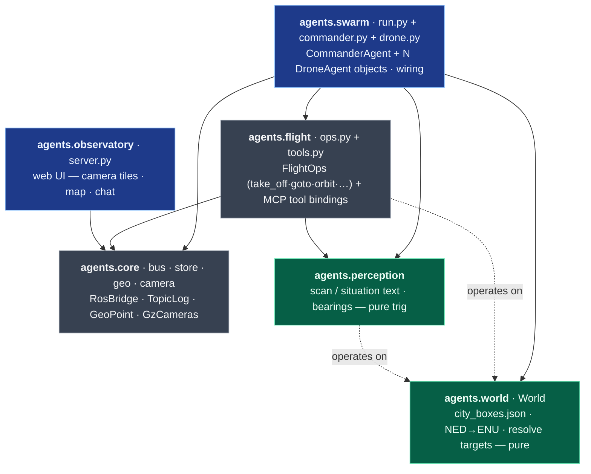
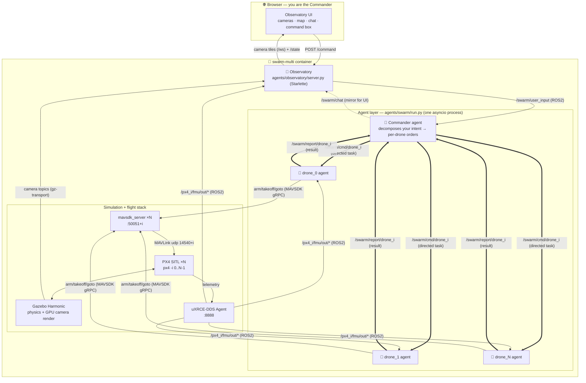
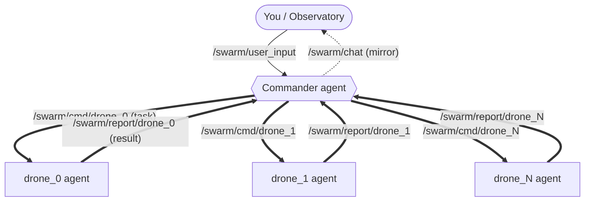
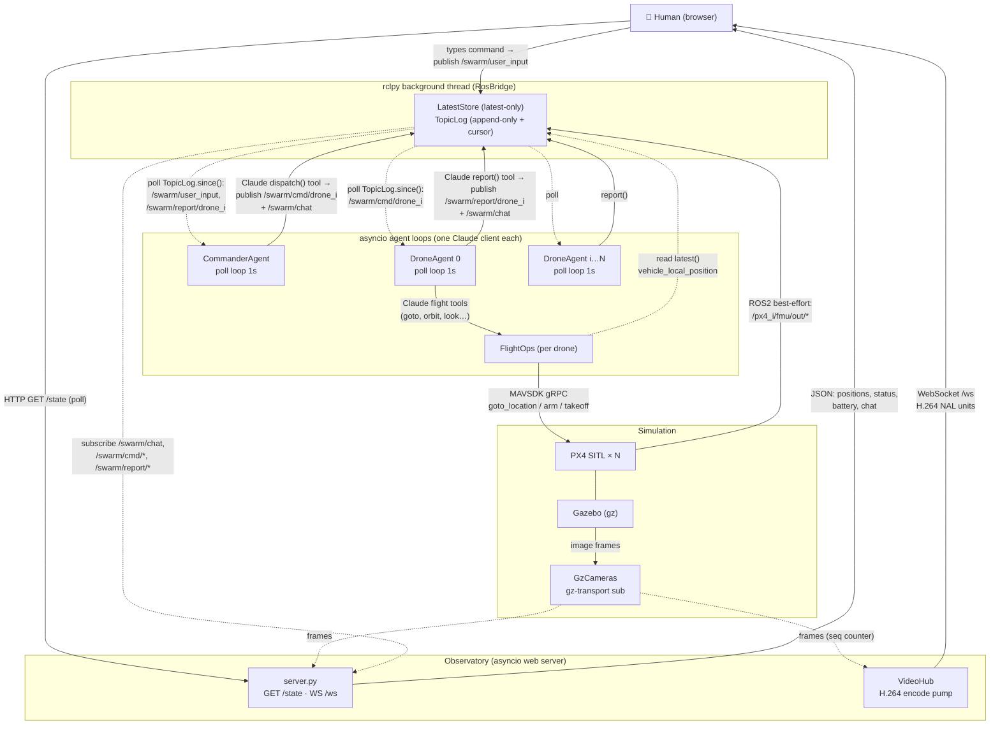
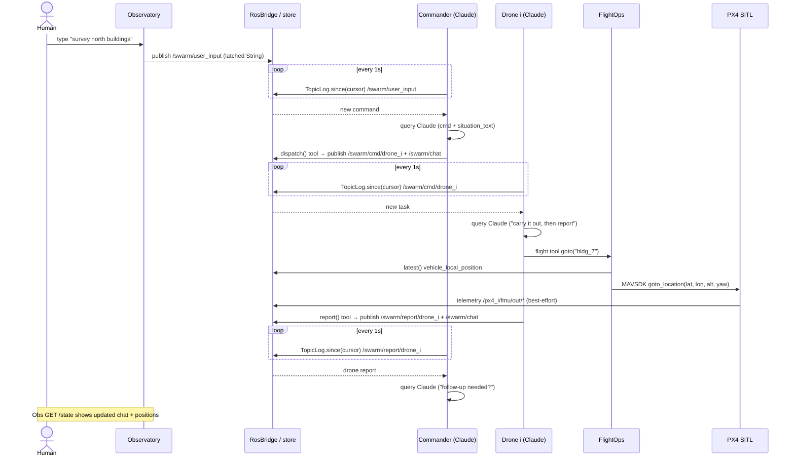
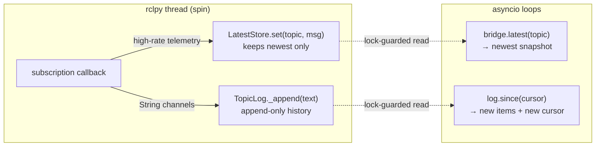
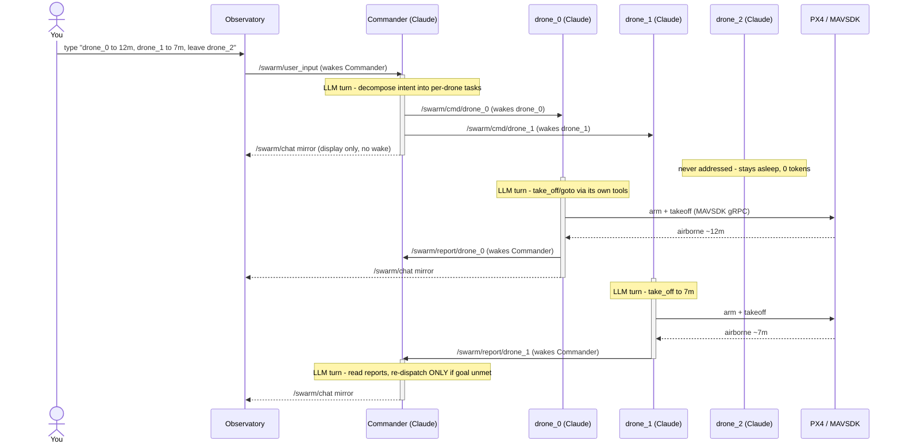

# Architecture

The deep dive behind the [README](../README.md): the code structure, how data
flows at runtime, how the agents are organized, the communication model, and the
wake/token dynamics.

The system *looks* event-driven, but coordination is actually **ROS 2 topics +
a 1-second poll loop**. Nothing pushes a wake-up into an agent; each agent runs
its own `asyncio` loop, sleeps 1s, and pulls whatever is new from a thread-safe
store that the ROS background thread fills.

---

## 1. Code modules

The code is **six small Python packages** with a one-directional dependency graph,
so each layer reads — and unit-tests — on its own.

*Solid arrows = imports; dotted = used at runtime. The **green** packages are pure
(no sim dependencies) and are covered by host-side unit tests.*

- **`agents.core`** — primitives only: the ROS bridge + QoS (`bus`), thread-safe
  holders (`store`: `LatestStore`, `TopicLog`), GPS offset math (`geo`), and the one
  camera reader (`camera`: `GzCameras`).
- **`agents.world` + `agents.perception`** — ground truth + telemetry → the drone's
  sense of place (positions, bearings, "what's in view", scan/situation text).
- **`agents.flight`** — `FlightOps` is the flight logic; `tools.py` binds it to
  Claude-Agent-SDK `@tool`s. Logic and SDK plumbing are separable.
- **`agents.swarm`** — the agent layer as objects: `CommanderAgent` (`commander.py`)
  and `DroneAgent` (`drone.py`), each owning its ROS channels, its Claude client, and
  an `async run()` loop; `run.py` is a thin assembler that constructs them and
  `gather`s their loops. **`agents.observatory`** is the web UI and depends only on
  `core`.

The dependency graph is a clean DAG — `core <- world <- perception <- flight <-
swarm`, and `observatory -> core` — so each package is importable and testable on
its own.

---

## 2. Runtime & data flow

One container, several cooperating processes. The simulator and flight stack are
classic PX4/Gazebo; the novel part is the **agent layer** and how it reads/acts on
the sim.

---

## 3. Agent organization

Each agent is a self-contained object — **`CommanderAgent`** (`agents/swarm/commander.py`)
and **`DroneAgent`** (`agents/swarm/drone.py`) — that owns its ROS channels, its
persistent **Claude Agent SDK** client, and an `async run()` loop;
**`agents/swarm/run.py`** is a thin assembler that builds them and `gather`s their
loops. They run as coroutines in one asyncio process today, but talk **only over ROS
topics** — so a drone can be split onto its own onboard computer with no code
change. The model is a **distributed hub**: the Commander is the one node that
talks to the human and tasks drones; the drones never hear each other.

**`CommanderAgent`** (`agents/swarm/commander.py`)
- Owns the `/swarm/user_input` inbox **and** every `/swarm/report/drone_<i>` channel;
  `run()` polls them both.
- For each user command, builds a prompt with the live **situation map** (positions,
  facing, nearest buildings — from `agents.perception`) and **dispatches a directed
  task to each drone** that should act.
- For each drone **report**, decides whether a follow-up is needed (otherwise just
  summarizes for you), keeping the loop from re-tasking drones that are already done.
- `dispatch(drone_id, task)` (the Claude tool, backed by the method of the same name)
  → publishes the task to `/swarm/cmd/drone_<i>` and mirrors
  `commander→drone_<i>: <task>` to `/swarm/chat` for the UI.

**`DroneAgent`** (`agents/swarm/drone.py`, one instance per drone, `drone_0 … drone_<N-1>`)
- Owns its MAVSDK link (`System` on `:50051+i`), its PX4 telemetry subscription, and
  **its own** `/swarm/cmd/drone_<i>` inbox only — no shared chat, no message filtering.
  `connect()` brings up the link + geofence; `run()` acts only when the Commander
  tasks it.
- Tools = `agents.flight.FlightOps` bound as in-process MCP tools (`tools.py`),
  MAVSDK underneath:
  - **move** — `take_off`, `goto` (absolute world point or a named target like
    `bldg_7`/`drone_1`), `orbit` (circle a target, camera on it), `fly` (relative),
    `face`, `hover`, `set_speed`, `land`
  - **sense** — `scan` (nearby buildings + drones with bearing, `agents.perception`),
    `look` (live camera frame **fed to Claude's vision** — see below)
  - **report** — `report(message)` (the `DroneAgent.report` method, exposed as a tool)
    → publishes the result to `/swarm/report/drone_<i>` (mirrored to `/swarm/chat`)
- System prompt: carry out the task with your tools, then report back; be terse.

### Claude is the vision model too (multimodal, not just text)

The drones don't just reason over text — they **see**. The same Claude that plans
and calls tools also processes images natively, so `look` turns the onboard camera
into genuine perception:

1. `agents.core.GzCameras` grabs the drone's RGB frame off gz-transport and
   `jpeg_b64()` encodes it (JPEG → base64 — base64 is just transport, so the bytes
   survive JSON/HTTP; it is **not** how Claude "reads" the image).
2. The `look` tool returns it as a typed **image** content block —
   `{"type": "image", "data": <b64>, "mimeType": "image/jpeg"}` (`agents/flight/tools.py`).
3. The Claude Agent SDK forwards that block to the API, where the `type: "image"`
   tag routes it into Claude's **vision encoder** (base64 → pixels → image tokens) —
   the same model, attending to pixels and text together.

So a drone can `look` and, in its very next thought, write *"open parkland with
paved paths and scattered trees, a parking lot to the south"* — real visual
understanding, not OCR or a bolt-on detector. (It is point-in-time and qualitative:
distances/coordinates still come from the `scan`/ground-truth channel, and each
`look` costs vision tokens, so drones use it deliberately, not continuously.)

**Observatory** (`agents/observatory/server.py`, Starlette + uvicorn)
- Pure consumer of the sim plus the one thing it publishes: your commands.
- Routes: `/` (UI), `/state` (JSON: positions + chat), `/ws` (one WebSocket of all
  camera tiles), `/cam/{i}` + `/frame/{i}` (MJPEG / single JPEG),
  `POST /command` (→ `/swarm/user_input`, and echoes `you: …` into the chat view).

---

## 4. Communication model

There are **six distinct transport mechanisms** in play. This section maps **who
sends what to whom, and through which mechanism**.

### 4.1 Component & transport map

**Reading the edges:** a solid arrow is an active *send* (publish / call /
HTTP push). A dotted arrow is a *pull* — the consumer reads on its own schedule
from the store, nobody hands it the data.

### 4.2 End-to-end message sequence

One command, from a human keystroke to a drone report and back. Note every
agent hop crosses a **1-second poll**, so latency is roughly 1s per arrow into
an agent.

### 4.3 Why it polls: the bridge boundary

`RosBridge` runs `rclpy.spin()` in a **daemon thread**. ROS callbacks fire on
that thread and write into thread-safe holders. The asyncio agents never touch
ROS directly — they only *read* from those holders, which is why the model is
pull-based rather than push-based.

- **`LatestStore`** (`agents/core/store.py`) — locked dict, one value per topic.
  Used for high-rate PX4 telemetry where only the current value matters.
- **`TopicLog`** (`agents/core/store.py`) — append-only list with a cursor API;
  `since(n)` returns everything after index `n` plus the new length, so a poller
  advances atomically. Used for the chat/command/report String channels.

### 4.4 Topic reference

| Topic | From → To | Msg type | QoS | Purpose |
|---|---|---|---|---|
| `/swarm/user_input` | browser → commander | `String` | reliable + transient-local (latched) | human commands |
| `/swarm/cmd/drone_<i>` | commander → drone i | `String` | latched | directed task |
| `/swarm/report/drone_<i>` | drone i → commander | `String` | latched | result back |
| `/swarm/chat` | all → observatory | `String` | latched | mirror of all traffic for the UI |
| `/px4_<i>/fmu/out/vehicle_local_position` | PX4 → all | `VehicleLocalPosition` | best-effort | NED position/heading |
| `/px4_<i>/fmu/out/vehicle_status` | PX4 → observatory | `VehicleStatus` | best-effort | arming / nav mode |
| `/px4_<i>/fmu/out/battery_status` | PX4 → observatory | `BatteryStatus` | best-effort | battery % / voltage |

Latched (`transient-local`) durability means a **late joiner replays the last
message** — e.g. the observatory restarting still sees the most recent chat/task.

### 4.5 Mechanism legend

| Mechanism | Where | Notes |
|---|---|---|
| **Latched String topics** | `/swarm/*` | reliable + transient-local; natural-language payloads, not structured events |
| **Best-effort telemetry** | `/px4_<i>/fmu/out/*` | high-rate, latest-only via `LatestStore` |
| **In-process tool callback → publish** | Commander `dispatch()`, Drone `report()` | Claude calls an MCP tool whose handler publishes to a topic |
| **MAVSDK gRPC** | `FlightOps` → PX4 | `goto_location`, `arm`, `takeoff`, etc. on port `50051 + i` |
| **gz-transport** | Gazebo → `GzCameras` | raw image frames, outside ROS; served as JPEG (`/state`) and H.264 (`/ws`) |
| **HTTP + WebSocket** | observatory ↔ browser | `GET /state` polled JSON; `/ws` pushes encoded video only when a viewer is connected |

---

## 5. Wake dynamics — who wakes whom

Each agent is its own persistent Claude client, but it only spends tokens when
something lands on a channel it listens to. In the diagram below an **activation
bar means that Claude is awake** (running one LLM turn); no bar means idle
(subprocess alive, zero tokens). The `(wakes …)` labels are the trigger.

The wake graph is a strict hub: **you → Commander → only the addressed drones →
back to Commander**. A drone wakes only on its own `/swarm/cmd/drone_<i>`; it never
wakes another drone, and an unaddressed drone (drone_2 here) costs nothing. Each
drone's `report` re-wakes the Commander, whose prompt tells it to re-dispatch only
if the goal isn't met — so the chain terminates instead of ping-ponging.
`/swarm/chat` is display-only: nothing subscribes to it to act, so it wakes no one.

---

## 6. Why these choices

- **uXRCE-DDS** bridges PX4 ⇄ ROS 2 so agents and the Observatory read telemetry as
  normal ROS topics, namespaced per drone (`/px4_0/...`, `/px4_1/...`).
- **MAVSDK** (one `mavsdk_server` per drone) gives the drone agents clean
  arm/takeoff/`goto_location` calls. The server is **version-matched** to the pip
  client (a mismatch silently hangs `connect()`).
- **gz-transport read directly** for cameras — `ros_gz` was dropped because its
  vendored Gazebo broke the system `gz sim`; the Observatory subscribes to the gz
  image topics itself and re-encodes to MJPEG.
- **One world named `city`** generated from PX4's `default.sdf` with injected
  building boxes. The world name, the file name, and `PX4_GZ_WORLD` are kept
  identical — otherwise the gz-launching PX4 instance calls a `/world/<name>/create`
  service that doesn't exist and dies on a spawn timeout.

---

## 7. Honest characterization

- **Decoupling is real.** Agents never call each other; everything goes through
  ROS topics with latched QoS, so any agent can restart independently and the
  design could be distributed across machines.
- **But it is poll-driven, not interrupt-driven.** Each hop into an agent waits
  on `asyncio.sleep(1.0)` + `TopicLog.since(cursor)`, so end-to-end latency is
  roughly **~1s per agent hop**, and idle agents still wake every second.
- **The Commander is the sole hub.** It is the only agent that talks to the
  human and the only one that tasks drones. **Drones never hear each other** —
  all inter-drone coordination is mediated by the Commander in natural language.

### Source files

`agents/core/bus.py` (`RosBridge`, QoS, `publish_str`) ·
`agents/core/store.py` (`LatestStore`, `TopicLog.since`) ·
`agents/swarm/commander.py` (`CommanderAgent.run`, `dispatch` tool) ·
`agents/swarm/drone.py` (`DroneAgent.run`, `report`) ·
`agents/swarm/run.py` (wiring / startup order) ·
`agents/flight/ops.py`, `agents/flight/tools.py` (FlightOps → MAVSDK, MCP tools) ·
`agents/observatory/server.py`, `agents/observatory/video.py` (`/state`, `/ws`, VideoHub) ·
`agents/core/camera.py` (`GzCameras`, gz-transport) ·
`agents/world/model.py`, `agents/perception/perception.py` (read-only situation text).
