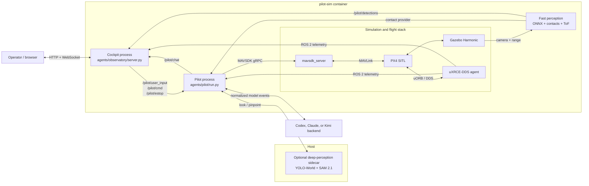
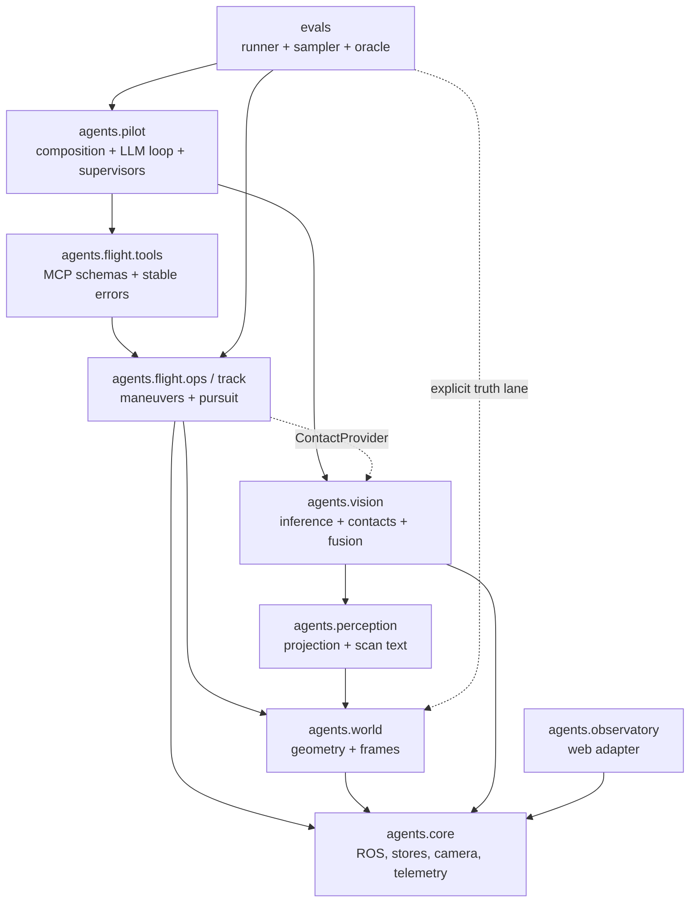

# Architecture — current single-drone system

This document describes the active `rebuild-single-drone` implementation. The
older Commander-led swarm architecture is historical: the simulator retains
multi-PX4 support, but the Commander and swarm assembly modules no longer exist.

## 1. Runtime topology

The system is a set of cooperating processes rather than one Python program.



`sim/launch/swarm_sim.sh` can start multiple PX4 instances, but the active pilot
and cockpit use drone index 0. There is no supported Commander or N-agent
assembly above them.

## 2. Construction and ownership

### Simulation process

`sim/launch/swarm_sim.sh`:

1. selects CPU, Intel EGL, or NVIDIA EGL rendering;
2. sources ROS 2 Jazzy and `px4_msgs`;
3. generates the selected procedural world and geometry sidecars;
4. patches camera resolution/rate in the local PX4 checkout;
5. starts Gazebo, uXRCE-DDS, PX4 SITL, and `mavsdk_server`;
6. clears selected persisted PX4 state before launch.

The launcher depends on a pre-existing, built `PX4-Autopilot/` checkout mounted
at `/workspace/PX4-Autopilot`. This dependency is not created by the Dockerfile.

### Pilot process

`agents/pilot/run.py` is the active composition root. It constructs, in order:

1. `RosBridge`, `World`, `GzCameras`, and the simulation clock;
2. PX4 state recording and the fast perception stack;
3. MAVSDK `System`, `Envelope`, and the single shared `FlightOps`;
4. optional deep-perception client/tools and slow-lane annotator;
5. `PilotAgent`, operator-command supervisor, and estop supervisor.

The production flight contact provider is `VisionContacts`. Gazebo mover truth
is reserved for simulation clocks, grading, and explicitly truth-fed eval lanes.

### Cockpit process

`agents/observatory/server.py` constructs its own `RosBridge`, `GzCameras`, and
`VideoHub`, then serves a Starlette application. It consumes camera and ROS
state but does not import the flight controller or vision implementation.

### Deep-perception sidecar

`agents/vision/deep/service.py` runs on the host GPU and binds to the Docker
gateway. Bearer-authenticated endpoints provide:

- health/model inventory;
- open-vocabulary YOLO-World detection for `look`;
- prompted SAM 2.1 segmentation for `pinpoint`.

The sidecar is optional. Missing credentials or an unavailable service produces
stable `UNAVAILABLE` tool results; it must not disable basic flight or the fast
ONNX perception lane.

## 3. Module boundaries



### `agents.core`

- `bus.py`: ROS bridge, QoS profiles, publish/subscribe, background spin.
- `store.py`: thread-safe latest-value and append-only topic stores.
- `contact.py`: immutable frame/contact DTOs shared across subsystems.
- `camera.py`: Gazebo image subscriptions and latest-frame ownership.
- `telemetry.py`: stamped PX4 pose/attitude history.
- `rangefinder.py`: forward range samples and controlled impairments.
- `gzposes.py`: Gazebo ground truth for clocks and explicit eval use.
- `singleton.py`: prevents duplicate pilot ownership.

### `agents.world` and `agents.perception`

`World` owns world geometry, target resolution, PX4-NED to Gazebo-ENU mapping,
and timestamped vehicle state. `agents.perception` owns mostly pure bearing,
scan-text, and camera-projection functions. Neither layer owns model inference
or vehicle control.

### `agents.vision`

- `config.py` validates environment-selected detector/tracker configuration.
- `backends.py` adapts color-blob, ONNX segmentation, and Ultralytics models.
- `detector.py` owns the camera-to-inference worker.
- `pipeline.py` converts detector output into atomic perception snapshots.
- `contacts.py` owns contact birth, association, CV-EKF state, lifecycle,
  designation, and ToF fusion.
- `beam.py` associates the fixed forward range sample with the designated mask.
- `slowlane.py` runs optional low-rate deep annotations without modifying fast
  contact authority.
- `deep/` is the host-GPU model registry and HTTP service.

Raw inference and world-contact state are deliberately separate. A detector can
change without rewriting pursuit, fusion, or the cockpit.

### `agents.flight`

- `ops.py` is the MAVSDK-facing async control façade.
- `track.py` contains target estimation and 10 Hz shadow/intercept references.
- `contacts.py` defines protocols between flight and contact providers.
- `envelope.py` defines altitude, speed, and radial-geofence checks.
- `tools.py` owns provider-neutral tool specifications (name, description,
  JSON schema, async handler) and adapts them to Claude/Kimi's in-process MCP.
- `codex_backend.py` serves the same catalog over bearer-authenticated
  Streamable HTTP MCP on an ephemeral `127.0.0.1` port.
- `backend.py` selects the provider and normalizes SDK messages to internal
  `Text`, `ToolCall`, `ToolResult`, and `Result` events.
- `errors.py` defines stable failure categories.

The LLM chooses a primitive and its parameters. PX4/MAVSDK handles ordinary
maneuvers; `track()` streams the moving-target control loop without model calls.

### `agents.pilot`

`PilotAgent` owns one persistent backend session, the natural-language command inbox, the
report publisher, and the active-tool registry. `cmd.py` arbitrates structured
cockpit operations above LLM tools. `estop.py` independently cancels the active
tool and commands hold or land through the same `FlightOps` owner.

### `agents.observatory`

The cockpit is a web adapter over camera and ROS state. It shapes telemetry,
encodes/fans out H.264, relays perception snapshots, performs freshness-aware
hit testing, and publishes operator commands. It is not a control authority.

### `evals` and `bench`

`evals/` measures agent/task behavior. YAML tasks declare setup, budgets,
scripted baselines, and pure oracle checks. The runner records tool-level
transcripts and simulator truth, while truth is isolated from the production
contact lane. `bench/` is the historical simulator/render-capacity harness.

## 4. Application interfaces

### ROS 2 topics

| Topic | Direction | Purpose |
|---|---|---|
| `/pilot/user_input` | operator → pilot | Natural-language command |
| `/pilot/cmd` | cockpit → pilot | Structured lock/orbit/standoff/stop/resume op |
| `/pilot/estop` | operator → pilot | Independent `hold` or `land` |
| `/pilot/chat` | pilot → cockpit | Reports and command acknowledgements |
| `/pilot/detections` | perception → cockpit | Atomic JSON detection/fusion snapshot |
| `/pilot/slowlane` | deep lane → cockpit | Advisory annotations and health |
| `/px4_0/fmu/out/*` | PX4 → consumers | Position, attitude, status, battery, telemetry |

Command and estop topics are volatile so a restarted pilot cannot replay an old
action. State/chat paths use durability where late consumers need the latest
view.

### Cockpit API

| Interface | Purpose |
|---|---|
| `GET /state` | Vehicle, camera, detector, beam, track, deep-lane state |
| `GET /chat?since=n` | Cursor-based chat polling |
| `POST /command` | Publish operator text |
| `POST /estop` | Publish hold or land |
| `POST /api/lock` | Freshness-aware frame hit test and target designation |
| `POST /api/cmd` | Validated structured operator operation |
| `WS /ws_cam` | Stamped H.264 access units |
| `WS /ws_detections` | Perception snapshot relay |

The server currently listens on `0.0.0.0:8000` without authentication. The API
is for a trusted local simulation workstation, not an untrusted network.

### Model tool interface

`make_pilot_tools()` assembles one provider-neutral catalog. The normal path is:

```text
JSON arguments -> tool validation -> FlightOps -> stable text/error result
```

The active-tool registry surrounds each call so an operator or estop can cancel
the current operation without destroying the model session. `detect` is included
when the fast pipeline is available. `look` and `pinpoint` remain registered in
degraded mode and return `UNAVAILABLE` when the optional sidecar is not usable.

Claude and the Anthropic-compatible Kimi route adapt the catalog to the
Claude SDK's in-process MCP server. Codex adapts it to a loopback-only
Streamable HTTP server with a per-process bearer token, `required=true`, and an
exact `enabled_tools` allowlist. Codex runs in a fresh empty working directory
with read-only sandboxing, denied approvals, shell/web/image tools disabled,
and no inherited shell environment. Its writable `CODEX_HOME` starts with only
a runtime copy of `auth.json`; host MCP, plugin, skill, and workspace settings
are not imported (the Codex runtime may create its own cache/state afterward).

## 5. Data flow for one command

1. The browser publishes natural language to `/pilot/user_input`.
2. `PilotAgent` reads the new line and starts a backend turn.
3. The selected backend client emits normalized text/tool/result events.
4. An MCP wrapper validates the call and invokes shared `FlightOps`.
5. Flight commands reach PX4 through MAVSDK; telemetry returns over ROS 2.
6. Independently, frames feed the detector and `VisionPipeline`.
7. `VisionContacts` joins camera geometry, pose/attitude history, CV-EKF state,
   and optional ToF samples.
8. A `track()` call reads that provider and streams offboard references at 10 Hz.
9. The pilot publishes a concise result to `/pilot/chat`.
10. The cockpit renders chat, telemetry, video, detections, and deep annotations.

## 6. Coordinate and time contracts

- Gazebo/world state: ENU (`east`, `north`, `up`).
- PX4 local telemetry: NED (`x=north`, `y=east`, `z=down`).
- MAVSDK global movement: latitude, longitude, absolute altitude.
- Camera inference: pixel boxes/masks plus angular projection.
- Contact and fusion state: world ENU.
- Detection/contact aging: simulation time.
- Some pursuit/eval deadlines: wall time, a known real-time-factor sensitivity.

Conversions belong in `World`, projection helpers, and geo helpers. New code
must not silently mix frames or wall/simulation clocks.

## 7. Safety and degraded operation

The intended layers are:

1. tool-boundary `Envelope` checks;
2. PX4 horizontal/vertical geofence parameters;
3. maneuver cleanup on timeout or cancellation;
4. an independent estop supervisor;
5. sensing-degraded boot that preserves basic flight and emergency controls.

Current limitations matter:

- not every fixed movement tool invokes its existing envelope validator;
- `run_mission` executes model-authored Python and bypasses the fixed-tool
  software envelope;
- PX4 geofence setup can degrade rather than hard-fail;
- the cockpit has no authentication;
- fixed-beam ToF availability is physically intermittent at difficult geometry.

See [the review findings](../gpt-review/ISSUES.md) before adapting this stack to
shared networks or real hardware.

## 8. Current versus historical scope

Current:

- `agents/pilot/run.py` and one `PilotAgent`;
- `/pilot/*` application topics;
- single-drone cockpit and perception authority;
- single-drone evals plus retained research tasks.

Historical or unsupported:

- Commander-led task decomposition;
- `agents/swarm/run.py` and `agents/swarm/commander.py`;
- the root `scripts/run_swarm_demo.sh` agent path;
- claims that N autonomous LLM agents currently launch end to end.

Historical benchmarks and design records remain useful evidence, but they are
not current operations documentation.
