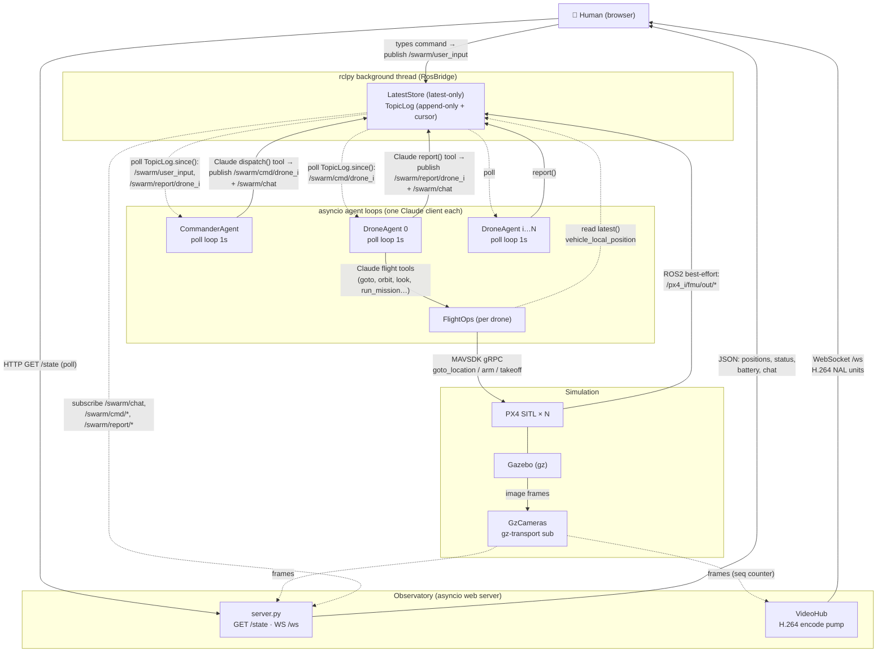
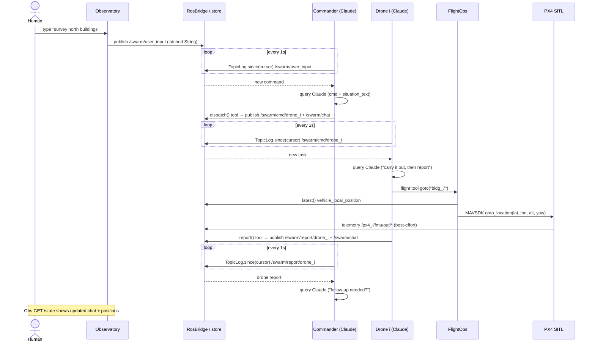
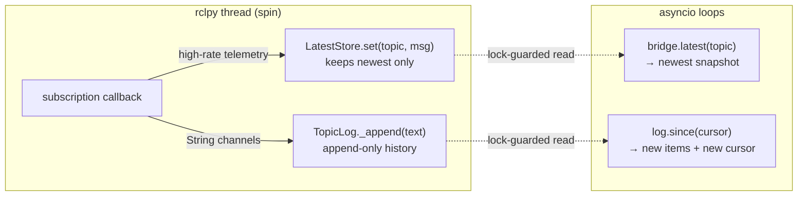

# Swarm Communication Architecture

This document maps **who sends what to whom, and through which mechanism**.

The system *looks* event-driven, but coordination is actually **ROS2 topics +
a 1-second poll loop**. Nothing pushes a wake-up into an agent; each agent runs
its own `asyncio` loop, sleeps 1s, and pulls whatever is new from a thread-safe
store that the ROS background thread fills.

There are **six distinct transport mechanisms** in play — see the legend below.

---

## 1. Component & transport map



**Reading the edges:** a solid arrow is an active *send* (publish / call /
HTTP push). A dotted arrow is a *pull* — the consumer reads on its own schedule
from the store, nobody hands it the data.

---

## 2. End-to-end message sequence

One command, from a human keystroke to a drone report and back. Note every
agent hop crosses a **1-second poll**, so latency is roughly 1s per arrow into
an agent.



---

## 3. Why it polls: the bridge boundary

`RosBridge` runs `rclpy.spin()` in a **daemon thread**. ROS callbacks fire on
that thread and write into thread-safe holders. The asyncio agents never touch
ROS directly — they only *read* from those holders, which is why the model is
pull-based rather than push-based.



- **`LatestStore`** (`agents/core/store.py`) — locked dict, one value per topic.
  Used for high-rate PX4 telemetry where only the current value matters.
- **`TopicLog`** (`agents/core/store.py`) — append-only list with a cursor API;
  `since(n)` returns everything after index `n` plus the new length, so a poller
  advances atomically. Used for the chat/command/report String channels.

---

## 4. Topic reference

| Topic | From → To | Msg type | QoS | Purpose |
|---|---|---|---|---|
| `/swarm/user_input` | browser → commander | `String` | reliable + transient-local (latched) | human commands |
| `/swarm/cmd/drone_<i>` | commander → drone i | `String` | latched | directed task |
| `/swarm/report/drone_<i>` | drone i → commander | `String` | latched | result back |
| `/swarm/chat` | all → observatory | `String` | latched | mirror of all traffic for the UI |
| `/px4_<i>/fmu/out/vehicle_local_position` | PX4 → all | `VehicleLocalPosition` | best-effort | NED position/heading |
| `/px4_<i>/fmu/out/vehicle_status` | PX4 → observatory | `VehicleStatus` | best-effort | arming / nav mode |
| `/px4_<i>/fmu/out/battery_status` | PX4 → observatory | `BatteryStatus` | best-effort | battery % / voltage |

Latched (`transient-local`) durability means a **late joiner replays the last
message** — e.g. the observatory restarting still sees the most recent chat/task.

---

## 5. Mechanism legend

| Mechanism | Where | Notes |
|---|---|---|
| **Latched String topics** | `/swarm/*` | reliable + transient-local; natural-language payloads, not structured events |
| **Best-effort telemetry** | `/px4_<i>/fmu/out/*` | high-rate, latest-only via `LatestStore` |
| **In-process tool callback → publish** | Commander `dispatch()`, Drone `report()` | Claude calls an MCP tool whose handler publishes to a topic |
| **MAVSDK gRPC** | `FlightOps` → PX4 | `goto_location`, `arm`, `takeoff`, etc. on port `50051 + i` |
| **gz-transport** | Gazebo → `GzCameras` | raw image frames, outside ROS; served as JPEG (`/state`) and H.264 (`/ws`) |
| **HTTP + WebSocket** | observatory ↔ browser | `GET /state` polled JSON; `/ws` pushes encoded video only when a viewer is connected |

---

## 6. Honest characterization

- **Decoupling is real.** Agents never call each other; everything goes through
  ROS topics with latched QoS, so any agent can restart independently and the
  design could be distributed across machines.
- **But it is poll-driven, not interrupt-driven.** Each hop into an agent waits
  on `asyncio.sleep(1.0)` + `TopicLog.since(cursor)`, so end-to-end latency is
  roughly **~1s per agent hop**, and idle agents still wake every second.
- **The Commander is the sole hub.** It is the only agent that talks to the
  human and the only one that tasks drones. **Drones never hear each other** —
  all inter-drone coordination is mediated by the Commander in natural language.

### Source files

`agents/core/bus.py` (`RosBridge`, QoS, `publish_str`) ·
`agents/core/store.py` (`LatestStore`, `TopicLog.since`) ·
`agents/swarm/commander.py` (`CommanderAgent.run`, `dispatch` tool) ·
`agents/swarm/drone.py` (`DroneAgent.run`, `report`) ·
`agents/swarm/run.py` (wiring / startup order) ·
`agents/flight/ops.py`, `agents/flight/tools.py` (FlightOps → MAVSDK, MCP tools) ·
`agents/observatory/server.py`, `agents/observatory/video.py` (`/state`, `/ws`, VideoHub) ·
`agents/core/camera.py` (`GzCameras`, gz-transport) ·
`agents/world/model.py`, `agents/perception/perception.py` (read-only situation text).
```
