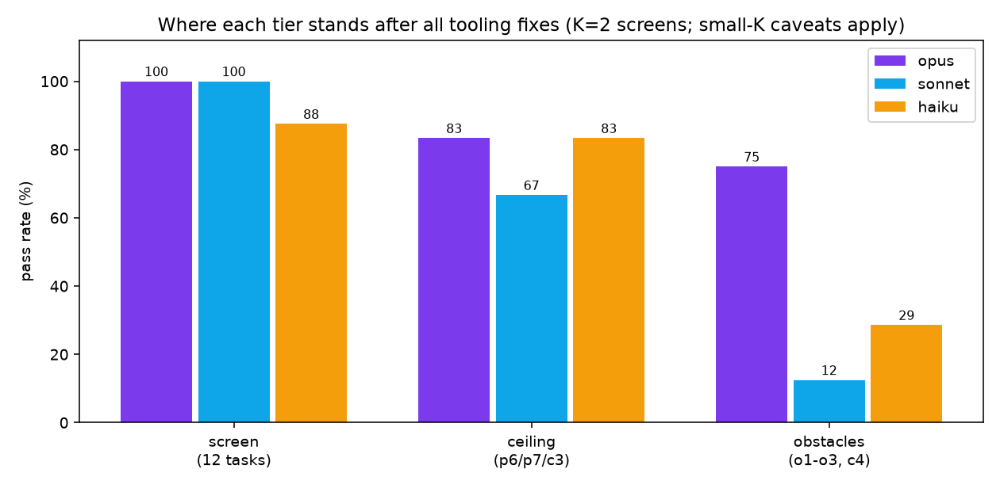
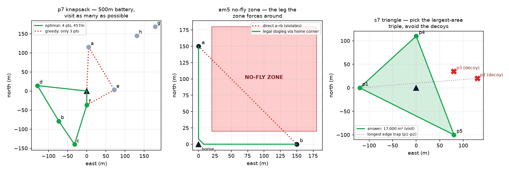
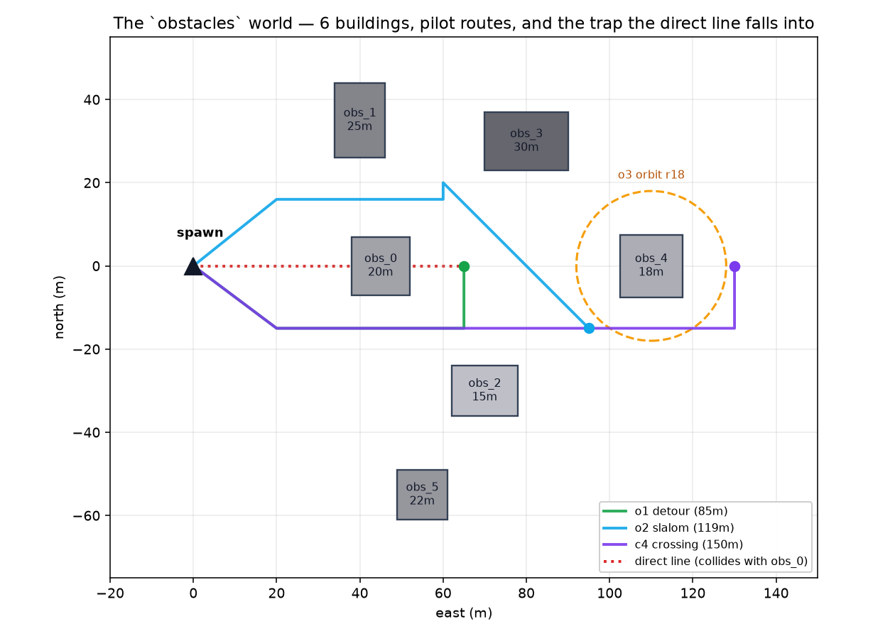
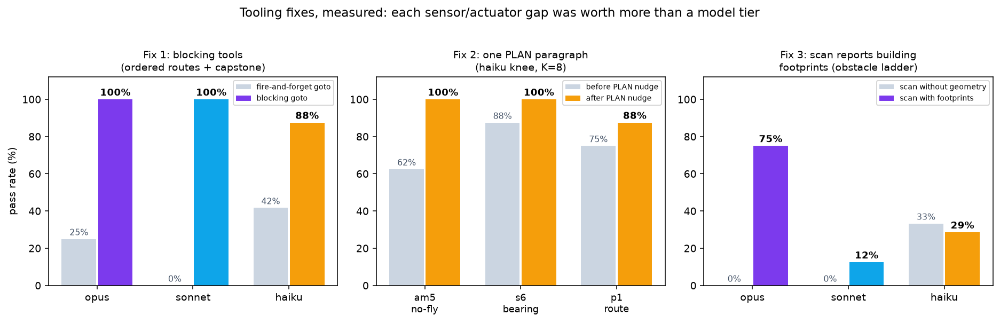

# LLM Drone-Pilot Evals — Experiment Summary

**Project:** how complex a mission can an LLM-piloted drone fly, which Claude tier does it
take, and how much capacity can better tooling/prompting unlock?
**Period:** 2026-07-01 → 2026-07-03 · **Branch:** `bench/swarm-capacity`
**Stack:** PX4 SITL + Gazebo (Docker), Claude Agent SDK over MCP flight tools,
deterministic sim-state oracle (no LLM judge).

---

## TL;DR

The first sweep's tier rankings were almost entirely **harness artifacts**. After three
measured tooling fixes (blocking movement tools, a planning prompt paragraph, and a scan
sensor that actually reports building geometry), the picture is:

| | opus | sonnet | haiku |
|---|---|---|---|
| Flat-world missions (12 tasks) | **100%** | **100%** | 87.5% |
| Ceiling rungs (knapsack, tight budgets, 5-constraint survey) | 5/6 | 4/6 | 5/6 |
| Obstacle navigation (buildings) | **6/8** | 1/8 | 2/7 |
| Collisions on obstacle course | **0** | **0** | several |
| Cost per 24-cell sweep | $3.90 | $5.49 | **$0.88** |
| Signature failure mode | occasional step-budget slip | verbosity (budgets, wandering) | collisions, skipped constraints |

**Verdicts.** Model latency per decision is nearly identical across tiers (3.5–4.9 s/step)
and is dwarfed by real-time flight — so **correctness, not latency, should pick the tier**.
haiku is a bargain for single-goal flights and (after the PLAN nudge) constraint routing;
obstacle fields and efficiency-bounded missions still need opus. sonnet flies safely but
verbosely — it loses on action budgets, not on judgment.

---

## How an experiment works

- **Cell** = one task × one model tier × one repeat. The drone sits in a live PX4/Gazebo
  sim; the model gets a natural-language tasking and ~12 MCP flight tools
  (`take_off, goto, fly, orbit, hover, face, land, set_speed, scan, look, report,
  run_mission` — the last one lets it author its own MAVSDK code).
- **Grading is pure geometry**: the drone's true position is sampled at 2 Hz and a
  deterministic oracle checks the trajectory (reached / visited-in-order / dwell /
  altitude band & ceiling / area coverage / no-fly-zone avoidance / building clearance /
  path length / step budget). No human or LLM judgment anywhere.
- **Pilot gate**: before any model flies a new task, a scripted no-LLM "pilot" flies the
  declared ideal solution through the *same* runner and oracle. If the pilot can't pass,
  the task is a harness bug and is quarantined. (This gate is the single best validity
  investment of the project.)
- **Statistics**: K repeats per cell (2 for screening, 8 at the knee); every rate carries
  a Wilson 95% interval — at K=2–3 a bare percentage is noise (0/3 vs 3/3 is p=0.10).
  Every tool call is recorded to `transcripts.jsonl`, so *how* a model flew is observed,
  not inferred.

---

## The mission ladders

**Flat world (19 tasks in 4 suites + capstones).** From "fly to a point" through computed
targets (midpoints, compass bearings from a marker), ordered patrols with revisits and
altitude changes, distractor briefings, no-fly-zone routing, a traveling-salesman route
under a distance budget, up to the verified-geometry showpieces above: the **battery
knapsack** (optimum 4 of 8 checkpoints in 500 m — greedy gets 3, listed order gets 2),
the **largest-triangle** selection with decoys, and **c3**, a survey with five
simultaneously binding constraints.

**Obstacles world (4 tasks).** A new Gazebo world — flat ground + six static buildings
with machine-verified layout — where the direct line to almost every target passes
through a building. Detour, gap slalom (margins calibrated so the lazy diagonal fails by
0.6 m), close-quarters tower inspection, and a full field crossing under a path budget.

---

## Experiment log

### E1 — Baseline: the fire-and-forget disaster (36 cells)
With the original tooling, `goto` returned before arrival, so consecutive calls
overwrote each other and only the last waypoint was ever flown. Result: **every tier
scored ~0% on multi-waypoint routes**, and the capstone *inverted* the tiers (haiku 100%,
opus 33%, sonnet 0%) purely because haiku paced its calls slowly. A same-day oracle fix
(chained in-order reach matching) confirmed the wall was mechanical, not cognitive.

### E2 — Fix 1: blocking tools, validated by the pilot gate
`goto`/`fly` now return on arrival (`wait=false` opts out) and `hover(seconds=N)` blocks —
"hold for 12 s" became an explicit, gradable decision. Pilot gate: 7/7 tasks, 100% of
oracle checks, before a single LLM cell was spent.

### E3 — Screening sweep: 12 tasks × 3 tiers × K=2, three sims in parallel
**opus 24/24, sonnet 24/24, haiku 21/24.** The plan-depth wall and the capstone inversion
vanished entirely. Behavioral color from transcripts: sonnet flew a clean 5-line
boustrophedon survey by authoring its own `run_mission` code, then landed on completion;
haiku emits ~2.4× opus's tokens for the same missions.

### E4 — Localizing haiku's knee (K=8 on the 3 borderline cells)
am5 no-fly-zone 5/8, s6 bearing 7/8, p1 6/8 — the knee is **negative-constraint routing
and coordinate geometry**, not flying skill.

### E5 — Ceiling rungs (because opus and sonnet were saturated)
The knapsack **fell to every tier** (route optimization is table stakes now — prediction
falsified, which is what probes are for). The tight-budget patrol fell too (haiku
compressed it into a single `run_mission` program — 3 steps). Only **c3's five-way
constraint stack** held: opus 1/2, sonnet 0/2, haiku 1/2 — the first above-opus rung.

### E6 — Fix 2: one PLAN paragraph closes haiku's knee
Adding "write your waypoint plan first and check every leg against every constraint" to
the system prompt, then re-running the knee at K=8: **am5 5/8 → 8/8, s6 7/8 → 8/8,
p1 6/8 → 7/8**. One paragraph ≈ one model tier, for free.

### E7 — Obstacles world: blindfold → sight → guard rails

1. **Blindfold baseline (~1/11 overall).** `scan` reported only edge distance + compass
   word — the models planned sensible detours around rectangles they couldn't locate.
   sonnet's detour clipped an unseen corner; opus groped cautiously and never found the
   pad. Also: `scan`'s silent nearest-4 cutoff let haiku thread the first gap perfectly
   and then fly into the *fifth* building it had never been told about.
2. **Fix 3: scan reports centre + footprint of every building.** Result: **opus 6/8 with
   zero collisions** (both misses were step budgets), sonnet 1/8 (zero collisions, but
   chronic budget blowouts — it flew the slalom perfectly twice and failed on one extra
   step), haiku 2/7 (still collides: it commanded `goto` to a tower's *centre* at 12 m and
   ground on the facade for 90 seconds).
3. **Guard rail shipped:** `goto` now refuses a target inside a building below its roof
   with a legible error naming the footprint — commanded collisions become visible
   re-planning events. (Effect to be measured in the next probe.)

---

## What the harness had to survive (infrastructure lessons)

Every one of these produced wrong *model* numbers until found — most were caught by the
per-cell transcripts within minutes:

| Lesson | Symptom it caused |
|---|---|
| Parallel sim containers **must** set unique `ROS_DOMAIN_ID` | DDS merged three sims' topics across the Docker bridge; every runner read a blend of three drones ("airborne at 165 m", phantom 700 m excursions) |
| Halt the vehicle when a turn is cancelled mid-`goto` | the abandoned PX4 setpoint kept flying; drones ended cells 770 m out |
| PX4 re-sets HOME **at arming** | the recovery ferry re-armed a stranded drone and RTL faithfully "returned" it to the stranding spot, forever |
| Recovery ferry must fly home *above* the buildings | the 10 m ferry hop collided with the obstacle world on its way home |
| Reset gate needs 3D + disarm-aware checks | 2D-only checks waved through drones hovering 12 m over home; parked EKF altitude drifts ~2 m |
| Stale copied OAuth credentials → `<synthetic>` 401 cells | 24 zero-step cells were scored as task failures until `client_failed()` flagged them infra |
| Unrecoverable sim states need **fresh-sim escalation** | `drive_sweep.sh` restarts the container and resumes (scored cells skip; infra cells re-run) |

---

## Reproduction

- Results live under `evals/out/`: `rerun_ordering` (baseline), `screen_v3_merged`
  (screening + TOOLS.md tool-mix metrics), `haiku_nudge`, `ceiling_*`, `obst_*`
  (`*_blindfold` = pre-scan-fix condition).
- Full narrative with per-cell tables: `docs/benchmarks/EVALS-SCREEN-2026-07-02.md`.
- Run anything: bring up a sim container (`evals/README.md`), then
  `python -m evals.run_evals --tasks <yamls> --assignments 'drones=<tier>' --k <K>
  [--pilot] [--seed N]`. Sweeps resume after any interruption.

**Caveats.** Screens are K=2 (Wilson lower bound of 2/2 is only 34% — patterns across
many tasks are the signal, single cells are not); the obstacle probes ran before the
`goto` collision guard; trajectories are graded but not yet persisted (only transcripts
are), which is the top instrumentation gap for the next round.

**Next:** re-probe obstacles with the collision guard, K=8 the knife-edge cells, wind as
an environmental multiplier, perception-grounded missions (camera), and the multi-drone
commander layer — the destination this tier matrix was built for.
