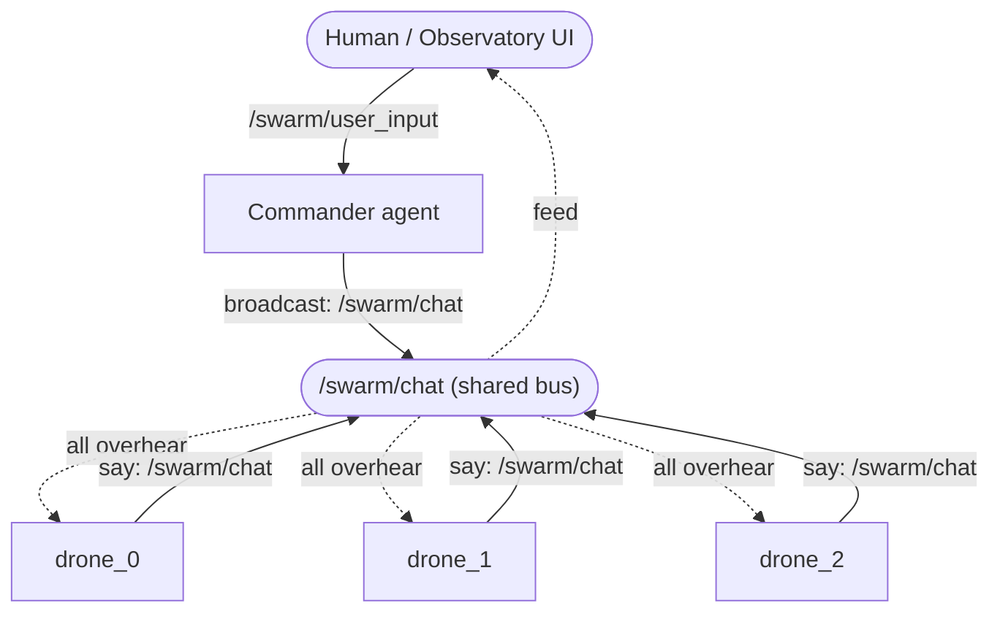
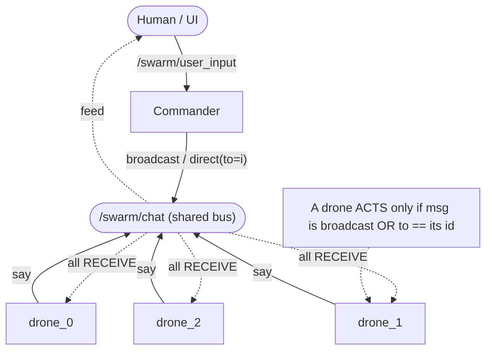
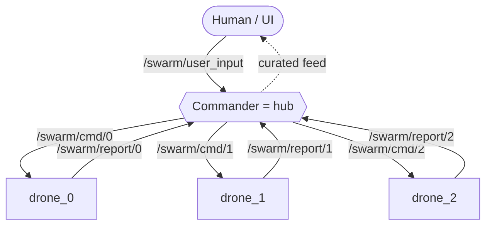
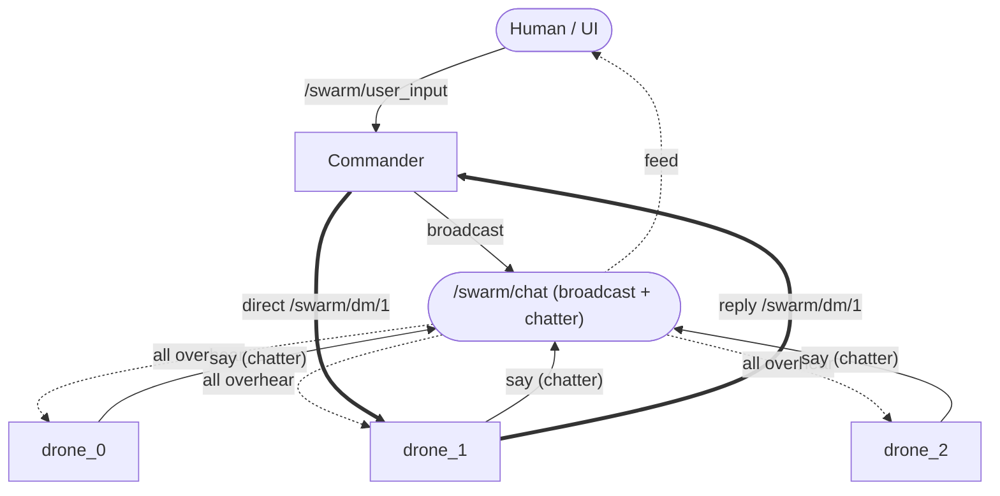
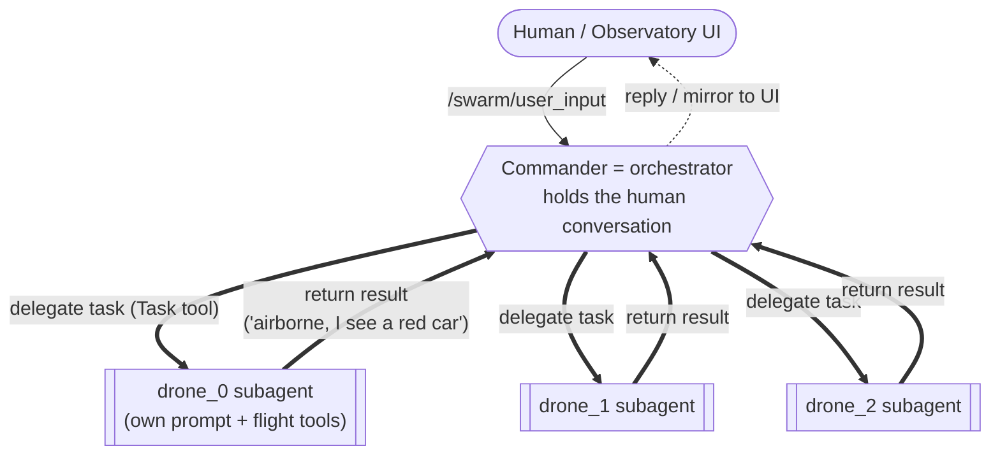
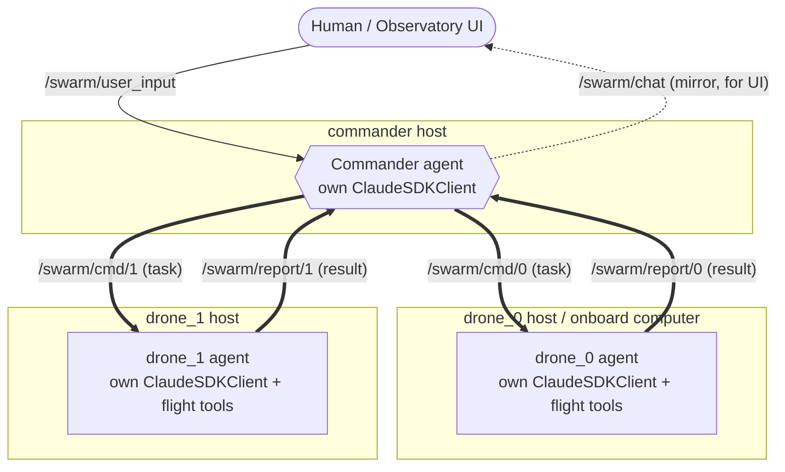

# Swarm Communication Model — Options for Review

**Status:** decision aid (pick a topology before we design the change)
**Date:** 2026-06-22

## The question

The commander should be able to **broadcast to all drones** *and* **interact with one
specific drone**. Before designing tools, we need to agree on the underlying
communication topology — who can physically hear whom, and who *acts* on what.

Two orthogonal axes run through every option below:

- **Delivery vs. action** — a drone may *receive* a message but choose not to *act* on
  it. Today every drone receives everything and filters in software.
- **One-way vs. two-way** — can the commander only *dispatch*, or can it also *hear a
  drone's reply* and act on it? Today the commander is write-only; it never reads the
  chat, so there is no true interaction yet.

---

## Baseline — what exists today

One ROS2 topic `/swarm/chat`. The commander writes to it (`broadcast`); every drone is
subscribed and overhears everything, then `relevant_to(msg, i)` decides in software
whether to spend an LLM turn. The human talks only to the commander via
`/swarm/user_input`.

**Known flaws:** every `commander:` message wakes *all* drones (each burns a turn just to
decide "not for me"); addressing is substring-matched (`"drone_3"` also matches
`drone_13`); the commander cannot hear drone replies.

---

## Option A — Shared bus + explicit addressing

Keep the single overheard bus, but make addressing a first-class field instead of a
substring guess. Commander gets `broadcast(msg)` and `direct(drone_id, msg)`; a drone
acts only when a message is a true broadcast or explicitly addressed to it.

- **Keeps:** shared situational awareness (drones still overhear each other), the single
  UI chat feed, minimal code change.
- **Fixes:** token waste (only the addressed drone wakes), the substring bug.
- **Still one-way** unless paired with the two-way add-on below.
- **Trade-off:** "private" is by convention, not enforced — every drone still physically
  receives every message.

---

## Option B — Commander as hub / router (star)

The commander is the only node that ever talks to a drone. Each drone has its own private
inbound channel and hears **only** what the commander sends it. Drones cannot overhear
each other; any drone-to-drone awareness must be relayed by the commander.

- **Keeps:** clean isolation — a drone only ever sees its own orders; no filtering needed;
  broadcast = commander loops over the per-drone channels.
- **Loses:** shared chat and drone-to-drone overhearing; the commander becomes a
  bottleneck and must relay everything; more topics to wire (2N).
- **Naturally two-way:** per-drone report channels mean the commander hears replies.

---

## Option C — Hybrid: broadcast bus + private channel

A broadcast bus for all-drone orders and situational chatter (drones keep overhearing each
other), **plus** a private commander↔drone channel for targeted orders and queries.

- **Keeps:** everything Option A keeps, **and** gives true private two-way for targeted
  interaction.
- **Most flexible:** broadcast for the squad, private for "drone_1, what do you see?" →
  reply → next order, without spamming the shared feed.
- **Trade-off:** the most moving parts — two transport patterns, and we must decide which
  conversations show in the UI feed and which stay private.

---

## At a glance

| | A: Bus + addressing | B: Hub/router | C: Hybrid |
|---|---|---|---|
| Drones overhear each other | yes | no | yes (on bus) |
| Targeted order to one drone | by convention | native | native (private) |
| Commander hears replies | only if add two-way | native | native (private) |
| Shared UI chat feed | unchanged | must be rebuilt | unchanged + private side |
| New ROS2 topics | 0 | 2N | 2 (or N) |
| Code change size | small | medium | medium |
| Enforced privacy | no | yes | yes (on private ch.) |

## My recommendation (topology only)

**Option A now, with the two-way reply add-on if you want interaction** — it fixes the two
real bugs (token waste, substring addressing) for little code, and keeps the shared
awareness and UI feed that make the swarm legible. Reach for **C** only if you specifically
want private commander↔drone dialogue that stays *off* the shared feed. I'd avoid **B**:
the hub bottleneck and loss of drone-to-drone overhearing cost more than the isolation buys
for a demo-scale swarm.

---

# Chosen direction: drones as subagents of the commander

> **Decision (2026-06-22):** the drones should behave like **subagents of the commander**,
> not peers on a shared bus.

This is a stronger statement than any of A/B/C above. It picks **hub topology (Option B)**
*and* **native two-way interaction**, but realized through the Claude Agent SDK's own
**subagent** primitive rather than hand-built ROS2 topics. It changes *what a drone is*, not
just how messages are routed.

## What changes conceptually

Today: commander + N drones are **peer `ClaudeSDKClient`s**, each an independent persistent
react-loop polling a shared chat. The commander only *broadcasts*; it never hears back.

Subagent model: **one orchestrator (the commander)** that owns the conversation with the
human and **delegates tasks to N drone subagents**. Each drone subagent has its own system
prompt and its own flight/sense tools (the per-drone MCP tools we already build), runs in an
**isolated context**, executes the task, and **returns a result** to the commander.

The defining property: a subagent is **dispatched with a task and returns a result** — the
interaction is two-way and hierarchical by construction. No shared chat, no overhearing;
drone↔drone coordination ("make two drones see each other") becomes the commander's job —
it tasks each and relays what comes back.

## The one real tension to resolve: persistent autonomy vs. task dispatch

This is the crux, and it's why I'm not jumping to code yet.

- **Today** each drone is a *long-lived loop* that reacts continuously to its environment
  (and could, in principle, notice something and speak up on its own).
- **A subagent** is *task-scoped*: spawned, runs to completion, returns, gone. It only
  "thinks" when the commander tasks it. Between tasks the drone is just an autopilot holding
  its last command — no autonomous reaction.

This fits the flight tools surprisingly well — `goto`/`orbit`/`hover` issue a MAVLink command
and return immediately (only `take_off`/`land` block), so "issue these commands and report
what you saw" is a natural task boundary. What we'd **give up** is a drone independently
reacting between commands; any "watch until X happens" becomes either a task that blocks
inside the subagent until the condition is met, or something the commander re-dispatches.

## Two implementation routes (this is the fork I need your call on)

**Route 1 — native SDK subagents.** One commander `ClaudeSDKClient`; the drones are defined
as subagents (own prompt + own flight tools) and the commander delegates via the Task tool.
Cleanest match to "behave like subagents," isolated context per drone, dispatch+return for
free. Risks to verify against the installed SDK: that a subagent can invoke our in-process
per-drone MCP flight tools, and that the commander can run several drone subagents
**concurrently** (so the swarm still acts in parallel). Drones lose their persistent loops.

**Route 2 — hub built over today's persistent drone clients.** Keep N persistent drone
clients, but replace the broadcast chat with **directed commander→drone tasks + drone→commander
replies** (private channels — essentially Option C's private half, minus the broadcast bus).
"Subagent-like" behavior and full two-way interaction, while keeping persistent drones that
*can* still react autonomously. More plumbing; not a "real" subagent.

## Secondary decision: UI visibility

With subagents, the commander↔drone dialogue is **in-process** (task results), not on
`/swarm/chat` — so the observatory feed would go quiet unless we **mirror** each dispatch and
result onto `/swarm/chat` purely for the UI. Cheap to add; worth doing so the demo stays
legible.

## My recommendation

If the goal is a clean commander-orchestrates-drones hierarchy and you don't need drones
reacting on their own between orders, **Route 1 (native subagents)** is the faithful
realization of what you asked for — pending the two SDK checks above. If autonomous
per-drone reaction matters, **Route 2** keeps it. Either way, **mirror dispatch+results to
`/swarm/chat`** so the UI still shows what's happening.

---

# DECISION: Route 2, distributed (2026-06-22)

> **Not** native Claude subagents. Each drone is its **own agent with its own thinking**, and
> must be able to **run on separate hardware** in a real deployment (onboard each drone).

This rejects Route 1 outright: native SDK subagents run *inside the commander's single
process and context* — they can't live on another machine. The "subagent" idea we keep is the
**interaction pattern** (commander delegates a task → drone executes → drone reports back),
not the in-process implementation.

## Architecture: distributed hub over ROS2

Each drone is an independent agent process holding its own `ClaudeSDKClient` (its own context,
its own LLM loop). The commander is a separate process. They talk **only over ROS2**, which is
already network-transparent — so "drone_2 runs on its own Jetson onboard the aircraft" is a
deployment/topic-routing change, not a code change. This is the original **Option B (hub)**,
which I'd cautioned against for a shared-bus *demo* — but the run-on-separate-hardware
requirement flips the trade-off: per-drone links and a hub are exactly what you want when the
agents are genuinely distributed.

**Channels:**
- `/swarm/user_input` — human → commander (unchanged)
- `/swarm/cmd/<i>` — commander → drone_i (a directed task, natural language)
- `/swarm/report/<i>` — drone_i → commander (its result / what it saw)
- `/swarm/chat` — kept as a **read-only mirror** the commander writes dispatches and results
  to, purely so the observatory feed stays legible. Drones no longer listen to it.

Each drone agent subscribes only to its own `/swarm/cmd/<i>`, acts with its tools, and
publishes to its own `/swarm/report/<i>`. No drone hears another drone; cross-drone
coordination is the commander relaying reports.

## Still open: does a drone act *only* when tasked, or also on its own?

Because each drone now has a persistent loop of its own, autonomous between-task reaction is
*possible* (a drone could notice something mid-flight and report unprompted). Whether the
design uses that, or keeps drones strictly commander-driven, changes the drone loop shape —
see the question below.

---

**One question left** (below) before I write the full design.
