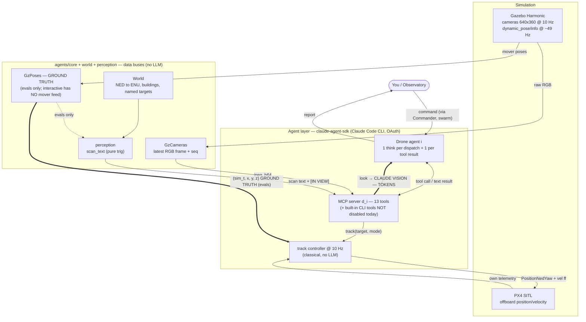
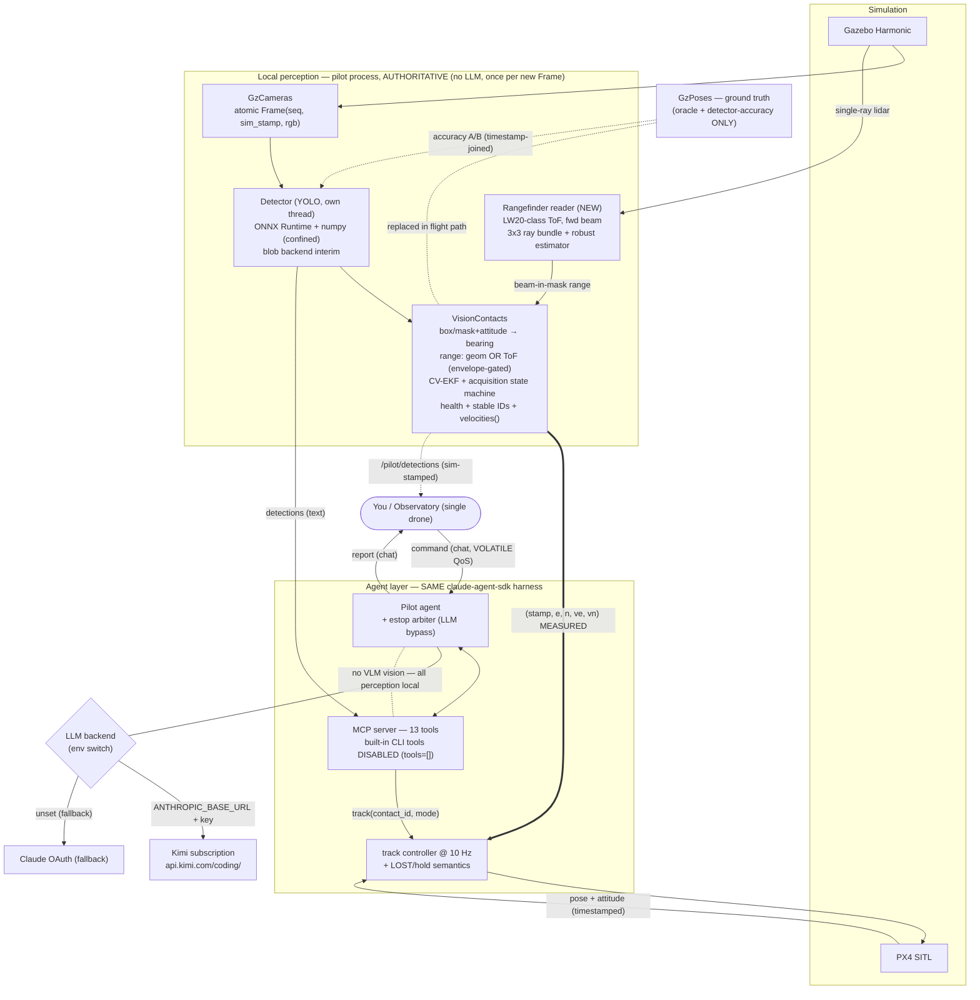
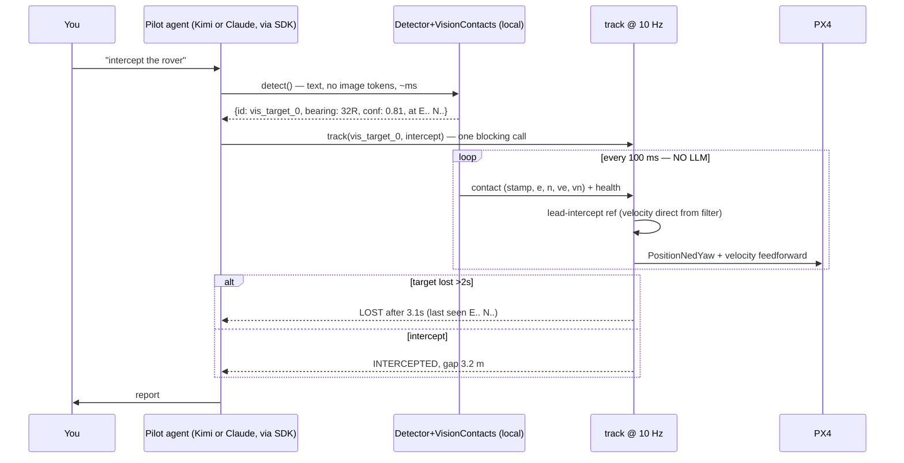

# Single-Drone Rebuild — Design Specification

- **Date:** 2026-07-18 (v4 FINAL — rangefinder design respecified after dual web review)
- **Status:** FINAL — v2 dual-reviewed (§10); v3 rangefinder extension dual-reviewed
  with web access and respecified as v4 (§12); v3.1 (Kimi orchestration-only) and
  v4.2 (`look` removed on ALL tiers — no VLM vision anywhere) owner decisions
  folded in; AerialClaw integration decisions added (§13, dual code-level
  investigation 2026-07-19). Companion presentation:
  `docs/superpowers/specs/2026-07-18-single-drone-rebuild-plan.html`.
  **Contract-level interface spec:** [2026-07-19-interface-specification.md](2026-07-19-interface-specification.md)
  (signatures, state, threading, dependency law, error taxonomy — where this spec
  says what/why, that one says the exact contract).
- **Codebase basis:** branch `feat/dynamic-scenarios` @ `7622618` (NOT `main` — `main`
  lacks the track primitive, `GzPoses`, dynamic worlds, and their evals; the rebuild
  branches from `feat/dynamic-scenarios`)
- **Supersedes scope:** the swarm architecture of
  [2026-06-14-squawd-swarm-design.md](2026-06-14-squawd-swarm-design.md)
- **Builds on:** [2026-07-06-track-primitive-design.md](2026-07-06-track-primitive-design.md)
- **Audience:** reviewing/implementing agents. Self-contained; existing components
  cited as `file:line` against the codebase basis above.

---

## 1. Context, goals, non-goals

### 1.1 Context

The current system ("squawd") is an LLM-piloted **swarm**: a Commander agent plus N
drone agents (each a Claude Code CLI subprocess via `claude-agent-sdk`), flying PX4
SITL + Gazebo Harmonic, with per-drone cameras whose frames reach the LLM only through
a `look` tool that hands a JPEG to Claude vision (`agents/flight/tools.py:112-117`).

Precise baseline statement (corrected in v2 after review):

1. **Claude is the whole perception loop, and the flight path has no real sensing at
   all.** 89 `look` calls sit in the transcripts currently in `evals/out/` — image
   tokens spent with zero oracle grading. Meanwhile the `track` controller's contact
   feed is **Gazebo ground truth, and only inside the eval harness**: `GzPoses` is
   injected by `evals/runner.py:223-226`; the interactive `DroneAgent`
   (`agents/swarm/drone.py:25-37`, `agents/swarm/run.py:47-67`) never constructs one,
   so interactive `track` today raises `"track needs a dynamic world (no mover feed)"`
   (`agents/flight/ops.py:245-246`). The fix the track benchmark already names —
   the ground-truth sense box "becomes a perception front-end (detector + data
   association + noisy-measurement filtering)"
   (`docs/benchmarks/EVALS-TRACK-2026-07-07.md:108`) — therefore closes *two* gaps at
   once: eval realism and the interactive feature hole.
2. **The swarm came before the single drone was solid.** Commander/fleet machinery
   (dispatch channels, fleet ops, N-derivation of ports/namespaces/tiles) adds surface
   area without adding what matters now: a well-perceiving, well-tooled single drone.

### 1.2 Goals (in priority order)

| # | Goal | Success looks like |
|---|------|--------------------|
| G1 | **Local YOLO perception front-end** | Routine "is there an X / where is it" answered by a local detector as *text* (no image tokens); `track` eats vision-measured contacts instead of ground truth — in evals AND interactively. Metric distance comes from a **single-point ToF rangefinder** fused with the camera (§3.10), not from VLM guesses |
| G2 | **Single drone, well-organized** | One pilot agent the user talks to directly; clean package DAG; every public interface documented in §3 |
| G3 | **Kimi-subscription LLM backend** | Agents run on Kimi via its Anthropic-compatible endpoint, env-configured; `claude-agent-sdk` unchanged; Claude OAuth fallback. **NO VLM vision anywhere (any tier): all perception is local (YOLO + rangefinder); the LLM reasons over text only** |
| G4 | **Eval/benchmark harness ported** | Geometric-oracle evals at N=1; perception-graded tasks (decoys); detector accuracy measurable against ground truth |
| G5 | **Web observatory** | Single-drone live camera tile (with detector overlay fed by the *authoritative* perception), map, chat |

### 1.3 Non-goals

- **Swarm, Commander, fleet ops** — dropped, not ported.
- **Sim-stack changes** — PX4 SITL, Gazebo Harmonic, Docker image, MAVSDK, uXRCE-DDS
  stay as they are. `SWARM_N=1` already works with the existing launch script.
- **SAM / segmentation** — deferred (§6.4 with an explicit revisit trigger).
- **VLM scene description (`look`)** — REMOVED entirely (owner decision, v4.2): no
  tier sends images to an LLM. Questions beyond the detector's classes are answered
  honestly ("not something I can see") or attacked geometrically (reposition +
  `detect` + `scan`). If open-ended vision is ever wanted, it returns as a **local
  VLM inside `vision/`** (on-device, e.g. SmolVLM-class) — never a cloud service.
- **Real hardware** — the ROS-topic-only agent boundary is preserved, nothing more.
- **Autonomous unsolicited behavior** — the pilot acts when tasked, holds otherwise.
- **Geometric (camera-only) ranging is scoped to ground movers in v1** — the
  footpoint/support-plane method (§3.3) only ranges targets on a known plane, and
  4 of the 5 dynamic-world movers are airborne at z=8–12
  (`sim/worlds/make_dynamic_world.py:34-53`). **Metric range to the ONE designated
  target — including airborne targets — comes from the LW20-class single-point
  rangefinder, inside an explicitly bounded fusion envelope** (§3.10); simultaneous
  all-object distance remains a non-goal (would need depth/stereo/radar).

### 1.4 Design principles

1. **LLM plans, classical executes** (carried; extended from control to sensing).
2. **Idle costs nothing** (poll-based wakes, seq-keyed dedupe, no per-tick LLM calls).
3. **Ground truth is for grading, not for flying** — with a stated distinction: the
   static world map (building footprints from the world sidecar) is a *known map* and
   stays in the flight path (`scan`, obstacle refusal/clamp); *live object* truth
   (`GzPoses` movers) is eval/oracle-only.
4. **Tool results must be verifiable** (gap/dwell numbers, structured contact health).
5. **One authoritative perception pipeline** (v2): what flies the drone is exactly
   what the UI overlays and what evals measure — no per-process detector copies with
   divergent IDs.

---

## 2. System architecture

### 2.1 Module map and dependency DAG

```
agents/
  core/         bus.py (RosBridge + QoS) · store.py (LatestStore, TopicLog)
                camera.py (GzCameras + atomic Frame snapshots) · gzposes.py
                (ground truth, eval-only) · rangefinder.py (NEW: single-point
                ToF reader) · geo.py · singleton.py                        [PORT+]
  world/        model.py (World + timestamped pose/attitude buffers)       [PORT+]
  perception/   perception.py (pure trig/text) · projection.py (NEW:
                box+attitude→bearing/range/world)                          [PORT + NEW]
  vision/       detector.py (NEW: YOLO inference thread, backend-agnostic)
                contacts.py (NEW: detections→world contacts, health, IDs)  [NEW]
  flight/       ops.py (FlightOps) · track.py (10 Hz pursuit)              [PORT+]
                tools.py (MCP tool surface + system prompt)                [REWRITE]
  pilot/        agent.py (PilotAgent + estop arbiter) · run.py               [REWRITE]
  observatory/  server.py · video.py · static/ (single-drone UI + overlay) [REWRITE-lite]

evals/          runner.py · oracle.py · sampler.py · worldstate.py · pilot.py
                reset.py · report.py · spec.py · tasks/                    [PORT-lite]
                + perceive_eval.py (NEW: detector-accuracy harness)        [NEW]

sim/            unchanged (launch script already parameterizes N; use N=1)
docker/         unchanged base; requirements gain onnxruntime + numpy      (§6.1)
```

(Package renamed from the v1 draft's `perceive/` → `vision/` to avoid confusion with
`perception/`.) Dependency DAG:

```
core ← world ← perception ← vision ← flight ← pilot
                     ↑                  ↑
              observatory → core -------┘ (observatory reads core + the pilot's
                                           published detections; runs NO detector)
evals → flight, world, core, vision (test-side consumer)
```

### 2.2 Information & decision flow — CURRENT (what we're replacing)



### 2.3 Information & decision flow — TARGET (this spec)



### 2.4 The perception pipeline (pilot process, one Detector thread)

```mermaid
flowchart LR
    F["atomic Frame<br/>(seq, sim_stamp, rgb)"] --> Q{"new seq?"}
    Q -- "no (idle costs nothing)" --> Q
    Q -- yes --> PRE["letterbox + normalize (numpy)"]
    PRE --> INF["YOLO nano ONNX<br/>onnxruntime session"]
    INF --> NMS["conf filter + NMS<br/>→ Detection(cls, conf, xyxy)"]
    NMS --> PROJ["footpoint → bearing (intrinsics atan)<br/>+ ATTITUDE at frame stamp"]
    RGF["ToF robust sample<br/>(Hampel, timestamp-joined)"] --> FUSE{"beam footprint ⊂<br/>ONE mask / eroded box?<br/>+ range-consistency gate"}
    PROJ --> FUSE
    FUSE -- "yes, in envelope → range_m = ToF" --> ASSOC
    FUSE -- "no → geom range (ground)<br/>or bearing-only track" --> ASSOC
    ASSOC["NN-gate on ground points<br/>CV-EKF per track (source cov,<br/>innovation gate, bearing-only mode)<br/>name REUSE inside coast gate"] --> HEALTH{"freshness"}
    HEALTH -- "≤1s" --> M["MEASURED/COASTING<br/>poses() + velocities()"]
    HEALTH -- ">2s" --> L["LOST → track() breaks<br/>with structured result"]
    M --> OUT1["detect tool<br/>/pilot/detections overlay feed"]
    M --> OUT2["contacts → FlightOps.track"]
    GT["GzPoses ground truth"] -. "offline accuracy scoring" .-> NMS
```



### 2.5 Decision sequence — "intercept the rover" (target state)



Decision ownership:

| Decision / information | Today | Target (this spec) |
|---|---|---|
| Command → tasks | Commander (Claude) | user → pilot directly |
| Tool choice + params, judgment | Drone agent (Claude) | Pilot agent (Kimi or Claude) |
| "Is there an X? / where?" | `look` (image tokens) | `detect` (YOLO, text, no image tokens) |
| Open-ended scene description | `look` | **not offered (v4.2)** — detector classes only; no VLM vision anywhere |
| Contact feeding `track` | GzPoses (evals) / nothing (interactive) | VisionContacts (measured, both) |
| Metric distance to the target | none reliable (geometry ground-only in v2) | **ToF rangefinder on the centered target (any altitude)** + support-plane geometry fallback |
| Contact health on dropout | silent stall (PX4 failsafe governs) | explicit MEASURED/COASTING/LOST + LOST result |
| 10 Hz pursuit control | classical | unchanged |
| Emergency stop | none (waits out a 120 s tool call) | estop arbiter, LLM-bypass |
| Agent harness / MCP tools | claude-agent-sdk | unchanged |
| Built-in CLI tools (Bash…) | exposed (not disabled) | disabled (`tools=[]`) |
| LLM billing | Claude OAuth | Kimi subscription (env switch) |
| Observatory tiles | raw video | + overlay from the *authoritative* detections |

---

## 3. Module-by-module specification

Legend — **PORT** = copy with ±minimal changes (provenance cited) · **PORT+** = port
plus specified additions · **REWRITE** = re-implement keeping the listed contract ·
**NEW** = does not exist today · **DROP** = not carried into the target.

### 3.1 `agents/core` — data buses [PORT+]

**`core/store.py`** [PORT unchanged] — `LatestStore`, `TopicLog`
(`agents/core/store.py:14-52`), signatures per v1 review-verified inventory:

```python
class LatestStore:
    def set(self, key: str, value) -> None
    def get(self, key: str) -> Any | None
class TopicLog:
    def __init__(self, bridge, topic: str, msg_type, qos) -> None
    def append(self, text: str) -> None
    def all(self) -> list[str]
    def since(self, n: int) -> tuple[list[str], int]
```

**`core/bus.py`** [PORT, one QoS addition] — `RosBridge`
(`agents/core/bus.py:34-84`): `subscribe/publisher/publish/latest/start/shutdown`,
`PX4_QOS` (BEST_EFFORT/VOLATILE for `/fmu/out/*`), `CHAT_QOS` (RELIABLE/
TRANSIENT_LOCAL latched chat), `publish_str`.

**Addition B1 — `CMD_QOS`** (review Codex-B4): commands must NOT be latched —
a restarted pilot must never replay a stale "take off":

```python
CMD_QOS = QoSProfile(reliability=ReliabilityPolicy.RELIABLE,
                     durability=DurabilityPolicy.VOLATILE,
                     history=HistoryPolicy.KEEP_LAST, depth=10)
```

Topic inventory (single drone; renamed `/swarm/*` → `/pilot/*`):

| Topic | Type | QoS | Producer → consumer |
|---|---|---|---|
| `/px4_0/fmu/out/vehicle_local_position` | `px4_msgs/VehicleLocalPosition` | PX4_QOS | uXRCE → World buffer |
| `/px4_0/fmu/out/vehicle_attitude` | `px4_msgs/VehicleAttitude` | PX4_QOS | uXRCE → World buffer (NEW, §3.2) |
| `/px4_0/fmu/out/vehicle_status` (+ battery) | `px4_msgs/*` | PX4_QOS | uXRCE → observatory |
| `/pilot/user_input` | `std_msgs/String` | **CMD_QOS** | observatory → pilot |
| `/pilot/estop` | `std_msgs/String` | CMD_QOS | observatory → estop arbiter (§3.6) |
| `/pilot/chat` | `std_msgs/String` | CHAT_QOS | pilot/observatory → UI feed |
| `/pilot/detections` | `std_msgs/String` (JSON) | CHAT_QOS | pilot → observatory overlay / evals |

(The rangefinder is read **gz-direct**, not via ROS — §3.10; no `/range/front` ROS
topic. The v3 row was removed per review Fable-MAJOR-3.)

**`core/camera.py` GzCameras** [PORT+] — the single owner of the camera feed
(`agents/core/camera.py:41-93`): gz-transport subscription, latest frame per drone
under a lock, monotonically increasing `seq`; existing `seq/has/raw/jpeg/jpeg_b64`
kept (observatory + tests use them).

**Addition C1 — atomic `Frame` snapshot** (review Codex-B2): independent
`seq()`/`raw()`/`stamp()` reads race the gz callback, so different consumers could
observe *different* frames for the "same" moment. One immutable object:

```python
@dataclass(frozen=True)
class Frame:
    seq: int
    sim_stamp: float          # gz Image header stamp (like GzPoses, gzposes.py:37-40)
    width: int
    height: int
    rgb: bytes                # RGB888

class GzCameras:
    ...
    def snapshot(self, i: int) -> Frame | None     # one lock hold, all fields consistent
```

`jpeg(i)`/`jpeg_b64(i)` remain for legacy callers (observatory fallback tile); the
Detector and the VideoHub use `snapshot()` exclusively, so inference, overlay, and
accuracy scoring all reference **the same frame, guaranteed**.

**`core/gzposes.py` GzPoses** [PORT, demoted] — (`agents/core/gzposes.py:17-60`)
`poses()`/`sim_time()`/`anchor()`. Constructed ONLY by evals/oracle tooling and the
detector-accuracy scorer, never by the flight path. Its `poses()`+`sim_time()` pair
remains the minimal half of the contact contract (§3.5 O1); it returns `{}` for the
contract's `velocities()` half (§3.5 O3).

**`core/rangefinder.py` Rangefinder** [NEW] — reader + reducer for the forward
single-point ToF sensor (full design §3.10). **gz-direct** (same ownership pattern
as `GzCameras`/`GzPoses`: one gz Node, lock, buffer): subscribes the 3×3
ray-bundle lidar topic and reduces each bundle to one canonical sample (min-reduce,
intra-bundle spread ⇒ edge-invalid, impairment model ⇒ quality). A provider
protocol keeps the hardware path open with zero downstream change:

```python
@dataclass(frozen=True)
class RangeSample:                       # canonical contract (§3.10)
    sample_time: float; receive_time: float
    range_m: float | None                # None = no valid return (NOT free space)
    min_m: float; max_m: float; fov_rad: float
    quality: float                       # 0..1
    status: str     # VALID|LOW_SIGNAL|SATURATED|OUT_OF_RANGE|STALE|EDGE_MIX
    seq: int

class RangeProvider:        # protocol: GzRangeProvider (sim) | LW20RangeProvider (hw)
    def latest(self) -> RangeSample | None
    def robust(self, window_s: float = 0.12) -> RangeSample | None
        """Hampel/median-of-residuals about a linear fit over a SHORT window
        (10–15 samples @100 Hz) — a trailing 0.5 s median lags ~3 m at 12 m/s
        closing; timestamp-joined to frames (20–50 ms sync gate)."""
```

### 3.2 `agents/world` — world model [PORT+]

`agents/world/model.py:29-87` — buildings/movers/spawn properties; `drone_state`,
`world_xy`, `resolve_xy` (NED→ENU axis swap). PORT unchanged, plus:

**Addition W1 — timestamped pose/attitude buffers** (reviews Fable-M3, Codex-B2/-B3):
`drone_state` holds only the wall-clock-latest sample; projecting a camera frame
needs the pose **at the frame's sim_stamp** (at 12 m/s, 100–200 ms skew is 1.2–2.4 m;
during `face`/`orbit` yaw rates, tens of ms of skew is several bearing degrees).

```python
class World:
    ...
    def note_pose(self, t: float, e: float, n: float, alt: float, heading: float) -> None
    def note_attitude(self, t: float, roll: float, pitch: float, yaw: float) -> None
        # ring buffers (~4 s), fed by bridge subscriptions on vehicle_local_position
        # + vehicle_attitude with their message timestamps; PX4 msg stamps are
        # microseconds-since-boot — aligned to sim time at subscribe time (offset
        # captured once, documented; both come from the same SITL clock domain)
    def pose_at(self, t: float)            # interpolated (e, n, alt, heading) | None
    def attitude_at(self, t: float)        # interpolated (roll, pitch, yaw) | None
```

Existing accessors keep returning latest (callers that don't care about alignment
are untouched); `vision/` uses only `pose_at`/`attitude_at`.

### 3.3 `agents/perception` — pure trig/text [PORT + NEW projection]

**`perception/perception.py`** [PORT unchanged] — (`agents/perception/perception.py:17-135`)
`FOV_HALF_DEG=35.0`, `MOVER_SCAN_RANGE_M=150.0`, `bearing_word`, `heading_word`,
`rel_bearing`, `yaw_deg_to`, `scan_text`, `situation_text`. One display fix
(review Fable-minor-4): `scan_text`'s contact line prints the mover `cz`; for
vision-fed contacts z is unknown, so the contact source may pass `z=None` and the
line renders `alt unk` instead of a misleading `alt 0m`.

**`perception/projection.py`** [NEW] — image-space → world-space, pure functions.
v2 changes from review: **full pinhole intrinsics in both axes** (Codex-B3: v1's
vertical linear approximation replaced), **attitude mandatory** (Fable-M2: a
multirotor at 12 m/s pitches 10–20°+; level-flight is not a v1 assumption), and a
**support-plane parameter** (Fable-B1/Codex-B3: airborne movers).

```python
HFOV_DEG = 69.0        # camera SDF hfov 1.204 rad (PX4 model dir; consistent with
                       # perception.py docstring) — VERIFIED against SDF at M2
VFOV_DEG = 42.0        # derived for 640x360: 2*atan(tan(hfov/2)*h/w)

def pixel_to_angles(u: float, v: float, img_w: int, img_h: int,
                    hfov_deg: float = HFOV_DEG) -> tuple[float, float]:
    """(angle_x, angle_y) in radians, pinhole-intrinsics in BOTH axes:
    ax = atan((u - cx)/fx), ay = atan((v - cy)/fy), fx = (w/2)/tan(hfov/2),
    fy = fx * (hfov→vfov aspect). Same parameterization as MAVLink LANDING_TARGET."""

def ray_support_range(angle_x: float, angle_y: float, *,
                      roll: float, pitch: float, alt: float,
                      support_z: float = 0.0) -> float | None:
    """Rotate the camera ray by vehicle attitude (roll/pitch from
    World.attitude_at(frame_stamp), yaw handled in contact_world) and intersect
    the support plane z = support_z (0.0 = ground; a task-supplied target altitude
    for airborne targets). Returns slant range, or None when the ray does not
    converge on the plane (depression ≤ ~1°): range unobservable."""

def contact_world(me_e: float, me_n: float, heading_rad: float,
                  angle_x: float, slant_range: float) -> tuple[float, float]:
    """World (e, n) of a contact: bearing = heading + angle_x, polar → cartesian."""
```

Error model (v2, attitude-corrected): at 0.108°/px, ±5 px box jitter ≈ ±0.3–0.6 m;
with *measured* attitude the dominant residual is timestamp skew (~1–2 m at chase
speeds pre-interpolation, ~cm–dm after) and terrain/support-plane mismatch (1:1
along-ray). Realistic contact accuracy ~1–3 m at 20–40 m altitude for GROUND
movers — ample for a closing chase that self-corrects at 10 Hz.

### 3.4 `agents/vision` — the local perception pipeline [NEW, flagship]

Two classes, no ROS, no MAVSDK, no LLM — unit-testable with recorded frames.
**One authoritative instance lives in the pilot process** (review Codex-Mj2):
the observatory and evals consume its published output (`/pilot/detections`), they
do NOT run duplicate detectors (duplicate inference would diverge in timing, IDs,
and CPU — and the UI must show exactly what fed flight control).

**`vision/detector.py`**

```python
@dataclass(frozen=True)
class Detection:
    cls: str
    conf: float
    xyxy: tuple[float, float, float, float]

class Detector:
    """Watches GzCameras.snapshot(i); infers at most once per new Frame, capped at
    `hz`. Backend-agnostic: ColorBlobBackend (interim, HSV threshold on the mover
    orange, PIL-only) ships first; OnnxBackend (YOLO nano, §6.1) when trained.
    numpy is confined to this module (§6.1/§6.2)."""

    def __init__(self, cameras: GzCameras, backend, *, i: int = 0,
                 hz: float = 5.0, conf: float = 0.45) -> None
    def start(self) -> None
    def stop(self) -> None
    def detections(self) -> tuple[Frame, list[Detection]] | None
        """The newest completed inference WITH its source Frame (atomic identity);
        None before the first. dets=[] for a clean frame."""
    def latency_ms(self) -> float
    def healthy(self) -> bool
```

- Failure behavior (review: degrade, don't brick the pilot): backend load failure
  at `start()` is caught by the pilot, which boots with **sensing degraded** —
  `detect` returns a legible error string, flight tools are unaffected, and the
  health state is published on `/pilot/chat`. Per-frame exceptions: logged, frame
  skipped, thread survives.
- Model artifact (OnnxBackend): `.onnx` under `models/` with a **checksum/provenance
  manifest** (source config, training commit, SHA-256); exported with NMS **inside**
  the graph where the exporter supports it, else decoded in numpy with the exact
  output contract documented (YOLOv8-family: 1×84×8400).

**`vision/contacts.py`**

```python
class VisionContacts:
    """Detections → world-frame contacts with health + stable IDs. Implements the
    contact contract (poses/sim_time/velocities, §3.5 O1/O3) so FlightOps consumes
    it unchanged. Authoritative for the flight path."""

    def __init__(self, detector: Detector, world: World, i: int = 0,
                 rangefinder: RangeProvider | None = None,
                 coast_s: float = 1.0, lost_s: float = 2.0,
                 max_range_m: float = 120.0) -> None
    # ---- contact contract (GzPoses-compatible superset) ----
    def poses(self) -> dict[str, tuple[float, float, float]]
    def sim_time(self) -> float
    def velocities(self) -> dict[str, tuple[float, float]]        # filtered (ve, vn)
    def ranges(self) -> dict[str, tuple[float, str, float]]
        """name -> (range_m, src, conf): src = "tof" (beam-associated, envelope-
        gated §3.10) | "geom" (support-plane, ground movers) | "bearing"
        (bearing-only track). poses() z: 0.0 for geom (note: mov_1's true z is
        1.2 — oracle tolerance covers it); alt - range*sin(boresight elevation
        from attitude_at(sample_time)) for tof; held estimate for bearing."""
    # ---- health + lifecycle ----
    def health(self, name: str) -> str        # "MEASURED" | "COASTING" | "LOST"
    def age_s(self, name: str) -> float       # since last measurement update
    def reset(self) -> None                   # evals: clear all tracks per cell
    # internals: NN-gating on PROJECTED GROUND POINTS (metric, camera-motion
    # invariant), gate = 2x max plausible displacement + 2sigma; per-track
    # constant-velocity EKF (state e,n,ve,vn; source-specific covariances for
    # tof/geom/bearing; normalized-innovation gating; two-hit confirmation on
    # source change; bearing-only updates with held range on beam slip — §3.10);
    # a detection entering the coast gate of a RECENTLY-DROPPED track REBINDS
    # that track's name (review Fable-M6) instead of minting a new one; tracks
    # with no measurement for > lost_s are dropped from poses() and reported LOST.
```

- IDs (review Codex-Mj3): `vis_{cls}_{k}` — **opaque**; nothing in the name encodes
  Gazebo identity. `detect` returns them; the agent passes them to `track`;
  evals discover them at runtime (§3.8), never hardcode them in gates.
- Trackability (v4): a contact enters `poses()` with a **ToF** (beam-associated,
  envelope-gated) or **geom** (support-plane, ground movers) range. Bearing-only
  contacts are still tracked in degraded mode (EKF bearing updates, held range —
  health `COASTING`/`ACQUIRING`) and are accepted by `track`, which starts in the
  ACQUIRING state to win the beam lock (§3.10 state machine).

### 3.5 `agents/flight` — ops + controller + tool surface

**`flight/track.py`** [PORT unchanged] — (`agents/flight/track.py:1-135`)
`TargetEstimator`, `intercept_t_go`, `control_ref`, `clamp_ref_alt`, `TrackLog`,
`CTRL_HZ/MAX_DURATION_S/MAX_SPEED_MPS/V_EMA_ALPHA`.

**`flight/ops.py` FlightOps** [PORT+] — async flight primitives
(`agents/flight/ops.py:62-422`): `take_off`, `fly`, `goto`, `orbit`, `hover`,
`set_speed`, `face`, `land`, `run_mission`, `track` (10 async) + `scan` (sync).
Changes:

**O1 — contact-source generalization.** Constructor param `gzposes` → `contacts`:
any object implementing `poses()`, `sim_time()`, and `velocities()`. The pilot
passes `VisionContacts`; eval tooling may still pass `GzPoses` (which implements
`velocities()` as `{}`).

**O2 — track-loss semantics** (reviews Fable-B2, Codex-B1 — replaces v1's "no other
line changes"; today a vanished contact silently `continue`s without streaming,
`ops.py:291-295`, which after ~`COM_OF_LOSS_T` (~1 s) hands behavior to PX4's
offboard-loss failsafe with no LOST status to the LLM):

```python
# inside track()'s 10 Hz loop:
#   contact MEASURED/COASTING → keep streaming control_ref as today
#     (coasting = filter prediction; stream NEVER stops mid-call)
#   contact LOST (age > lost_s) → break; finally-block stops offboard as today;
#     return f"{name} LOST {target} after {t:.1f}s (last seen E.. N.., "
#            f"gap {log.min_gap:.1f}m best)" — a legible degraded result
```

Unit test: a fake contacts object that goes silent mid-track ⇒ early return with
the LOST text, offboard stop called, no hang.

**O3 — velocity dispatch** (review Fable-M5 — the duck type otherwise discards the
filter's velocity and `TargetEstimator` would re-differentiate filtered positions
at 5 Hz, stacking lag on lag into `intercept_t_go`):

```python
vmap = self.contacts.velocities()          # {} for GzPoses → legacy path
if name in vmap:  est.feed_direct(*vmap[name])   # filtered velocity, no re-diff
else:             est.update(t, e, n)            # legacy finite-difference + EMA
```

(`TargetEstimator.feed_direct` is a 3-line addition setting `ve/vn/ready`.)
The M3 gate measures both paths (§7).

**O4 — contact-aware target resolution** (review Codex-Mj6): `_resolve_xy`/`face`/
`orbit`/`goto` currently resolve only drones/buildings (`model.py:71-87`). Extend:
a target string present in `contacts.poses()` resolves to its filtered position —
`face(vis_target_0)`, `orbit(vis_target_0)` work.

**O5 — `face` waits for heading** (review Codex-Mj6): today it returns immediately
after issuing yaw, making "face it, then detect" race-prone. `face` now blocks
until |heading error| ≤ 5° or a 5 s timeout, returning the settled heading; at 10
Hz frames, a post-face `detect` is then guaranteed a fresh on-target frame.

**O6 — rangefinder beam steering + acquisition inside `track`** (v4, §3.10): the
10 Hz loop already yaws the camera onto the contact every tick (`ops.py:305`) —
that same yaw steers a co-boresighted ToF beam. v4 semantics: (a) `track` accepts
bearing-only contacts and starts in **ACQUIRING** (yaw onto bearing, altitude
toward target elevation, bounded beam-lock retries); (b) ToF samples fuse only
inside the **fusion envelope** (shadow, ≤3 m/s, near co-altitude, beam on target)
or opportunistically when every gate passes — the chase never depends on them;
(c) the altitude bias (±3 m) routes through `clamp_ref_alt` and respects task
ceilings; (d) range + closing speed are measured when fused (sharper
`intercept_t_go`), estimated otherwise. This lets `track` pursue AIRBORNE movers
with metric range **in the envelope**, not just ground ones (§1.3).

**`flight/tools.py`** [REWRITE — same binding pattern] — `@tool` +
`create_sdk_mcp_server` (`agents/flight/tools.py:9-22`). Surface: **13 tools,
uniform across backends** — the 12 swarm-era tools minus `look` (`report` rerouted
to the operator) + NEW `detect`; fleet tools (`tools.py:246-319`) DROPPED.

**T0 — built-in CLI tools disabled** (review Codex-Mj14):
`ClaudeAgentOptions(..., tools=[])` — SDK `types.py` documents `tools=[]` as
"disable all built-in tools" (`allowed_tools` only auto-approves, it does NOT
restrict; today Bash/Read/Edit remain exposed). The MCP server is unaffected.
Test asserts the exposed tool list equals exactly the 13 MCP tools.

**T3 — NEW `detect`** (full text in §4.2): returns pipe-joined
`id cls conf bearing [range/world]` lines + the frame's `sim_stamp` and age;
freshness is implicit at 10 Hz after O5. Empty ⇒ "nothing detected" (+ degraded
notice if `Detector.healthy()` is False).

**T4 — `look` is REMOVED, all tiers (v4.2, owner decision).** No backend sends
images to an LLM; there is no `vision` flag and no prompt variant. ALL visual
perception is local: `detect` + rangefinder + `scan` text — the model reasons over
text only. Questions beyond the detector's classes get an honest "not something I
can see" (or a reposition + re-detect). If open-ended vision is ever wanted, it
returns as a **local VLM inside `vision/`** (§1.3) — never a cloud service. This
retires risk R4 and the S0 image-round-trip check (§5.6).

**Schema note (review adjudication, §10):** shorthand schemas' optional fields work
(transcript evidence: `take_off` called with zero args 7×, `goto` with `target`
only). Belt-and-braces: one schema-level test per tool with optional fields
(`detect.classes`, `goto.target/east/north`, `track.*`) asserting omitted-field
invocation succeeds — guards future SDK upgrades.

### 3.6 `agents/pilot` — the single agent [REWRITE from `agents/swarm/drone.py`]

Template (`agents/swarm/drone.py:22-74`): persistent `ClaudeSDKClient`, 1 Hz inbox
poll, one query per command, drain `receive_response()`.

```python
class PilotAgent:
    def __init__(self, world, bridge, cameras, detector, contacts,
                 env=None, model=None) -> None
    async def connect(self) -> None      # MAVSDK + geofence (drone.py:45-60)
    async def run(self) -> None
```

- Inbox: `TopicLog(bridge, "/pilot/user_input", String, CMD_QOS)`; on startup the
  cursor starts at the CURRENT log end (skip-backlog, same pattern as
  `agents/swarm/commander.py:99-119`) — belt-and-braces with the VOLATILE QoS.
- Report: `publish_str(bridge, "/pilot/chat", f"pilot: {text}")`.
- Perception authority: owns the one `Detector` + `VisionContacts`; a publisher
  task streams `/pilot/detections` JSON `{sim_stamp, seq, dets:[{id,cls,conf,xyxy,
  e,n,health}]}` at detector rate (CHAT_QOS depth gives late joiners the latest).
- **Estop supervisor** (review Codex-B4; refined by the ICD v2 arbiter, ICD §7.1):
  an independent asyncio task watching `/pilot/estop` (CMD_QOS) plus an
  `ActiveToolRegistry`. On "hold"/"land": cancels the active TOOL task (the agent
  turn survives to receive the `ESTOPPED` result code), awaits its cleanup under
  `asyncio.shield`, then drives `FlightOps` `emergency_hold()`/`emergency_land()`
  under an operation generation counter — a cancelled controller can never resume
  streaming stale setpoints, and nothing queues behind a 120 s `track`.
  Confirmation to `/pilot/chat`.
- Prompt on new input: `"Command from the operator: {cmd}\n\nCarry it out with your
  tools, then call report(...) with a short result (what you did and what you saw)."`
- Construction order preserved from `agents/swarm/run.py:47-67`: bridge → world →
  cameras → detector/contacts → agent → `bridge.start()` → `connect()` → gather;
  `agent_env(tag)` per-agent `CLAUDE_CONFIG_DIR` isolation (`run.py:30-44`) extended
  per §5.
- `make_pilot_options(i=0, ...)`: `ClaudeAgentOptions(mcp_servers, allowed_tools,
  tools=[], setting_sources=[], env, model, system_prompt)` (+`cli_path` fallback,
  §5.1).

### 3.7 `agents/observatory` — single-drone cockpit UI [REWRITE-lite]

- **`video.py` VideoHub** [PORT unchanged] — seq-throttled H.264 pump
  (`agents/observatory/video.py:113-176`); addition: track each pumped frame's
  `sim_stamp` (from `snapshot()`) so overlays can be matched to detections.
- **`server.py`** [REWRITE-lite] — single WS camera channel; `/state` (add
  attitude/battery from the new topics); command intake → `/pilot/user_input`
  (CMD_QOS); estop button → `/pilot/estop`; chat from `/pilot/chat`; **NEW**
  `/detections` WS relay of the pilot's `/pilot/detections` (NO local detector —
  review Codex-Mj2).
- **`static/`** [REWRITE-lite] — the **cockpit POV** (below) + single-blip PPI map
  + FOV cone + chat/command dock + estop button.

**The cockpit POV tile — POV video + sensor-fusion HUD.** One tile, the drone's
live camera, with the *authoritative* fusion state drawn on top (all overlay data
from `/pilot/detections`, matched to the video frame by `sim_stamp`; overlays
older than 0.5 s are dropped — a stale overlay is worse than none):

| HUD element | Content (source field) |
|---|---|
| Detection boxes | box (+mask outline when the seg model ships), `id · cls · conf` label; color = health: MEASURED green / COASTING amber / bearing-only blue |
| Range readout | per contact: `34 m` + src chip (`ToF` / `geom` / `bearing`) + confidence bar (`range_conf`) |
| **ToF beam indicator** | boresight crosshair + footprint disc at the measured range; beam status chip: `LOCKED` / `SEARCHING` / `NO-RETURN` / `EDGE-MIX` / `OUT-OF-ENVELOPE` — the operator sees *why* fusion is or isn't happening |
| Track banner | top-right: state `ACQUIRING / RANGE_LOCKED / WORLD_TRACKED / COASTING / LOST` + target id + current gap |
| Flight strip | bottom: alt, ground speed, heading tape, battery, flight mode, geofence margin |
| Attitude | left: mini pitch/roll ladder (from `vehicle_attitude`) — explains beam-off-target events |
| Sensor health chips | camera frame age, detector latency/health, ToF sample rate/quality, contacts tracked |
| Degraded banner | `SENSING DEGRADED — manual flight OK` (detector down) / `RANGE UNAVAILABLE` (never "free space") |

- Degraded states are first-class UI, per §3.4/§3.10: absence of valid range shows
  as `RANGE UNAVAILABLE`, never as empty space.
- No tile grid, no drone switching (single drone). Manual/AI: v1 shows mode +
  estop only (teleop rejected, §13).

**M4 gate additions:** overlay boxes + ids + range-src chips render on the live
tile tracking the mover; beam indicator state transitions are visible through an
acquisition (`SEARCHING` → `LOCKED`); stale-overlay guard demonstrably drops
>0.5 s overlays; degraded banner shows on a killed detector; estop holds the drone
mid-`track`.

### 3.8 `evals` — harness port [PORT-lite + NEW]

- **Keep**: runner `single_drone` layer (`_drive` `:239-259`, Trace, budgets),
  oracle CHECKS (`evals/oracle.py:474-498`), sampler/worldstate 2 Hz WorldTrack,
  scripted pilots + null gates (`evals/pilot.py`), soft_reset, report metrics,
  task YAML (`evals/spec.py`).
- **Drop**: operator + commander layers, swarm tasks, role-matrix `--assignments`
  (single role: `pilot`).
- **Deps split** (review Codex-Mj11): `Deps.gzposes` → `oracle_truth` (sampler +
  oracle ONLY), NEW `flight_contacts` (the VisionContacts fed to FlightOps) and
  `detector`. `FleetHarness.client_for` (`runner.py:213-233`) wires flight tools to
  `flight_contacts`, never to `oracle_truth`. Scripted pilots (`evals/pilot.py:298-299`
  currently builds FlightOps with gzposes directly) gain a scripted perception
  client that calls the same detect→lock→track path as the LLM.
- **Per-cell reset**: `VisionContacts.reset()` at soft_reset (no filter/ID leak
  across anchored repeats).
- **`identified_target` data path** (review Codex-B5): the Trace already records
  every tool call; on the first `track`/`goto` call whose target is a `vis_*` ID,
  the runner logs a `TargetLockEvent(contact_id, sim_stamp)` into `run_meta`; the
  harness then associates that contact's measurement to `oracle_truth` **at that
  sim_stamp** and passes the resulting truth ID into `run_meta` for the oracle
  check. Report text is never graded (§4.3 contract stands).
- **NEW `evals/perceive_eval.py`** — detector accuracy vs `GzPoses`,
  **timestamp-joined** (not "same tick", review Codex-B2): per-class
  precision/recall (IoU≥0.5 vs projected truth boxes where sizes are known),
  contact position error p50/p95 vs range, **ID-switch rate + track fragmentation**
  (review Codex-Mj4).
- **NEW perception tasks** (`evals/tasks/perceive/`): true target + decoys with
  **distinct visual evidence** (different color/shape/marker — the blob backend
  cannot separate same-orange decoys, `make_dynamic_world.py:55`); dual pilot
  gates; ground-mover variants for the vision ladder (v1 scope, §1.3).
- Tier map gains Kimi (§5.2); cost capture per §5.5.

### 3.9 Dropped modules + M1 test migration (explicit, review Codex-Mj12)

Drop from packages: `agents/swarm/commander.py`, `agents/flight/fleet.py`,
`agents/swarm/run.py` (superseded by `agents/pilot/run.py`), operator/commander eval
layers, `bench/` (shelved, N-scaling moot at N=1).

Tests that import dropped code and must migrate or be removed **in M1** (the gate
is pytest green AFTER migration, so deletion can't strand the suite):
`tests/test_commander.py`, `tests/test_fleet_ops.py`, `tests/test_operator_tools.py`,
`tests/test_track_tool.py` (fleet-path parts), `tests/evals/test_commander.py`,
`tests/evals/test_oracle_fleet.py`, `tests/evals/test_run_evals.py` (layer-matrix
parts). Ported and kept: `test_perception.py`, `test_track.py`, `test_drone_tools.py`
(→ pilot tools), `test_geo.py`, `test_flight_helpers.py`, `test_world.py`,
`test_blocking_goto.py`, `test_run_mission.py`, `test_latest_store.py`,
`test_singleton.py`, `test_video*.py`, `test_observatory_metrics.py`,
`tests/evals/{test_oracle,test_oracle_dynamic,test_runner,test_sampler,
test_pilot,test_reset,test_report*,test_spec,test_task_files,test_transcript,
test_worldstate,test_areas*}.py`.

### 3.10 Single-point rangefinder fusion [NEW — v4, rewritten after dual web review]

**Role (narrowed, honest).** The camera answers "what and which way" (class, box or
mask, bearing); one forward single-point ToF rangefinder answers "exactly how far"
for the **one designated target** — inside an explicitly bounded fusion envelope
( below). It is NOT a general replacement for depth at 20–60 m, NOT dense ranging,
and NOT depended on outside its envelope: everywhere else, geometric (support-plane)
or bearing-only estimation remains the path and ToF is opportunistic — fused when
its gates pass, never required.

**Named sensor class: LW20/TF03-class, NOT TF-Luna.** The v3 text said "TF-Luna
class" — impossible: TF-Luna reaches 0.2–8 m at 90 % reflectivity (~2.5 m at 10 %),
while the mission envelope needs 10–60 m slant ([TF-Luna manual](https://en.benewake.com/uploadfiles/2024/04/20240426135946148.pdf)).
The honest class is **LightWare LW20/SF20 or Benewake TF03**: 0.3–0.5° beam,
~100 m at 90 % (~40–70 m at 10 %), 100+ Hz, ~$220–300, 77–86 g ([TF03 datasheet](https://acroname.com/sites/default/files/assets/tf03_datasheet_v0.4_en.pdf),
[SF20/C](https://lightwarelidar.com/shop/sf20-c-100-m/)). PX4's upstream gz models
even ship an `x500_lidar_front` simulating the LW20/C ([PX4 vehicle list](https://docs.px4.io/main/en/sim_gazebo_gz/vehicles))
— **not present in this checkout's models dir** (verified: only x500 variants); M2
either bumps the models submodule to inherit it or uses the composite below.

**The pointing reality (why the envelope exists).** A multicopter pitches 10–25° at
chase speeds — pitch is the speed actuator — and a body-fixed ~1–2° beam displaces
~0.5 m/° at 30 m against sub-meter airborne targets. Nobody ships body-fixed 1D
target ranging (Skydio/DJI use gimbaled vision; PX4's forward 1D use is collision
prevention with a *rotating* SF45). Therefore:

- **Reliable fusion envelope:** `shadow` mode, low speed (≤3 m/s), near co-altitude
  (|Δz| ≤ 3 m), target within beam half-width of boresight. Inside it, altitude
  bias (±3 m, routed through `clamp_ref_alt` and task ceilings — review Fable-MINOR-2)
  keeps the beam vertically on target.
- **Outside it (incl. `intercept`):** ToF is opportunistic — fused only when a
  sample passes every gate; the chase never depends on it.
- **Escape hatches (named, not in v1):** a 1-axis pitch micro-gimbal (the field-
  standard answer), or **mmWave radar** as the future primary for fast/any-attitude
  target ranging (sunlight-immune, range+Doppler, §6.3).

**Acquisition state machine** (fixes the v3 bootstrap deadlock: bearing-only
contacts couldn't enter `poses()`, so `track` refused them, so the beam never
steered onto them):

```
DETECTED_BEARING_ONLY → DESIGNATED → ACQUIRING → RANGE_LOCKED → WORLD_TRACKED
                                      ↓ (beam slip)                ↓ (dropout)
                                   retry/backoff              COASTING → LOST
```

- `face`/`goto` accept **bearing-only** contacts (yaw needs only bearing) — O4 is
  extended accordingly; `track(id)` accepts a bearing-only designation and starts
  in ACQUIRING: yaw onto the bearing, bias altitude toward the target's elevation,
  hold for first beam lock (bounded retries + backoff).
- A task-supplied initial `support_z` (open question (c), promoted to v1) can skip
  ACQUIRING for known-altitude targets.
- **Bearing-only filter updates** (review Fable-MAJOR-2): on beam slip the EKF
  consumes the bearing innovation with held/predicted range (health COASTING) —
  no LOST-cycling; the §4.1 "degrades to bearing-only" claim is then true.

**Association algorithm** (per detection cycle):

1. At most ONE designated target; the controller steers the beam (yaw from the
   track loop; altitude inside the envelope).
2. Project the beam (boresight + documented camera↔rangefinder offset) into the
   current `Frame` as a **footprint disc** at the measured range.
3. **Mask-aware gating** (v3 said "inside one mask" but produced only boxes —
   resolved): with a mask-producing backend (`ColorBlobBackend`'s HSV mask; the
   M2.5 artifact is a **nano instance-segmentation model** — box+mask, same weight
   class, NOT the deferred SAM-class, §6.4): footprint ⊂ exactly ONE mask, with
   margin. Box-only fallback: footprint ⊂ box **eroded 20–25 %**, reject occluded/
   overlapping boxes.
4. **Range-consistency gate:** accept the sample only within k·σ of the filter's
   predicted range (or of the support-plane prior for ground movers) — a single
   valid-looking edge/multipath return must not jump the aircraft.
5. Otherwise the range is NOT assigned: multiple masks ⇒ ambiguous; background ⇒
   unattributed; not centered ⇒ premature; out of envelope ⇒ opportunistic-only.
   **Absence of a valid range is never read as free space.**

**Sim sensor model (the one permitted sim addition, respecified).** A single-ray
`gpu_lidar` is a zero-area ray — it physically cannot produce finite-beam edge
mixing, and native gz lidar noise is only constant-σ Gaussian
([SDF spec](http://sdformat.org/spec?ver=1.11&elem=sensor)). The addition is:

- a **3×3 ray-bundle `gpu_lidar`** spanning the beam divergence, co-boresighted
  with the camera, on a repo-owned **composite model** `x500_depth_range` (no
  `sed` on upstream SDF — review Codex-minor; link named NON-`lidar_sensor_link`
  to opt out of PX4's `SIM_GZ_EN_LIDAR` auto-ingestion as a `distance_sensor`
  uORB — documented, review Fable-MAJOR-3);
- a **shim inside `Rangefinder`**: min-reduce the bundle, flag high intra-bundle
  spread as edge-invalid, and inject the impairment model — distance-scaled noise,
  reflectivity-scaled effective max range, dropouts/no-return (incl. water
  no-return for baylands), latency, sunlight-noise-floor caveat, boresight jitter,
  dust/spray dropout bursts. Output: honest `quality`.
  This is "interface parity + calibrated impairment modeling", not full parity.

**Transport: gz-direct** (consistent with `GzCameras`; no `ros_gz_bridge` — the v3
ROS topic row is deleted). Contract (replaces the v3 `RangeSample`, §3.1):

```python
@dataclass(frozen=True)
class RangeSample:
    sample_time: float          # sensor/sim clock of the measurement
    receive_time: float
    range_m: float | None       # None = no valid return (NOT free space)
    min_m: float; max_m: float; fov_rad: float
    quality: float              # 0..1, from the impairment model / signal strength
    status: str                 # VALID|LOW_SIGNAL|SATURATED|OUT_OF_RANGE|STALE|EDGE_MIX
    seq: int
```

behind a provider protocol: `GzRangeProvider` (sim) now, `LW20RangeProvider`
(hardware) later — downstream code never knows the difference.

**M2 live verification (2026-07-21) — two operational root causes that had been
mis-attributed to this sensor.** (1) gz derives the scan topic from the sensor
*name* (`.../sensor/lidar/scan`), not its type — `RANGE_TOPIC` updated
accordingly; the composite flies with a clean EKF. (2) The multi-day
"rangefinder destabilizes PX4" saga was confounded by two independent defects,
both fixed: PX4's **Land-mode arming lock** (`mode_req_prevent_arming` — after
any `land()`, a bare `arm()` is denied until the intention leaves Land; fixed by
`hold()`→`arm()`→`takeoff()` in `FlightOps._arm_robust` and `evals/reset.py`)
and **cross-world `EKF2_MAG_DECL` poisoning** (PX4 auto-saves the learned
declination at disarm into the host-mounted rootfs; a baylands value ≈+12.8°
silently broke Zurich-world boots; fixed by factory-state wipe in
`sim/launch/swarm_sim.sh`). The lidar never touched the EKF — GZBridge has no
lidar-ingestion code path at all.

**Estimator.** No 0.5 s trailing median (≈3 m lag at 12 m/s closing — review
Fable-MAJOR-5/Codex-Mj1): timestamp-join range to frames (20–50 ms sync gate),
then a short **0.1–0.15 s window (10–15 samples @100 Hz) Hampel/median-of-
residuals about a linear fit**, preserving the selected sample time and
forward-predicting to the control tick. Closure-rate assumption stated at the
default.

**Filter (upgraded from alpha-beta, review Codex-Mj4).** A small constant-velocity
**EKF** per track (state e, n, ve, vn; numpy confined to `vision/`): source-specific
measurement covariance (ToF vs geom vs bearing-only), normalized-innovation gating,
two-hit confirmation after source changes, acceleration limits. Resolves both the
outlier-jump risk and the bearing-only dropout mode.

**Output schema** (detect text, `/pilot/detections`, evals): `id, cls, det_conf,
xyxy(+mask ref), bearing_rel_deg, world(e,n), range_m, range_src(tof|geom|bearing),
range_conf, (ve,vn), health(incl. ACQUIRING)`.

**Scope honesty (contract, unchanged):** fast, reliable distance to ONE selected
object — following, approaching, inspecting, stand-off. NOT simultaneous all-object
distance or dense obstacle avoidance.

---

## 4. The prompting layer (verbatim drafts)

Everything the LLM ever reads: the system prompt (§4.1) and the tool descriptions
(§4.2), both in `agents/flight/tools.py`, plus the task-injection envelope (§4.3).
Style rules carried from the current prompt (`agents/flight/tools.py:192-242`):
terse, imperative, CAPS headers, and every behavioral claim must match the tool's
real semantics. **The prompt renders in two variants** (T4): the SENSE section
below is the ONLY variant — there is no `look` on any backend (v4.2).

### 4.1 Pilot system prompt (verbatim draft)

```
You are drone_0, an autonomous drone with your own onboard thinking. The OPERATOR
sends you commands; you carry them out with your tools, then call report(...) with
a short result. Be terse.
MOVE: `goto` (an absolute world point east/north/up OR a named target like 'bldg_7'
OR a vision contact id like 'vis_target_0') — it returns once you ARRIVE, so for an
ordered route just call it once per leg, in order; `orbit` (circle a target keeping
your camera on it — ONE call, no need to compute waypoints); `fly` (relative
north/east/up, also returns on arrival); `face` (turn in place to aim your camera;
waits until you face the target); `hover` (hold; seconds=N holds N seconds — use it
for dwell tasks); `set_speed`; `take_off`; `land`. Pass wait=false to goto/fly if
you need to scan/detect/report while moving. Prefer `goto`/`orbit` with named
targets and the world coords from `scan` over hand-computing paths.
SENSE: `scan` lists nearby buildings (from the known map) and moving contacts (from
YOUR camera) with distance and bearing RELATIVE to where you face — items marked
[IN VIEW] are in your camera. `detect` runs your onboard vision model and returns
visible objects as TEXT (contact id, class, confidence, relative bearing, estimated
distance/world position) — instant, and your ONLY visual sense: use it for 'is
there a …' / 'where is the …' questions. It knows only its trained classes — if
you need something it can't see, say so honestly; repositioning (face/orbit to a
building name, a contact id, or a compass word) and re-detecting is often the
answer. Camera is fixed forward (~69deg). Use `scan` before moving near obstacles.
TRACK: to follow a MOVING contact (a vis_* id from detect/scan), `track(target,
mode, alt, duration_s, within_m)` runs an onboard real-time pursuit controller fed
by YOUR CAMERA — mode='shadow' to stay on it (dwell tasks), mode='intercept' to
close on it fast (returns early on contact). One call beats any sequence of gotos.
The CONTROLLER (not you) works to center the target: while the beam stays on it
and it's inside sensor range, your forward rangefinder reports metric distance
(reported as src=tof); otherwise tracking uses geometric (ground contacts) or
bearing-only estimates — still flyable, just less precise. Bearing-only contacts
are accepted: track then ACQUIRES first (turns and levels onto it). Tracking
degrades through dropouts (~1s coast), then returns LOST with the last-seen
position — re-acquire with face/detect and call track again. Verify the returned
gap/dwell numbers against your task before reporting success.
PLAN: when a task carries constraints (no-fly zones, altitude ceilings, distance or
action budgets), write out your full waypoint plan FIRST and check every leg against
every constraint before your first move — a leg that clips a no-fly zone or busts
the budget fails the mission even if you reach the goal.
MISSION: for a smooth or geometry-heavy trajectory (arcs, figure-8s, per-leg
speed/camera control), `run_mission(code, timeout)` runs your OWN async MAVSDK.
Pre-bound (no import): `drone`, `mission_item(**fields)`, `await world_to_geo(east,
north,up)`, `await arm_and_start()`, `log(msg)`; import MAVSDK classes (e.g.
MissionPlan) yourself. Coords: lat/lon from `world_to_geo`, set `relative_altitude_m`
to the world `up` (world `up` is height above launch; NOT its absolute altitude).
Example:
  from mavsdk.mission import MissionPlan
  pts = [(0,0,15), (40,0,15), (40,40,15)]
  items = []
  for e,n_,u in pts:
      g = await world_to_geo(east=e, north=n_, up=u)
      items.append(mission_item(latitude_deg=g.latitude_deg,
      longitude_deg=g.longitude_deg, relative_altitude_m=u, speed_m_s=5,
      is_fly_through=True))
  await drone.mission.upload_mission(MissionPlan(items))
  await arm_and_start()
  async for p in drone.mission.mission_progress():
      log(f'{p.current}/{p.total}')
      if p.current == p.total: break
  return 'mission complete'
Set `timeout` to the seconds the path needs.
SAFETY: the operator can kill any action instantly (their estop cancels your tools
and holds the drone). If a tool call is cancelled mid-flight, re-assess state with
scan/detect before acting again.
```

Diff vs the swarm prompt: Commander→OPERATOR; SENSE rebuilt `detect`-first with the
known-map/live-contact distinction; TRACK states camera-fed, coast-then-LOST,
ground-only; `face` waits (O5); contact ids as first-class targets (O4); SAFETY
paragraph for the estop (§3.6); MISSION verbatim.

### 4.2 Tool descriptions (verbatim)

Kept unchanged (source lines in `agents/flight/tools.py`):

- `take_off` (:26): "Arm and take off (default 10m). Returns once airborne at altitude."
- `fly` (:34): "Fly a relative offset from the current position (metres). Turns to face the travel direction so your camera looks where you're going. Returns when you ARRIVE; set wait=false to return immediately and act mid-flight."
- `hover` (:74): "Hold current position (loiter in place). Pass seconds=N to keep holding for N seconds before returning — use this for 'hold/dwell for N seconds' tasks."
- `set_speed` (:83): "Set cruise speed (m/s) for subsequent moves."
- `land` (:99): "Land in place. Returns once on the ground."
- `run_mission` (:123-134): unchanged.
- `report` (:106): "Report back to the operator: a short summary of what you did and what you saw. Call this when you finish a task." (commander→operator)

Edited (labeled — v1 review nit):

- `goto` (:46): drop "a drone like 'drone_1'," from the named-target clause; ADD "or a vision contact id ('vis_…')".
- `orbit` (:61): drop "a drone,"; ADD contact ids as valid centers.
- `face` (:90): drop "a drone ('drone_1'),"; ADD contact ids; ADD "Returns once you actually face it."
- `scan` (:119): "Sense nearby buildings (known map) and moving contacts (your camera): distance + bearing relative to where you face."
- `track`: as today (:142-155) with: contact names are `vis_*` from detect/scan (bearing-only accepted — acquisition runs first); "the controller measures the target through YOUR CAMERA plus your forward rangefinder when the beam holds on it (src=tof), else geometric/bearing-only estimates; it coasts ~1s through dropouts, then returns LOST with the last-seen position".

DROPPED (v4.2):

- `look` (:112-117): removed — no tier sends images to an LLM.

NEW:

- `detect`: "Onboard vision (YOLO): list objects currently visible in your camera, as TEXT — contact id, class, confidence, relative bearing, estimated distance and world position when computable. Instant, and your ONLY visual sense: use it for 'is there a …' / 'where is the …' questions. Optional `classes` filter (comma-separated). Empty result means the model sees nothing — reposition and retry if you expected something. Geometric distances beyond ~60m are rough; a target the controller is tracking gets metric distance from the forward rangefinder while the beam holds on it (src=tof)."

### 4.3 Task-injection envelope and report contract

- Interactive: on new `/pilot/user_input` line:
  `"Command from the operator: {cmd}\n\nCarry it out with your tools, then call
  report(...) with a short result (what you did and what you saw)."`
- Evals (corrected per review Codex-Mj7 — today `run_cell` passes `spec.prompt`
  unchanged, `evals/runner.py:363-366`; budgets are enforced externally by
  `_drive`): v2 generates ONE canonical envelope, with a test asserting the exact
  rendered text:

```
MISSION: {spec.prompt}
BUDGET: you have {wall_clock_s}s of wall-clock and at most {max_steps} tool calls.
SAFETY: stay inside the geofence; you may be halted externally at any time.
When done, call report(...) with a short result (what you did and what you saw).
```

- The oracle grades sim state (+ `run_meta` TargetLockEvent, §3.8), never the
  report text.

---

## 5. LLM backend switch — Kimi subscription on the unchanged SDK

### 5.1 Mechanics (verified against installed `claude-agent-sdk` 0.2.87 by symbol,
not line — the lockfile pins 0.2.107, and M1's T0 test must re-verify on the
LOCKED version, review Codex-minor)

`ClaudeAgentOptions.env` is merged over `os.environ` at CLI-subprocess spawn
(per-agent env switching is safe); `ClaudeAgentOptions.model` is passed verbatim as
`--model`; `tools=[]` disables built-ins (§3.5 T0); `setting_sources=[]` is already
set (`agents/flight/tools.py:189`), so filesystem `settings.json` cannot override
the backend. `agent_env()` isolates `CLAUDE_CONFIG_DIR` per agent
(`agents/swarm/run.py:30-44`).

### 5.2 Env recipe (Kimi Code subscription — per official Kimi Code docs for
third-party coding agents, review Codex-Mj9)

```python
{
  "CLAUDE_CONFIG_DIR": "/root/.claude-pilot",
  "ANTHROPIC_BASE_URL": "https://api.kimi.com/coding/",
  "ANTHROPIC_API_KEY": os.environ["KIMI_API_KEY"],     # sk-kimi-..., Kimi Code console (≤5 keys)
  "ANTHROPIC_MODEL": "kimi-for-coding",                # = kimi-k2.7-code on subscription
  # every tier var must be set or background features fail SILENTLY:
  "ANTHROPIC_DEFAULT_OPUS_MODEL": "kimi-for-coding",
  "ANTHROPIC_DEFAULT_SONNET_MODEL": "kimi-for-coding",
  "ANTHROPIC_DEFAULT_HAIKU_MODEL": "kimi-for-coding",
  "ANTHROPIC_DEFAULT_FABLE_MODEL": "kimi-for-coding",
  "CLAUDE_CODE_SUBAGENT_MODEL": "kimi-for-coding",
  "ENABLE_TOOL_SEARCH": "false",          # endpoint lacks tool search
  "CLAUDE_CODE_AUTO_COMPACT_WINDOW": "262144",
}
```

- The official third-party-agents recipe uses `ANTHROPIC_API_KEY`; community guides
  use `ANTHROPIC_AUTH_TOKEN` (Bearer). The S0 spike asserts which one the endpoint
  honors; do NOT ship both interpretations untested.
- Claude fallback tier: empty `env` (OAuth) — today's behavior.
- Pay-as-you-go alternative (NOT the subscription): `https://api.moonshot.ai/anthropic`
  (intl) / `.cn` (China) with a platform-console key; credentials are not
  interchangeable with `sk-kimi-`.
- Models: pilot = `kimi-for-coding` (kimi-k2.7-code: agent-tuned, mandatory
  thinking, vision-capable). Upgrade: `k3` (kimi-k3, 1M ctx, native vision).
  `kimi-k2.6` only if latency demands (watch the multi-turn `reasoning_content`
  400 bug, risk R6).
- Kimi Code onboarding/third-party mode may require a one-time interactive `claude`
  login flow against the endpoint — the spike confirms and documents it.
- **Terms check (strengthened 2026-07-19):** the subscription is gated by terms AND
  a UA whitelist to Kimi CLI / Claude Code / Roo Code
  ([Kimi third-party-agents terms](https://www.kimi.com/help/kimi-code/third-party-agents))
  — our Claude-Code-via-SDK path is the *tolerated* one; any hand-rolled client is
  `403`-and-terms territory (§6.5). Non-coding drone-control usage of the
  subscription remains the owner's call, documented in M6.
- Evals tier map gains `"kimi": "kimi-for-coding"`, `"kimi3": "k3"`.
- Known SDK issue: the **bundled** CLI ignores `ANTHROPIC_BASE_URL` — CONFIRMED
  live in the locked 0.2.107 (`_find_cli` prefers `_bundled/claude`;
  anthropics/claude-agent-sdk-python#677, open, zero engagement). On the Kimi tier
  `cli_path=shutil.which("claude")` is **REQUIRED**, not a fallback (R5). The S0
  spike also asserts the exact base path (`…/coding/` vs `…/coding/v1` — official
  pages show both).

### 5.3 Plumbing

`.env.example` gains `KIMI_API_KEY` + `SQUAWD_BACKEND=claude|kimi`;
`run_single_demo.sh` passes them into the container and skips the `~/.claude`
credential copy when `SQUAWD_BACKEND=kimi`; `agents/pilot/run.py` builds the recipe
env; evals read the same env for kimi tiers.

### 5.4 Vision and the LLM — none, on ANY backend (v4.2, owner decision)

No tier sends images to an LLM — `look` is removed entirely (T4, §1.3), on Kimi
AND on the Claude fallback. All visual perception is local — YOLO detections as
text, rangefinder metric distance, `scan` geometry — which is exactly the
philosophy of this rebuild (the VLM is out of the perception loop). Consequences:
the image-block compatibility question on Kimi's Anthropic endpoint is moot (no
spike needed for it), risk R4 is retired, backend prompt variants collapse to one,
and Kimi-side vision limits (base64-only, ≤4K, undocumented feature matrix) no
longer affect the design. If open-ended scene description is ever wanted, it
returns as a **local VLM inside `vision/`** — on-device, never a cloud service.

### 5.5 Metrics under a subscription backend (review Codex-Mj10 / Fable-minor-3)

`ResultMessage.total_cost_usd` is meaningless for a non-Anthropic backend (null,
zero, or a Claude-price estimate). Evals capture **request count, input/output
tokens, latency (ttfa, gap_p50), quota-error count** per cell; `cost_usd` is
reported only for the Claude tier. Subscription budget: ~300–1,200 requests/5h
shared — interactive single-pilot use is trivial; sweeps are scheduled within it.

### 5.6 Spikes (two-phase)

**S0 — pre-M1, sim-free** (fail fast on the backend decision; ~30 min):
1. auth + actual network destination verified via CLI debug logs (NOT `/status`
   assumptions) — guards the bundled-CLI bug AND the API_KEY-vs-AUTH_TOKEN question;
2. multi-turn MCP tool calling against a dummy in-process MCP server (two tools,
   three turns);
3. tier-var sanity: no silent background-feature failures observed.

**S6 — M6, in-sim:** take_off → scan → detect → report on the Kimi tier (text-only
tool path — `look` is absent by design, §5.4); mini-ladder (d2_shadow + one
perceive task + one obstacle task); quota metrics recorded.

---

## 6. Technology choices & alternatives (wheel-check, July 2026)

Constraints given to research: Python 3.12, Ubuntu 24.04 container, CPU-first
(i9-12900H) with optional RTX 3070 Ti 8GB, 640×360@10 Hz, open-source research repo.

### 6.1 Detection — YOLO11n fine-tuned, ONNX Runtime at runtime

- **Decision:** train **YOLO11n with Ultralytics** on auto-labeled, domain-randomized
  Gazebo renders; export ONNX; run inference with **ONNX Runtime (MIT)** — no
  `ultralytics` import at runtime.
- **License posture:** Ultralytics code + pretrained weights are **AGPL-3.0**
  ([LICENSE](https://raw.githubusercontent.com/ultralytics/ultralytics/main/LICENSE),
  [license page](https://www.ultralytics.com/license)); fully-open projects are
  covered without fee. This repo is open-source ⇒ compliant; README states "models
  produced with Ultralytics are AGPL-3.0". Detection outputs are unencumbered.
  Permissive swap path if ever needed: **YOLOX** (Apache-2.0,
  [repo](https://github.com/Megvii-BaseDetection/YOLOX)) — Nano/Tiny @416, ONNX
  export, downstream identical.
- **Performance evidence:** YOLOv8n-class ≈ 12–13 ms/frame @640 on Intel i9 (OpenCV
  DNN / ONNX Runtime, [OpenCV 5 DNN benchmarks](https://github.com/opencv/opencv/wiki/OpenCV-5-DNN-Benchmarks));
  ~5–10 ms @416; TensorRT on the 3070 Ti ≈ 1–2 ms if ever needed.
- **Rejected:** RT-DETR (~100 ms CPU, [lyuwenyu/RT-DETR](https://github.com/lyuwenyu/RT-DETR));
  YOLO-NAS (weights non-commercial, [issue](https://github.com/Deci-AI/super-gradients/issues/1174));
  YOLOv6/v7 (GPL, stale); DAMO-YOLO (stale, old-torch pins); PP-YOLOE (Paddle dep).
- **numpy (corrected per review):** numpy is unavoidable (onnxruntime hard-depends
  on it) and is adopted **confined to `agents/vision/`** (inference + letterbox +
  NMS) — the rest of the codebase stays stdlib-pure. Pin `onnxruntime` + `numpy` in
  requirements; ship the model with a SHA-256 provenance manifest (§3.4).
- **Custom classes:** fine-tune on synthetic Gazebo renders auto-labeled from ground
  truth with domain randomization ([Tobin 2017](https://arxiv.org/abs/1703.06907),
  [Tremblay 2018](https://arxiv.org/abs/1804.06516)); no sim-to-real gap. A few
  hundred–2k frames/class suffice for simple shapes (cf. [Ultralytics tips](https://docs.ultralytics.com/yolov5/tutorials/tips_for_best_training_results/)).
  Scheduled as its own milestone (M2.5, §7) — review Fable-M4.
- **Interim:** `ColorBlobBackend` (HSV on the mover orange, PIL-only, stdlib) behind
  the same `Detector` interface; single-class ⇒ M5 decoys must differ visually (§3.8).
- **Swappable backends & trackers (perception-lab integration, ICD §6.2/§6.8):**
  the sibling `~/perception-lab` donates its pluggable layers — an
  `UltralyticsBackend` (yolo26 detect/seg, yolo11-seg, and **visdrone aerial
  fine-tunes — real classes like person/car/van/truck at M2, before the custom
  mover model exists**; OBB-DOTA only via an added extraction branch) and a
  tracker registry (BoT-SORT/ByteTrack/OC-SORT via ultralytics, CSRT/KCF/MOSSE
  templates, SAM2 mask tracker) behind availability-guarded optional extras
  (`perception-dnn|cv|sam`). Association (image-space, OPTIONAL, for the one
  designated contact) is separated from fusion (world-space CV-EKF + built-in
  world gate, the default for every contact); the baseline runs with
  `tracker=none` and no extras.

### 6.2 Association & filtering — hand-rolled, numpy confined to `vision/`

- **Decision (v4):** NN-gating on **projected ground points** + per-track
  **constant-velocity EKF** (state e, n, ve, vn) with source-specific measurement
  covariances (tof/geom/bearing-only), normalized-innovation gating, two-hit
  confirmation on source change, and a bearing-only update mode (reviews
  Codex-Mj4, Fable-MAJOR-2). Supersedes v2's alpha-beta filter, which had no
  uncertainty model and no dropout mode. Its filtered velocity feeds `track`
  directly (O3).
- **Rejected for the DEFAULT fusion path:** ByteTrack/BoT-SORT standalone repos
  (MIT but vendor-only, heavy deps,
  [ByteTrack](https://github.com/ifzhang/ByteTrack), [BoT-SORT](https://github.com/NirAharon/BoT-SORT));
  Norfair (BSD-3 but pulls filterpy/scipy + `numpy<2` pin, [repo](https://github.com/tryolabs/norfair));
  DeepSORT (GPL); motpy (unmaintained). For one designated mover, NN-gate + KF is
  the practitioner standard (SORT = IoU + CV-Kalman, [arXiv:1602.00763](https://arxiv.org/abs/1602.00763)).
  (Qualification, v3.1: the same algorithms ARE welcome as OPTIONAL designated-target
  image-association trackers via ultralytics' built-ins — ICD §6.8; the rejection
  is scoped to making any of them the fixed fusion mechanism.)
- numpy is confined to `agents/vision/` (§6.1); the rest of the codebase stays
  stdlib-pure.

### 6.3 Box-to-world — footpoint + attitude + support plane

- **Decision (v2):** footpoint (box bottom-center) → full pinhole angles (both axes,
  MAVLink [LANDING_TARGET](https://mavlink.io/en/services/landing_target.html)
  parameterization) → rotate by **measured attitude at the frame stamp** → intersect
  support plane `z = support_z` (default ground). No range-from-size.
- **v1 scope (camera-only geometry): ground movers.** Airborne movers (4 of 5 in
  the dynamic world) get no geometric range: ground-plane ranging carries a
  systematic altitude bias, and co-altitude targets have no depression angle.
- **Metric ranging of the designated target: the LW20/TF03-class single-point
  ToF, envelope-gated, scheduled M2/M3b (§3.10).** Alternatives weighed (v3 dual
  web review): (a) **mmWave radar** — the named FUTURE primary for fast/
  any-attitude target ranging (sunlight-immune, range+Doppler; integration +
  angular-resolution complexity, [TI mmWave overview](https://www.ti.com/document-viewer/lit/html/SWRA819/GUID-8D12B5C9-CA25-4074-AEBE-733ADE6252E2));
  (b) **1-axis pitch micro-gimbal** for the ToF — the field-standard pointing fix,
  hardware v1.1; (c) aligned **depth from the `gz_x500_depth` model** — free in
  sim but near-field only (OAK-D Lite error grows quadratically past ~10 m real,
  [Luxonis depth accuracy](https://docs.luxonis.com/hardware/platform/depth/depth-accuracy);
  the sim model's own clip is 19.1 m) and heavier/costlier on hardware; (d)
  own-motion triangulation — fallback when the beam can't be held; (e) TF-Luna
  and 8×8 ToF arrays — rejected (8 m and ~4 m class respectively, far under the
  mission envelope).
- Expected accuracy ~1–3 m at 20–40 m altitude for ground contacts (§3.3 error
  model) — ample for a 10 Hz closing chase.

### 6.4 Segmentation — DEFERRED (confirmed), with a revisit trigger

- Nothing SAM-class buys is loop-critical at 640×360@10 Hz today; missions are
  execution-bound, not perception-bound. (Scope note, v3.1: the SAM2 *tracker*
  of ICD §6.8 — box-seeded mask propagation on the ONE designated contact via
  ultralytics — is tracker-scoped and optional; it is NOT this section's
  full-image segmentation capability and does not lift the deferral below.)
- **Revisit when all three hold:** (1) a Gazebo ground-truth-mask oracle ablation
  (gz-sensors has a native segmentation camera, [tutorial](https://gazebosim.org/api/sensors/7/segmentationcamera_igngazebo.html))
  shows bbox-extent error measurably caps task success; (2) the dGPU is guaranteed,
  or ≤2 Hz async CPU masks proven sufficient; (3) licensing settled.
- **At that point:** SAM 2.1 hiera-tiny (Apache-2.0, [repo](https://github.com/facebookresearch/sam2))
  in detector→box-prompt→mask mode; EfficientSAM-S (Apache-2.0) if CPU-only;
  EdgeTAM (Apache-2.0) for video mask-tracking. **Avoid:** SAM 3 (GPU-mandatory;
  military-use license clause is awkward for dual-use drone work,
  [repo](https://github.com/facebookresearch/sam3)), EdgeSAM (non-commercial),
  FastSAM (pulls AGPL Ultralytics).

### 6.5 Agent harness — claude-agent-sdk now + a one-module seam (decided 2026-07-19, dual-sourced investigation)

**Decision: keep claude-agent-sdk (Kimi routed through it per §5), and narrow the
coupling to ONE seam module** — `make_pilot_options` plus a thin wrapper exposing
`query(prompt)` and a normalized event stream (`Text / ToolCall / ToolResult /
Result(usage)`); `Trace.observe` consumes the typed events instead of SDK imports
(~100 lines + mechanical edits at `evals/runner.py`, `agents/swarm/drone.py`→
pilot, `evals/commander.py`). If a backend swap ever happens, it touches one file.

**Why not switch to a Kimi-native harness now:** an official one DOES exist —
[kimi-agent-sdk](https://github.com/MoonshotAI/kimi-agent-sdk) (Apache-2.0,
in-process `KimiCLI`, MCP via fastmcp, custom tools, `TokenUsage`/compaction wire
events, py≥3.12) — but switching forfeits the Claude OAuth fallback (or forces
two SDKs at once) and rewrites the
tool-binding + eval-trace layers for zero measured gain. It is recorded as the
**designated fallback harness** (replacing the implicit "hand-roll a loop"
alternative) if the triggers below fire.

**Why not hand-roll an OpenAI/kosong loop (ever, on the subscription):** the Kimi
Code subscription is gated by terms AND a UA whitelist to Kimi CLI / Claude Code /
Roo Code — third-party clients get `403 access_terminated_error`
([Kimi third-party-agents terms](https://www.kimi.com/help/kimi-code/third-party-agents),
[kodus-ai#1257](https://github.com/kodustech/kodus-ai/issues/1257)). Hand-rolling
is pay-as-you-go-only (`api.moonshot.ai`, unaffected) — a different product, not a
fallback for the subscription.

**Pivot triggers (→ kimi-agent-sdk):** S0 fails multi-turn MCP through
`api.kimi.com/coding`; Anthropic breaks `ANTHROPIC_BASE_URL` honoring in a CLI
update (the pin + T0 re-verify guards); Kimi narrows the third-party terms. If
Kimi enforcement kills the *subscription* only, option A survives unchanged on
pay-as-you-go — same env mechanism.

Also noted: LangGraph/AutoGen rewrites remain rejected (re-implement the CLI's
agentic loop + MCP hosting, break auth paths); LLM-drone frameworks (TypeFly,
LLM2Swarm, AerialVLN) mined for ideas, not adopted.

### 6.6 Observatory — keep the custom stack

VideoHub H.264 + WebCodecs works and shrinks to one tile
(`agents/observatory/video.py:113-176`). Foxglove/rviz2/QGC rejected (heavy bridges,
GCS ≠ agent console). WebRTC noted as a future latency option.

---

## 7. The detailed build plan

Branch `rebuild-single-drone` created from **`feat/dynamic-scenarios`** at M1 start
(the only git mutation). Every milestone: files, tests (pytest), and a **gate**.
v2 orderings reflect review: Kimi spike first (Codex), GzPoses demotion lands at M3
not M1 (Fable-minor-2), training is its own milestone (Fable-M4).

**Testing strategy (ICD §11, binding):** every test maps to a contract — one test
per promise, anything that can't fail is deleted. Three defense lines: per-module
contract tests (sim-free, shared fakes), ONE architecture gate (AST import scan
of the §0.1 dependency matrix), and reality gates (one `@pytest.mark.sim` smoke
per milestone + the oracle harness). The entire rebuild ships **41 tests + 3
spike scripts**, enumerated per milestone below and in ICD §11 — not one more.

### M0 — Kimi sim-free spike (S0, §5.6)

- **Files:** `spikes/kimi_backend_check.py` (+ a dummy two-tool MCP server),
  `spikes/kimi_agent_sdk_check.py` (30-min smoke of the fallback harness, §6.5).
- **Gate:** all S0 checks pass (§5.6), PLUS: the exact base path asserted
  (`…/coding/` vs `…/coding/v1` — official pages show both); what
  `ResultMessage.usage`/`total_cost_usd` actually contain on the Kimi endpoint
  recorded (§5.5 metrics depend on it); the `cli_path` requirement confirmed
  (R5); the kimi-agent-sdk smoke result documented so fallback B is
  evidence-based. If the subscription endpoint can't do multi-turn MCP, the Kimi
  goal de-scopes to "Claude OAuth now, backend seam ready" BEFORE any rebuild
  effort is spent.

### M1 — Single-drone skeleton: pilot + flight tools (baseline parity)

- **Create:** `agents/pilot/agent.py` (+estop arbiter: `ActiveToolRegistry`, ICD
  §7.1), `agents/pilot/run.py`,
  `scripts/run_single_demo.sh`, `scripts/doctor_sim.sh` (§13 item 1: preflight
  checks gating the demo script, hard-deadlined waits), `agents/flight/envelope.py`
  (§13 item 3: the one enforced safety envelope), `agents/flight/errors.py`
  (ICD §9: the typed `ToolFailure` hierarchy the result codes map from),
  `agents/pilot/strategies/`
  (§13 item 6: optional loader, nothing active yet).
- **Port unchanged:** `agents/core/*`, `agents/world/*`, `agents/perception/*`,
  `agents/flight/ops.py`, `agents/flight/track.py`. **`GzPoses` stays wired into
  FlightOps for now** (demotion lands at M3a).
- **Rewrite:** `agents/flight/tools.py` → `make_pilot_options` (12 tools at M1 —
  the current 13 minus `look`, with `detect` arriving at M2 (ICD §0.6); `tools=[]`;
  T0 test), system
  prompt §4.1 minus `detect` sentences; CMD_QOS + skip-backlog + estop; eval
  injection envelope §4.3 (+render test); **stable tool-result codes** (§13 item 4:
  `NOT_READY`/`INVALID_PARAM`/`BLOCKED`/`LOST`/`TIMEOUT`/`ESTOPPED`) across all
  tools; **fail-closed startup** (§13 item 2: pilot + demo report `px4+connected`
  or refuse); **envelope enforcement** at the tool/ops boundary with explicit
  clamp/reject text; **narrow fakes** (§13 item 5: `FakeContacts`,
  `FakeRangeProvider`, kinematic `FakeOps`) for the T0/estop tests.
- **Delete on branch** (with the test migration enumerated in §3.9):
  `agents/swarm/commander.py`, `agents/flight/fleet.py`, `agents/swarm/run.py`,
  operator/commander eval layers.
- **Tests (ICD §11 M1 set):** import-rules AST scan · exposed tool list == 12 +
  full JSON schemas · envelope rejects out-of-range goto/speed/orbit-perimeter
  (legible code, no motion) · error mapping (ValueError→INVALID_PARAM,
  CancelledError→ESTOPPED) · estop arbiter sequence (cancel→cleanup→shielded
  hold; generation counter blocks stale setpoints) · §4.3 envelope render (exact
  text) · doctor FAIL ⇒ launch refused.
- **Gate:** pytest green AFTER the §3.9 migration; **`doctor_sim.sh` FAIL ⇒
  `run_single_demo.sh` refuses to start**; sim smoke — "take off to 12m and
  orbit bldg_1" complies + reports; estop during a `hover(seconds=60)` cancels the
  tool task and holds within ~2 s, with `ESTOPPED` returned into the live turn
  (ICD §7.1); exposed-tool list == the 12 M1 MCP tools (ICD §0.6); envelope unit tests
  (out-of-range goto/speed rejected with legible code + text, no motion).

### M2 — Frame snapshots, projection, Detector + `detect` + rangefinder reader

- **Create:** `agents/vision/detector.py` (+ColorBlobBackend, +OnnxBackend shell,
  +UltralyticsBackend when the `perception-dnn` extra is present),
  `agents/vision/config.py` (`VisionConfig`, ICD §0.5), `agents/vision/pipeline.py`
  (`VisionPipeline`, ICD §6.7 — publishes raw-detection snapshots at M2,
  `contacts=None`),
  `agents/vision/trackers/` (protocol + lazy registry, derived from perception-lab
  — dormant adapters at M2, `tracker=none` default), `agents/vision/follow.py`
  (adapted lifecycle skeleton, ICD §6.8),
  `agents/perception/projection.py`, `agents/core/rangefinder.py` (provider protocol,
  GzRangeProvider, robust estimator §3.1), `evals/perceive_eval.py` (timestamp-joined
  accuracy harness — ONE name, used everywhere), `models/README.md`.
  **Sim (the one permitted addition, §3.10):** composite model `x500_depth_range`
  with the 3×3 ray-bundle lidar (non-`lidar_sensor_link` naming) + the impairment
  shim (distance-scaled noise, reflectivity-scaled max, dropouts/no-return,
  latency, edge-mix flag, boresight jitter).
- **Modify:** `core/camera.py` (atomic `Frame` + `snapshot()`, C1);
  `agents/world/model.py` (pose/attitude buffers + `pose_at`/
  `attitude_at`, W1 — incl. the `/fmu/out/vehicle_attitude` subscription);
  `flight/tools.py` (+`detect` T3); pilot wires Detector + publishes
  `/pilot/detections`.
- **Tests:** projection (synthetic geometry incl. attitude rotation, support-plane
  None case); Frame atomicity (hammered reader vs writer); detector on synthetic
  images; tool tests (detect text, omitted-`classes` invocation);
  pose-interpolation tests; rangefinder shim tests (bundle reduce, edge-mix flag,
  dropout streaks, Hampel lag bound at 12 m/s closure); **perception-lab adapter
  contracts (ICD §6.2/§6.8, dormant at M2): `VisionConfig` validation incl.
  fail-closed explicit selections, `available_trackers(backend)` extras×capability
  intersect, `configure_tracking` generation + always-on track mode, `tid`
  normalization, extraction branches (boxes/mask/obb), `frame_to_array` channel
  order, AssociationHit schema.**
- **Gate:** pytest green; sim — airborne `detect` lists the orange mover with sane
  bearing **through a 12 m/s transit** (attitude path exercised); **accuracy: p50
  contact error < 5 m at ≤30 m slant range vs GzPoses for the GROUND mover
  (mov_1)** — explicitly not the airborne movers (§1.3); rangefinder reader reports
  canonical `RangeSample`s with honest `status`/`quality` and the robust estimator
  rejects injected dropouts within its lag budget; detector `latency_ms` logged;
  **registry adapters dormant-but-wired (tracker=none default; mis-paired explicit
  tracker+backend fails closed legibly); raw-detection snapshots flow on
  `/pilot/detections` (contacts empty, Codex-B4).**

### M2.5 — Model-training pipeline

- **Create:** `tools/vision_dataset.py` (render capture + auto-label from GzPoses +
  domain randomization over textures/lighting/poses), training config, export
  script (ONNX + SHA-256 manifest), `models/mover-nano-seg-v1.onnx` — a **nano
  instance-segmentation** model (box + mask; same weight class as the detector —
  NOT the deferred SAM-class, §6.4): masks are what make the §3.10 beam-footprint
  association sound.
- **Gate:** dataset ≥1k frames/class with train/val split; **manifest SHA-256
  verified at load (mismatch ⇒ BackendError)**; OnnxBackend meets or
  beats ColorBlobBackend on the accuracy harness AND adds obstacle-class
  (blue-grey) detection; mask quality (IoU vs Gazebo's segmentation-camera ground
  truth on a fixture) documented; inference ≤25 ms/frame CPU at 640.

### M3a — Vision-fed track, core (GO per both v3 reviews)

- **Create:** `agents/vision/contacts.py` (CV-EKF per `TrackerConfig`, health
  states MEASURED/COASTING/ACQUIRING/LOST, name-rebind, `reset()`); wire the
  M2 `VisionPipeline` from `contacts=None` to the real `VisionContacts`;
  **exercise the dormant registry trackers** (`botsort`/`csrt` on the designated
  contact — `sam2` optional, ICD §6.8).
- **Modify:** `flight/ops.py` — O1 `contacts` rename, O2 LOST/hold semantics,
  O3 `velocities()` dispatch (+`TargetEstimator.feed_direct`), O4 contact-aware
  resolution (incl. bearing-only), O5 `face` heading-wait; `agents/core/gzposes.py`
  — add `velocities()` returning `{}` (the O1 contract's other half; written in the
  present tense in v2/v3 by mistake); `scan()` mover source = contacts; prompt
  TRACK/SENSE final text; **`GzPoses` demoted out of the flight path** (evals keep
  it as `oracle_truth`).
- **Tests:** EKF association (noisy tracks, coast-then-drop, name-rebind,
  bearing-only updates); contacts-goes-silent track test (O2); velocity-dispatch
  A/B unit test (O3); face-wait test (O5); **pipeline starvation (agent turn
  held open while the pipeline keeps publishing — the Fable-B2 regression
  test); `scan` renders `alt unk` for bearing-only contacts.**
- **Gate:** sim — camera-fed `track` shadows `mov_1` 60 s (discover the `vis_*` id
  from `detect` output — gates never hardcode IDs); a minimal single-drone oracle
  lane runs `d2_shadow` 2/2 camera-fed AND 2/2 ground-truth control (the lane is
  built HERE, not deferred to M5 — review Codex-Mj5); dropout >2 s ⇒ structured
  LOST result, no flyaway; velocity-direct path measured ≥ EMA path on intercept
  convergence.

### M3b — ToF rangefinder fusion (the v4 envelope)

- **Modify:** `flight/ops.py` — O6 acquisition state machine + envelope-gated ToF
  fusion; `agents/vision/contacts.py` — beam-footprint association (mask / eroded
  box + range-consistency gate, §3.10); `evals/perceive_eval.py` — range metrics.
- **Tests:** acquisition SM transitions (bearing-only → lock → track; beam-slip →
  COASTING, no LOST-cycle); association gates (footprint inside/outside/two masks,
  erosion margin, multipath outlier rejected by the consistency gate); envelope
  gating (no fusion at chase pitch); **deterministic consumption order
  (designated detection reserved — no double-consume, no silent fallback).**
- **Gate:** in the ENVELOPE (shadow, ≤3 m/s, near co-altitude): ToF-fused slant
  range error < 0.5 m p50 AND < 1.5 m p95 vs truth, range availability ≥ 80 %,
  false-association rate = 0 on the fixture set; `track` an AIRBORNE mover
  (d1-class) from bearing-only detection through ACQUIRING to a ToF-locked shadow;
  opportunistic fusion in intercept never destabilizes the chase (gap p50 no
  worse than the M3a baseline). Metrics also reported: latency/sample age,
  reacquisition time, ID-switch rate.

### M4 — Single-drone cockpit observatory (parallel with M3a/M3b)

- **Rewrite-lite:** server (single cam WS, `/detections` relay of the PILOT's feed,
  `/pilot/user_input`, `/pilot/estop`, attitude/battery in `/state`), static (the
  **cockpit POV tile** of §3.7 — POV video + full sensor-fusion HUD — + PPI + chat
  + estop), VideoHub ported + sim-stamp tracking.
- **Gate:** manual — per §3.7: overlay boxes + ids + range-src chips render on the
  live tile tracking the mover; beam indicator transitions visible through an
  acquisition (`SEARCHING` → `LOCKED`); stale-overlay guard drops >0.5 s overlays;
  degraded banner on killed detector; chat command flies the drone; estop button
  holds the drone mid-`track`.

### M5 — Evals port + perception grading

- **Port-lite:** runner `single_drone` only; Deps split (§3.8); per-cell
  `VisionContacts.reset()`; tier map + kimi entries (no Kimi runs yet).
- **Create:** `evals/perceive_eval.py`, `identified_target` check +
  TargetLockEvent→run_meta path, `evals/tasks/perceive/*` (true target + visually
  distinct decoys), ground-mover variants for the vision ladder; **strategy-snippet
  A/B cells** (§13 item 6: a snippet activates only on measured lift);
  **primitive statistics** in `report.py` (§13 item 7: per-primitive latency +
  error-code counts by model/detector/difficulty — observational only).
- **Tests (ICD §11 M5 set):** `accuracy_report` fixtures (precision/recall +
  ID-switch) · TargetLockEvent → `identified_target` oracle path · per-cell
  `VisionContacts.reset()` (no filter/ID leak across anchored repeats) ·
  strategy A/B infrastructure (activation only on measured lift).
- **Gate:** existing single-drone suite green at N=1; accuracy report (incl.
  ID-switch rate) in `evals/out/`; A/B `d2_shadow` ground-truth-fed vs camera-fed
  documented; perceive task passes on `pilot` gate, fails on `pilot_null`;
  strategy A/B infrastructure demonstrated (activation only on lift).

### M6 — Kimi backend switch + in-sim spike

- **Modify:** `agent_env()` recipe (§5.2), `.env.example`, `run_single_demo.sh`,
  `make_pilot_options` (`cli_path=shutil.which("claude")` **required** on the Kimi
  tier, R5); ToS confirmation documented (owner).
- **Create:** the **backend seam module** (§6.5): `query(prompt)` + normalized
  event stream (`Text / ToolCall / ToolResult / Result(usage)`); `Trace.observe`
  and the pilot loop consume typed events instead of SDK imports — any future
  backend swap (to the designated kimi-agent-sdk fallback) touches one file.
- **Tests (ICD §11 M6 set):** seam emits typed events (Text/ToolCall/ToolResult/
  Result) · `cli_path` honored on the Kimi tier · in-sim text-only tool chain on
  `kimi` (take_off → scan → detect → report).
- **Gate:** S6 spike checks all pass; mini-ladder on the `kimi` tier committed to
  `docs/benchmarks/` with quota metrics (§5.5).

**Dependencies:** M0 → M1 → M2 → M2.5 → M3a → M3b → M5 → M6; M4 after M2,
parallel with M3a/M3b.

---

## 8. Risks & open questions

| # | Risk / question | Mitigation |
|---|---|---|
| R1 | Fine-tuned model slips; blob backend is single-class | Blob ships first (M2 gate uses it); auto-labeling from ground truth; M2.5 has its own gate; M5 decoys use distinct visuals |
| R2 | CPU contention (note: the 26–35% host-CPU figure is 6 drones @720p, NOT N=1) | N=1 workload benchmarked at M2 (`latency_ms` gate); 5 Hz cap; dGPU/TensorRT fallback |
| R3 | AGPL posture challenged later | Repo stays open-source; README note (M2); YOLOX drop-in swap (§6.1) |
| R4 | ~~Kimi vision breaks~~ — **RETIRED (v4.2)**: NO tier sends images to an LLM; `look` removed entirely (§1.3, §5.4, T4) | all perception is local + text, on every backend |
| R5 | Bundled CLI ignores `ANTHROPIC_BASE_URL` (#677 — confirmed live in locked 0.2.107, open, zero engagement) | `cli_path=shutil.which("claude")` is REQUIRED on the Kimi tier; S0 check 1 verifies the real destination via debug logs; T0 re-verifies on version bumps |
| R6 | Thinking models 400 on multi-turn (`reasoning_content` dropped; k2.7-code has mandatory thinking) | S0 check 2 exercises multi-turn MCP; if hit: pin `kimi-k2.6` or `k3` |
| R7 | Airborne targets: camera-only geometry can't range them | LW20-class ToF ranges the designated target at any altitude **inside the fusion envelope** (§3.10); acquisition SM wins the beam lock (O6); bearing-only EKF mode degrades gracefully; mmWave radar is the named future primary for any-attitude (§6.3) |
| R13 | ToF edge effect / multipath: beam near a boundary mixes surfaces ⇒ wrong range fused | Mask / 20–25%-eroded-box footprint gating + range-consistency gate (k·σ) + two-hit confirmation (§3.10); sim ray-bundle models edge-mix honestly (M2); degrade, never extrapolate; absence of valid range ≠ free space |
| R14 | Pointing: body pitch 10–25° at chase speeds vs a ~1–2° beam | ToF fusion is envelope-gated (shadow, slow, co-altitude) and opportunistic elsewhere — never depended on (§3.10); altitude bias ≤±3 m via `clamp_ref_alt` + ceilings; 1-axis micro-gimbal is the named hardware escape hatch |
| R15 | Outdoor ToF failure modes (sunlight >70 klux noise floor, reflectivity-scaled max range, water no-return in baylands, dust/spray at low altitude) | Impairment shim models them (M2); reflectivity-scaled effective max; water no-return ⇒ bearing-only degrade; sunlight remains a hardware-phase caveat |
| R8 | Contact renaming mid-`track` | Name-rebind inside coast gate (§3.4); LOST result names last-seen position (O2); gates discover IDs (Codex-Mj3) |
| R9 | Subscription request budget vs sweeps | Interactive trivial; sweeps scheduled; quota metrics captured (§5.5) |
| R10 | Flat-ground/support-plane assumption | True for city/dynamic; baylands terrain undulates — world-dependent caveat in `detect` docs |
| R11 | PX4/msg clock-domain alignment for `pose_at` (W1) | Offset captured once at subscribe; interpolation tolerance asserted in M2 tests |
| R12 | `run_mission` exec surface (Codex-Mj14) | Adjudicated KEEP (§10): sim-only, no creds in container on the Kimi path, timeout+halt discipline, `tools=[]` removes built-ins; isolation subprocess is the documented alternative if the threat model changes |

Open questions for reviewers: (a) RESOLVED (v4.2) — no `look` on any tier; the
open-ended-vision slot stays empty until/unless a LOCAL VLM earns it (§1.3);
(b) RESOLVED (v4) — CV-EKF with source covariances (§3.4, §6.2); (c) `support_z`
as a `track` parameter for airborne targets in v1.1?

---

## 9. Appendix — existing-component glossary

| Component | Location | Role (today) |
|---|---|---|
| GzCameras | `agents/core/camera.py:41-93` | sole camera-frame owner (gz-transport, seq) |
| GzPoses | `agents/core/gzposes.py:17-60` | ground-truth mover poses (~49 Hz sim-stamped) |
| RosBridge / QoS | `agents/core/bus.py:34-84` | rclpy thread ↔ asyncio surface |
| LatestStore / TopicLog | `agents/core/store.py:14-52` | thread-safe holders |
| World | `agents/world/model.py:29-87` | buildings/movers/spawn; NED→ENU |
| perception trig | `agents/perception/perception.py:17-135` | FOV_HALF_DEG=35, rel_bearing, scan_text |
| FlightOps | `agents/flight/ops.py:62-422` | 11 public primitives: 10 async + sync `scan` |
| track controller | `agents/flight/track.py:1-135` | TargetEstimator, lead intercept, TrackLog |
| tool surface | `agents/flight/tools.py:22-178` (drone), `:246-319` (fleet) | 13 MCP tools + system prompt `:192-242` |
| DroneAgent | `agents/swarm/drone.py:22-74` | per-drone agent loop (pilot's template) |
| swarm assembler | `agents/swarm/run.py:47-74` | construction order, `agent_env` `:30-44` |
| VideoHub | `agents/observatory/video.py:113-176` | seq-throttled H.264 pump |
| observatory server | `agents/observatory/server.py` | state/cams/command HTTP+WS |
| eval runner | `evals/runner.py` (TIERS `:22-28`, `_drive` `:239-259`, Deps `:154-160`, client_for `:213-233`) | cell runner, Trace, budgets |
| oracle | `evals/oracle.py:474-506` | 23 geometric checks, pass = all |
| sampler | `evals/sampler.py:22` + `evals/worldstate.py` | 2 Hz WorldTrack |
| scripted pilots | `evals/pilot.py:229` (gate), `:289` (FlightOps wiring) | LLM-free reference + null gates |
| track design spec | `docs/superpowers/specs/2026-07-06-track-primitive-design.md` | "LLM plans, classical executes" |
| track benchmark | `docs/benchmarks/EVALS-TRACK-2026-07-07.md:107-112` | names this spec's keystone |
| dynamic world movers | `sim/worlds/make_dynamic_world.py:33-55` | 5 movers, 4 airborne (z=8–12), orange targets / blue-grey obstacle |

---

## 10. Review changelog (v1 → v2)

Raw reviews: [Fable (high effort)](reviews/2026-07-18-fable-high-review.md) ·
[GPT-5.6-sol (high effort)](reviews/2026-07-18-codex-gpt56sol-high-review.md).
Every finding triaged; "verified" = confirmed against the repo by the author before
accepting.

### Blockers — accepted and designed in

| Finding | Verdict | Where addressed |
|---|---|---|
| Fable-B1: 4/5 movers airborne; flat-ground ranging can't range them (verified: `make_dynamic_world.py:34-53`) | ACCEPT | §1.3 non-goal, §3.3 support-plane, §3.4 bearing-only, §6.3 v1.1 depth/triangulation, M2 gate scoped to mov_1 |
| Fable-B2 = Codex-B1: contact loss silently stops setpoints → PX4 failsafe governs (verified `ops.py:291-295`) | ACCEPT | O2 LOST/hold semantics, health states (§3.4), M3 gate, prompt TRACK |
| Codex-B2: `seq()/raw()/stamp()` race; no pose↔frame time alignment (verified accessors independent) | ACCEPT | C1 atomic `Frame` + `snapshot()`, W1 pose/attitude buffers + interpolation |
| Codex-B3: vertical linear approx invalid; attitude ignored; airborne movers | ACCEPT | full intrinsics (§3.3), attitude mandatory (W1, §3.3), scope §1.3 |
| Codex-B4: latched command QoS replays stale commands; no interruption path | ACCEPT | CMD_QOS VOLATILE + skip-backlog (§3.1/§3.6), estop supervisor (§3.6), M1 gate |
| Codex-B5: `identified_target` has no data path (verified `runner.py:399-403`) | ACCEPT | TargetLockEvent→run_meta + timestamp association (§3.8) |

### Majors — accepted

| Finding | Where addressed |
|---|---|
| Fable-M1: base branch misstated (verified: on `feat/dynamic-scenarios` @ 7622618) | header, §7 |
| Fable-M2: level-flight assumption wrong at chase speeds | attitude in v1 (W1, §3.3) |
| Fable-M3: pose↔frame skew breaks projection + gating | W1 + M2 tests |
| Fable-M4: training pipeline unscheduled | M2.5 milestone |
| Fable-M5: double filtering; velocity discarded | O3 `velocities()` + `feed_direct` |
| Fable-M6: contact renaming | name-rebind (§3.4) |
| Codex-Mj1: interactive track has NO mover feed today (verified `drone.py:25-37`, `run.py:47-67` vs `runner.py:223-226`) | §1.1 corrected; G1 covers interactive too |
| Codex-Mj2: duplicated detectors diverge | single authoritative pipeline + `/pilot/detections` (§1.4 P5, §3.4, §3.7) |
| Codex-Mj3: gate hardcoded `vis_mov_1` | gates discover IDs (§3.4/§3.8, M3 gate) |
| Codex-Mj4: same-orange decoys beat blob + NN association | distinct-visual decoys (§3.8), ID-switch metrics, M2.5 multi-class |
| Codex-Mj6: `face`/`orbit` can't target contacts; face returns early | O4 + O5 |
| Codex-Mj7: eval prompts lack budget lines (verified `runner.py:363-366`) | §4.3 envelope + render test |
| Codex-Mj8: `look` dedupe weak; annotation/image frame mismatch | T2 rescoped; T1 atomic (C1); "no image tokens" phrasing |
| Codex-Mj9: Kimi recipe not the official one; onboarding; ToS | §5.2 (API_KEY-first, AUTH_TOKEN spike), S0 spike, ToS note |
| Codex-Mj10: Kimi cost capture meaningless | §5.5 quota metrics |
| Codex-Mj11: eval truth/flight deps entangled | Deps split + scripted perception client + `reset()` (§3.8) |
| Codex-Mj12: M1 deletion strands tests | §3.9 explicit migration; M1 gate post-migration |
| Codex-Mj13 = Fable-minor-1: numpy-free untenable; model artifact/contract unspecified | §6.1 numpy confined + pinned + manifest; §3.4 |
| Codex-Mj14: `run_mission` exec + built-ins exposed | `tools=[]` (T0) + R12 adjudication below |

### Adjudications (author's call, with evidence)

1. **`run_mission`: KEEP** (Codex-Mj14 said remove/isolate; Fable-nit said keep).
   Sim-only research tool, verified working, geometry-heavy tasks need it, timeout +
   halt discipline exists (`ops.py:387-422`); `tools=[]` closes the built-in
   exposure, which was the sharper half of the finding. Isolation subprocess is the
   documented fallback (R12).
2. **Codex-Mj5 ("shorthand schemas make every property required"): DISPUTED.**
   Transcript evidence in the current `evals/out/`: `take_off` invoked with ZERO
   args 7×, `goto` with only `['target']` 2×, `face` with a non-schema arg
   (`['direction']`) — optional fields demonstrably work. The SDK's
   all-keys-required conversion exists only for **TypedDict** schemas
   (`claude_agent_sdk/__init__.py:289-304`), not the dict shorthand this project
   uses. Adopted the cheap half anyway: schema-level omitted-field tests (§3.5).
3. **Kimi `ANTHROPIC_API_KEY` vs `ANTHROPIC_AUTH_TOKEN`:** sources conflict
   (official third-party page: API_KEY; community guides: AUTH_TOKEN). Spike S0
   check 1 decides empirically; the recipe ships the official one (§5.2).
4. **"461 look calls" (v1) → "89"** (verified count over current `evals/out/`;
   Codex found the same). §1.1 corrected.

### Minors/nits folded in

perceive→`vision` rename (Fable); `scan` `alt unk` for vision contacts (Fable-4);
"10 async + scan" (both); M1 "13 tools minus detect" (Fable-5); orbit/face
drone-clause edits labeled (Fable-5); look/compaction caveat (Fable); CPU figure
re-scoped (Codex-minor); topic inventory + attitude/battery (Codex-minor);
known-map vs live-truth distinction (Codex-minor, §1.4 P3); detector degrade-not-
brick (Codex-minor, §3.4/§3.6); SDK cited by symbol not line (Codex-minor, §5.1);
hfov flagged for SDF verification at M2 (Fable-5).

---

## 11. v3 — single-point rangefinder extension (under review)

v3 integrates "efficient distance evaluation": one RGB camera for semantics + one
forward single-point ToF rangefinder (TF-Luna class) for precise metric distance to
the ONE designated target, with beam-in-mask association and full sim↔real parity.
Sections added/changed: G1 + non-goal rewording (§1.2/§1.3), module map (§2.1),
target diagrams (§2.3/§2.4), `/range/front` + `Rangefinder` reader (§3.1),
`ranges()` + ToF trackability (§3.4), O6 beam steering (§3.5), NEW §3.10 (the full
fusion design, incl. the one permitted sim addition with honest imperfections),
prompt updates (§4.1/§4.2), §6.3 alternatives re-ordering, M2/M3 gates, R13/R14.
The scope honesty of the source design is adopted as contract: one-target-at-a-time
ranging; NOT dense all-object distance or obstacle avoidance.

This v3 is submitted to the same dual review (Fable + GPT-5.6-sol, web-enabled)
before finalization; the triage will land here as §12.

**v3.1 addendum (owner decision, folded in during review):** Kimi is
**orchestration-only** — never sent image input (G3, T4, §5.4). All visual
perception is local (YOLO + rangefinder + scan); `look` exists only on the Claude
fallback tier. R4 retired; the S0 image round-trip removed. The final plan is
presented as a self-contained webpage (mermaid retired as the primary
illustration): `docs/superpowers/specs/2026-07-18-single-drone-rebuild-plan.html`.

**v4.2 addendum (owner decision, 2026-07-19): `look` REMOVED on ALL tiers** — no
backend sends images to an LLM, including the Claude fallback (T4, §1.3, §4, §5.4,
R4). Tool surface is a uniform 13; the prompt has a single variant. The
open-ended-vision slot is empty by choice; if ever wanted, it returns as a LOCAL
VLM inside `vision/` — never a cloud service.

---

## 12. v3 → v4 triage log (rangefinder dual web review)

Raw reviews: [Fable v3 (web)](reviews/2026-07-18-v3-fable-high-review.md) ·
[GPT-5.6-sol v3 (web)](reviews/2026-07-18-v3-codex-gpt56sol-high-review.md).
The two reviews converged on the same five structural flaws; v4 resolves all of
them. Nothing in v1–v2 (architecture, modules, prompting, M0–M1, M4–M6) was
challenged beyond the nits folded in below.

### The five structural flaws and the v4 answers

1. **Wrong sensor class (both).** TF-Luna is a 0.2–8 m sensor; the mission
   envelope is 10–60 m. **v4: LW20/TF03-class named honestly** (~100 m @90 %,
   ~40–70 m @10 %, $220–300, 77–86 g), sim min/max + reflectivity-scaled effective
   max from the datasheet. (Upstream PX4 has a stock `x500_lidar_front`/LW20
   model — verified ABSENT in this checkout; M2 may bump the models submodule.)
2. **Pointing (both).** A body-fixed 1–2° beam from a multicopter pitching 10–25°
   cannot stay on a sub-meter target; nobody ships body-fixed 1D target ranging.
   **v4: the fusion envelope** — reliable in shadow/low-speed/near-co-altitude,
   opportunistic elsewhere, never depended on; 1-axis micro-gimbal and mmWave
   radar named as the hardware/future escapes.
3. **Mask vs box (both).** v3 demanded "beam inside one mask" but produced only
   boxes. **v4: M2.5's artifact is a nano instance-segmentation model** (box+mask,
   same weight class — NOT the deferred SAM-class); blob backend already has a
   true mask; box-only fallback = 20–25 % erosion + range-consistency gate.
4. **Acquisition bootstrap deadlock (both).** Bearing-only contacts couldn't enter
   `poses()` → `track` refused → beam never steered → no range, ever. **v4:
   acquisition state machine** (DETECTED_BEARING_ONLY → DESIGNATED → ACQUIRING →
   RANGE_LOCKED → WORLD_TRACKED; `track` accepts bearing-only; `face`/`goto`
   resolve bearing-only contacts; `support_z` promoted to v1) plus a bearing-only
   EKF update mode so beam slips degrade to COASTING instead of LOST-cycling.
5. **Sim beam model (both).** A 1-sample `gpu_lidar` is a zero-area ray — finite-
   beam edge mixing is physically impossible, and gz lidar noise is constant-σ
   only. **v4: 3×3 ray-bundle + in-`Rangefinder` shim** (min-reduce, spread ⇒
   edge-invalid, impairment injection: distance-scaled noise, reflectivity max,
   dropouts/no-return incl. water, latency, boresight jitter) — "interface parity
   + calibrated impairment modeling", not full parity.

### Also adopted

Canonical `RangeSample` + `GzRangeProvider`/`LW20RangeProvider` protocol, gz-direct
transport (v3's ROS row deleted), non-`lidar_sensor_link` naming to opt out of
PX4 auto-ingestion; 0.1–0.15 s Hampel/median-of-residuals estimator (a 0.5 s
median lags ~3 m at 12 m/s closing) timestamp-joined to frames; CV-EKF with
source covariances + innovation gating + two-hit confirmation (supersedes
alpha-beta); `GzPoses.velocities()` added as a real method (was cited in the
present tense); O6 altitude bias routed through `clamp_ref_alt` + task ceilings;
honest prompt envelope language ("the controller centers the target; src=tof while
the beam holds; else geometric/bearing-only") replacing "PRECISE at any altitude";
M3 split into **M3a** (vision-fed track core — GO per both reviews) and **M3b**
(ToF fusion, gated on the envelope metrics: <0.5 m p50 / <1.5 m p95 slant error,
≥80 % availability, 0 false associations on fixtures, plus latency/age,
reacquisition, ID-switch reporting); the single-drone oracle lane built in M3a
(not deferred to M5); M2.5 mask-IoU gate vs Gazebo segmentation-camera ground
truth; `perceive_eval.py` naming unified; CMD_QOS assigned to M1 only;
`evals/pilot.py:298-299` nit; T0 re-verified against locked SDK 0.2.107;
`contact_world` slant-vs-horizontal clarified via boresight elevation.

### Adjudications

- **Mask source:** nano-seg as primary (Codex's "real mask is the sounder choice")
  with Fable's eroded-box + range-gate as the box-only fallback — both kept.
- **Sensor pick:** LW20/TF03-class (Fable's find, incl. the stock-model lead)
  adopted; Codex's TF03-100 is the same class — either part satisfies the spec.
- **Role of ToF:** Fable's narrowed-envelope framing adopted ("shadow, low speed,
  co-altitude; elsewhere opportunistic") — this IS Codex's "coarse acquisition +
  short-range precision" pattern generalized to a longer-range sensor.

### Milestone verdicts after triage

M0 GO · M1 GO · M2 GO (with the v4 sim sensor spec) · M2.5 GO (nano-seg) ·
M3a GO · M3b GO (v4 envelope + acquisition, previously NO-GO) · M4 GO · M5 GO ·
M6 GO (after M3b/M5). The plan is implementable from M0.

---

## 13. Related work: AerialClaw — integration decisions (dual investigation, 2026-07-19)

[AerialClaw](https://github.com/XDEI-Group/AerialClaw) (XDEI-Group, MIT,
[arXiv:2606.12142](https://arxiv.org/abs/2606.12142), investigated at commit
`e01adaa`) is the closest sibling: LLM agent + PX4/Gazebo + skill library. Both
reviewers read its actual code (cloned source, not the README). Their convergent
verdict: **borrow its operational patterns, not its subsystems — net code intake
≈ zero lines.** Much of its marketing surface is dead code (the approval gate and
safety-envelope YAML are loaded by zero lines of Python; the memory system mostly
serves dashboard endpoints; the 2D LiDAR sensor SDF isn't even in the repo; the
heartbeat failsafe is write-only). Its agent loop and perception stack are direct
empirical confirmation of our principles 1–2: 50+ serial cloud-VLM/LLM round-trips
per task, LLM-guessed distances, a mock `detect_object` ("暂未接入 YOLO"), and
guardrail code documenting exactly the failure classes our design excludes.
Raw reviews: [Fable](reviews/2026-07-19-aerialclaw-fable-high-review.md) ·
[GPT-5.6-sol](reviews/2026-07-19-aerialclaw-codex-gpt56sol-high-review.md).

### Adopted into the plan (both reviewers agree; milestone slots updated)

| # | Item (pattern, not code) | Slot | What it is for us |
|---|---|---|---|
| 1 | **Health-gated startup** (their doctor/preflight pattern — the strongest part of their repo) | **M1**, extended M2 | NEW `scripts/doctor_sim.sh`: gz topics live, PX4 instance-0 alive, uXRCE agent, unique `ROS_DOMAIN_ID`, venv deps (incl. `websockets`), model SDF present, camera publishing — gates `run_single_demo.sh`, all waits hard-deadlined; M2 adds rangefinder/composite-model checks. Readiness is **capability-specific** (degraded boot per §3.4; estop/hold/land always available). M1 gate gains: "demo refuses to start on doctor FAIL". |
| 2 | **Fail-closed / no-silent-mock policy** (their adapter-manager rule) | **M1** | Launch + pilot startup must report `px4 + connected`; a run never silently degrades to a fake backend; detections/contacts always carry source + timestamp + health. |
| 3 | **Central enforced safety envelope** (their broken YAML, done right) | **M1**, shared with M3a O-routing | One envelope dataclass in code at the FlightOps/tool boundary (speed/alt/geofence/task ceilings), explicit clamp/reject text in tool results, PX4 geofence as defense-in-depth. Constants live at the enforcement point — **no parallel config file** (their lesson: unenforced config is worse than none). |
| 4 | **Stable tool-result codes** (their unused exception tree, done right) | **M1**, consumed M3/M5 | Small machine-readable codes in tool results: `NOT_READY`, `INVALID_PARAM`, `BLOCKED`, `LOST`, `TIMEOUT`, `ESTOPPED` — improves LLM replanning and M5 aggregation. |
| 5 | **Narrow protocol fakes** (their mock adapter, narrowed) | **M1** tests | `FakeContacts`, `FakeRangeProvider`, a small kinematic `FakeOps` behind the FlightOps surface for the T0/estop tests — never a selectable mission backend. |
| 6 | **Versioned strategy snippets** (static half of their soft skills) | loader **M1** (optional), activation **M5** | Hand-written, version-controlled `agents/pilot/strategies/*.md` per task family, validated against the real tool registry; a snippet activates only if an M5 A/B shows measured lift. **Runtime self-generation/self-activation: REJECTED by both** (unmeasurable prompt mutation); offline LLM drafts allowed post-M6 only if traces justify. |
| 7 | **Oracle-derived primitive statistics** (their self-graded skill stats, done right) | **M5** | Extend `Trace`/`evals/report.py` with per-primitive latency + error-code counts, grouped by model/detector/difficulty — observational only, never rewrites prompts or parameters. |

### Rejected (both reviewers, with code evidence)

Four-layer memory / reflection engine / vector stores (mostly dead code; conflicts
with eval reproducibility — our `docs/benchmarks/` lessons are strictly better) ·
approval gate (does not exist; estop covers operator override) · WASD/manual
switching (unarbitrated second PX4 writer — v1 keeps estop; Codex's
authority-arbiter + deadman-lease design is recorded as the correct shape IF teleop
is ever added, post-M6) · five-camera setup (97 % of their frames go unused; 5×
detector load, against KISS) · 2D 360° LiDAR (sensor not in their repo; real-time
avoidance delegated to a cloud LLM reading prose) · universal device protocol
(fleet plumbing for a fleet we don't have; unauthenticated action endpoint) ·
identity documents SOUL/BODY (half-generated, half-stale, self-contradicting — our
prompt-next-to-code + render test is the durable form) · skill evolution (self-
graded, inert) · safety YAML pattern (dead config) · runtime HTTP/file cognitive
skills · duplicate perception owners · mock detections labeled success.

### Standing rejections, confirmed with their code as evidence

- **LLM-every-step loops** — confirmed. Codex's useful qualification: event-driven
  replanning *after tool results* (ARRIVED/BLOCKED/LOST) is compatible with
  principle 1 — which is exactly our SDK tool loop. What we reject is the LLM
  inside the execution path per tick with self-declared success.
- **Cloud VLM in the perception loop** — confirmed. Their entire semantic
  perception is base64 frames to a cloud endpoint returning guessed distances;
  v4.2 goes further: NO tier of ours sends images to an LLM at all (`look`
  removed, §5.4) — perception is 100 % local.
