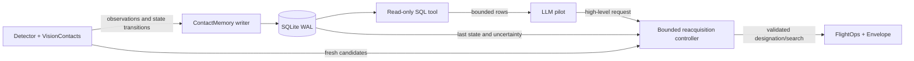

# Agent-queryable contact memory — design proposal

**Status:** proposed for later implementation
**Date:** 2026-08-09
**Scope:** single-drone pilot/cockpit stack

## 1. Motivation

The live tracker deliberately forgets a contact after a short observation
dropout. This keeps stale estimates from becoming flight authority, but it also
means that an ephemeral tracker name such as `vis_car_3` can disappear and the
same physical car can return later as `vis_car_5`. Today the pilot has little
structured history with which to recognize that relationship.

The proposed feature is a persistent **contact ledger** that records
observations, lock transitions, ephemeral tracker aliases, and durable object
identities. The LLM pilot can inspect that ledger through bounded, read-only SQL
and use the result to choose a high-level action such as a guarded reacquisition.

The fixed-camera lock problem has two distinct layers. Vehicle roll/pitch can
move the target out of the live image; a database cannot prevent that and must
not be presented as visual stabilization. A gimbal or deterministic
visibility-aware controller owns continuous in-frame tracking. This ledger
addresses the later problem: correlating programmatically recorded observations
and finding a safe candidate after the live lock has already degraded or been
lost. The bounded experiments establishing that distinction are recorded in
[the body-camera lock study](../../benchmarks/lock-camera-motion-experiments-2026-08-09.md).

### Writer-authority invariant

**The ledger is written only by programmatic system components, never by the
LLM.** Detector and tracker outputs (YOLO/ONNX or another configured detector,
`VisionContacts`, ToF fusion, and deterministic identity association) produce
the observation, alias, and state-transition records. The memory writer accepts
typed internal events from those components.

The model-facing database connection and every model-facing memory tool are
read-only. Model-generated SQL, natural-language reports, tool arguments, or
correlation hypotheses cannot `INSERT`, `UPDATE`, `DELETE`, merge identities,
change labels, or otherwise mutate the ledger. If the pilot proposes a
candidate for reacquisition, deterministic code validates it against fresh
perception and records any accepted alias or lock transition itself.

This is intended to improve:

- correlation of observations across tracker-ID churn and temporary occlusion;
- explanations such as where and when an object was last seen;
- route and motion-pattern inference over several observations;
- recovery from `LOST` without requiring the operator to remember an old ID;
- evaluation of lock duration, dropout, identity switches, and reacquisition.

The recurring lock-loss evidence motivating this proposal is documented in
[the complex demo scenarios](../../benchmarks/demo-scenarios-complex-2026-08-02.md)
and [the W3 validation run](../../benchmarks/w3-run7.md).

## 2. Core rule

**Memory is an analysis and search aid, never a live contact or movement
authority.**

A historical row may guide a camera search, help rank a new observation, or
support a report. It must not be passed directly to pursuit as though it were a
fresh `VisionContacts` position. Live movement continues through `FlightOps`,
the safety envelope, active-tool cancellation, PX4, and the independent estop
supervisor.

Memory is also not a substitute for a stabilized camera or a real-time
image-space controller. It may help reacquire after an observation gap, but it
cannot claim that a target remains locked while the detector has no fresh view.

The LLM remains outside real-time control loops. It may query memory and request
`reacquire_contact`; deterministic code performs freshness, uncertainty,
identity, ambiguity, and safety checks.

## 3. Proposed architecture



The initial implementation should use SQLite in WAL mode. It matches the
current local, single-process/single-drone deployment and adds no service to the
demo. The storage layer should use a small interface so a future multi-drone or
distributed deployment can move to PostgreSQL/PostGIS without changing model
tools.

Suggested ownership:

- `agents/vision/memory.py`: storage interface, writer, association records;
- `agents/flight/tools.py`: provider-neutral query/reacquisition tool specs;
- `agents/flight/reacquire.py`: bounded deterministic search and validation;
- `agents/pilot/run.py`: composition only;
- cockpit: read-only presentation of memory state, never an authority.

Gazebo mover truth must not enter this production memory. Truth remains
available only to explicit evaluation/oracle lanes.

## 4. Identity model

Tracker names and durable identities are different concepts:

- `track_name`: ephemeral live name, for example `vis_car_3`;
- `object_id`: durable memory identity, for example `vehicle_0007`;
- `class_group`: conservative association family such as `vehicle`;
- `identity_status`: `tentative`, `confirmed`, `ambiguous`, or `retired`.

The memory writer may attach a new observation to an existing object when the
deterministic association policy accepts it. The LLM may inspect and propose a
candidate through a high-level tool, but it cannot write aliases or merge
objects with SQL.

All authoritative class labels, coordinates, timestamps, velocities,
uncertainties, and appearance references originate in programmatic perception
or vehicle-state pipelines. LLM statements are not observations and are never
persisted in these authoritative fields.

Correlations should consider:

- predicted position and its age-dependent covariance;
- velocity and heading compatibility;
- class or conservative superclass compatibility;
- image bearing and recent bounding-box continuity;
- optional appearance embedding/model version;
- route history and physically possible acceleration;
- ambiguity from other nearby candidates.

When evidence is ambiguous, preserve separate objects and remain in `HOLD`.

## 5. Minimal data model

### `objects`

One row per durable identity:

```text
object_id, class_group, display_class, identity_status,
created_sim_t, last_seen_sim_t, retired_sim_t
```

### `observations`

Append-only observation history:

```text
observation_id, object_id, track_name,
sim_t, wall_t, frame_seq,
east, north, up, velocity_east, velocity_north, velocity_up,
covariance_json, bearing_deg, elevation_deg,
bbox_x1, bbox_y1, bbox_x2, bbox_y2,
class_name, class_group, confidence,
position_source, range_source, health,
detector_name, detector_version, appearance_ref
```

Simulation and wall timestamps must remain separate. `frame_seq` ties an
observation to the camera/perception snapshot. Position and velocity fields
must be nullable for bearing-only observations.

### `lock_events`

Append-only state transitions:

```text
event_id, object_id, track_name, sim_t, wall_t,
event, reason, operation, vehicle_east, vehicle_north, vehicle_up
```

Example events include `designated`, `measured`, `coasting`, `lost`,
`reacquire_started`, `reacquired`, `ambiguous`, and `released`.

### `object_aliases`

Auditable mappings between ephemeral and durable identities:

```text
track_name, object_id, valid_from_sim_t, valid_to_sim_t,
association_method, association_score, decision_reason
```

## 6. Model-facing SQL tool

Expose one provider-neutral high-level tool to Codex, Kimi, and Claude:

```text
query_contact_memory(sql, params={}, max_rows=50)
```

The tool queries curated views rather than giving the model unrestricted
database access. Initial views:

- `latest_contacts`;
- `contact_observations`;
- `lock_events`;
- `object_aliases`;
- `latest_lost_locks`;
- `trajectory_segments`;
- `reacquisition_candidates`.

Example query:

```sql
SELECT object_id, track_name, last_seen_sim_t,
       east, north, velocity_east, velocity_north,
       confidence, position_age_s, uncertainty_m
FROM latest_contacts
WHERE class_group = :class_group
  AND position_age_s <= :max_age_s
ORDER BY last_seen_sim_t DESC
LIMIT 20
```

The response should include the memory snapshot's simulation timestamp and
writer lag so the model can reason about age without confusing it with current
flight state.

### SQL safety boundary

The implementation must enforce all of the following independently of the
prompt:

- a dedicated SQLite read-only connection with `query_only` enabled;
- only one `SELECT` or `WITH ... SELECT` statement;
- an SQLite authorizer that denies writes, schema changes, `ATTACH`, `PRAGMA`,
  extension loading, and access outside the approved views;
- bound parameters rather than interpolated values;
- a progress-handler deadline and bounded VM instruction count;
- maximum rows and serialized response bytes;
- no database path, filesystem function, credential, or raw image access;
- stable errors for denied, invalid, timed-out, and oversized queries;
- query audit records containing the tool-call ID and normalized metadata, but
  no secrets.

Regex validation alone is not a sufficient SQL security boundary.

## 7. Guarded reacquisition tool

SQL gives the pilot reasoning flexibility, but does not grant flight authority.
The corresponding action should be a separate tool:

```text
reacquire_contact(object_id, candidate_track_name=null, timeout_s=20)
```

A bounded implementation should:

1. cancel or finish the old active operation through the existing registry;
2. command `HOLD` through the shared `FlightOps` owner;
3. load the last accepted object state and grow its uncertainty with age;
4. search with bounded yaw sectors while holding position and altitude;
5. rank only fresh `VisionContacts` candidates;
6. require one unambiguous candidate within motion, class, appearance, age,
   and covariance gates;
7. re-designate that live contact and return a structured result;
8. remain in `HOLD` on timeout or ambiguity.

Any translational search pattern is a later capability and must pass through
`Envelope`, the active-tool registry, PX4 geofence assumptions, cancellation,
and estop checks. The first version should search by yaw while stationary.

## 8. Expected pilot workflow

```text
track reports LOST
  -> query lock history and latest compatible contacts
  -> correlate trajectory, timing, and uncertainty with SQL
  -> report the leading candidate and ambiguity
  -> call reacquire_contact for the durable object
  -> deterministic controller validates and re-designates a fresh contact
  -> resume the requested high-level behavior only after success
```

The pilot can also answer retrospective questions such as:

- “Where was the red vehicle last seen?”
- “Which contacts repeatedly crossed the southeast corner?”
- “Did this car return under a different tracker name?”
- “How much of the last three minutes was the lock measured versus coasting?”

## 9. Retention and operational limits

- Keep a bounded recent observation window at full resolution.
- Downsample older trajectories and retain state transitions longer.
- Record detector/model versions so observations from incompatible appearance
  models are not silently compared.
- Make reset semantics explicit: mission reset, simulator reset, and database
  purge are different operations.
- Exclude secrets and raw images from the SQL-visible database.
- Treat appearance data as optional and versioned.
- Database failure must degrade memory/query tools to `UNAVAILABLE`; takeoff,
  landing, estop, and basic flight remain usable.

## 10. Bounded implementation sequence

1. Define the `ContactMemory` protocol and SQLite schema; write observations and
   lock events without exposing any model tool.
2. Add deterministic unit tests for persistence, clock boundaries, tracker-ID
   aliases, ambiguity, reset, and failure degradation.
3. Add the read-only SQL tool with authorizer, resource limits, audit metadata,
   and identical schemas across Codex/Kimi/Claude adapters.
4. Add model-independent fixture evaluations for temporal and spatial queries.
5. Implement stationary-yaw `reacquire_contact` and pin cancellation, `HOLD`,
   envelope, ambiguity, timeout, and estop behavior.
6. Prove a scripted no-LLM lock-loss/reacquisition baseline in a fresh demo
   container.
7. Only then run one bounded model cell per backend, with explicit quota and
   latency reporting.

## 11. Evaluation gates

The feature is not accepted merely because SQL queries work. A useful gate
should measure:

- correct durable identity across deliberate short and long detector dropout;
- false-merge and false-reacquisition rate with two nearby vehicles;
- time from `LOST` to fresh re-designation;
- fraction of a fixed mission window spent measured/tracking;
- SQL latency, timeout enforcement, row/byte limits, and denied statements;
- no movement from stale memory alone;
- safe `HOLD` on missing, stale, or ambiguous candidates;
- cancellation and estop during the reacquisition routine;
- identical tool name, schema, stable errors, and behavior across backends;
- basic flight remaining operational with a missing/corrupt database.

Start with K=1 scripted diagnosis, then use K>=3 for a statistical claim. Do
not spend LLM quota until the scripted baseline passes.

## 12. Open decisions

- How long should full-resolution observations and aliases be retained?
- Which appearance representation is useful without coupling memory to one
  detector?
- Should durable identity association live entirely in `VisionContacts` or in
  a separate memory associator consuming immutable snapshots?
- What uncertainty threshold makes a historical position unsuitable even for
  stationary-yaw search?
- When should SQLite be replaced by PostgreSQL/PostGIS for multiple vehicles or
  multiple drones?
- Should the agent be allowed to propose an alias explicitly, or only select a
  candidate for deterministic validation?

These decisions are deliberately deferred until implementation begins.
