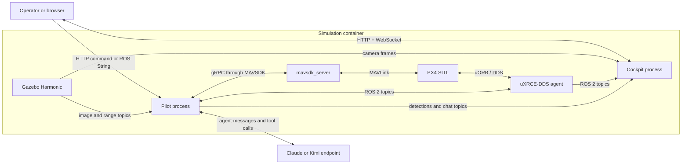

# Architecture and interfaces

## Runtime topology

The current system is a collection of cooperating processes rather than one
Python application.



[`sim/launch/swarm_sim.sh`](../sim/launch/swarm_sim.sh) still supports N PX4
instances, but the active pilot and cockpit are hard-wired to drone index 0.

## Construction and startup order

### Simulation side

`sim/launch/swarm_sim.sh`:

1. selects CPU, Intel EGL, or NVIDIA EGL rendering;
2. sources ROS 2 Jazzy and `px4_msgs`;
3. generates a requested procedural world and sidecar geometry when needed;
4. patches the camera model resolution/rate in the local PX4 checkout;
5. starts the Gazebo server and waits for its create service;
6. starts one uXRCE-DDS agent;
7. clears selected persisted PX4 state;
8. starts N PX4 SITL instances with namespaced DDS topics;
9. starts one `mavsdk_server` per instance.

### Pilot side

[`agents/pilot/run.py`](../agents/pilot/run.py) builds components in this order:

1. `RosBridge`
2. `World`
3. `GzCameras`
4. `GzPoses` as a simulation clock source only
5. `Px4StateRecorder`
6. detector, range provider, `VisionContacts`, and `VisionPipeline`
7. MAVSDK `System`
8. immutable `Envelope`
9. shared `FlightOps`
10. `PilotAgent`
11. background ROS, recorder, and perception loops
12. the pilot command loop and estop supervisor

The production flight contact provider is `VisionContacts`. Gazebo mover truth
is intentionally not injected into this path.

### Cockpit side

[`agents/observatory/server.py`](../agents/observatory/server.py) independently
constructs another `RosBridge`, another `GzCameras`, and a `VideoHub`, then runs
a Starlette/uvicorn server. It consumes ROS topics published by the pilot; it
does not import flight or vision implementations.

## Layer responsibilities

### `agents.core`

This is the infrastructure layer.

- `bus.py` runs `rclpy` in a background thread, defines QoS profiles, stores
  latest messages, and exposes publish/subscribe operations.
- `store.py` provides thread-safe latest-value and append-only topic stores.
- `contact.py` defines immutable frame/contact/lock-event data transferred
  across subsystem boundaries.
- `camera.py` subscribes to Gazebo transport image topics and retains the latest
  frame per drone.
- `telemetry.py` aligns PX4 messages with simulation time and records short
  pose/attitude histories in `World`.
- `rangefinder.py` reads and filters forward range samples and can inject
  controlled simulation impairments.
- `gzposes.py` reads Gazebo ground-truth poses for clocks, eval sampling, and
  explicit truth-fed experiments.
- `geo.py` converts local offsets to global latitude/longitude positions.
- `singleton.py` prevents two pilot assemblies from owning the same interfaces.

### `agents.world`

`World` loads `<world>_boxes.json`, exposes building and mover definitions,
maps PX4 local NED telemetry into Gazebo ENU, resolves names, and stores the
timestamped vehicle state needed to project camera pixels. `trajectory.py`
contains pure functions for scripted line, waypoint-loop, and circular movers.

### `agents.perception`

This layer is intentionally light and mostly pure. It converts positions into
bearing/range descriptions, emits `scan`/situation text, and contains camera
projection geometry. It does not own models, tracking state, or vehicle control.

### `agents.vision`

- `types.py` defines detections, results, tracking mode, and backend protocols.
- `config.py` parses and validates environment-selected backend/model/tracker
  configuration.
- `backends.py` implements color-blob, ONNX segmentation, and Ultralytics
  inference adapters.
- `detector.py` owns the camera-to-inference worker and latest-result handoff.
- `pipeline.py` periodically consumes detector output, updates contacts, and
  publishes `/pilot/detections` snapshots.
- `contacts.py` owns track birth, association, CV-EKF state, health, rebind,
  designation, and ToF fusion state.
- `beam.py` determines whether the fixed forward ToF sample belongs to the
  designated visual detection.
- `trackers/` is a plug-in seam for optional image-space trackers.

The separation between raw inference and world contact state is valuable: a
detector backend can change without rewriting pursuit or the UI.

### `agents.flight`

- `ops.py` is the large vehicle-control façade. It has no SDK message coupling
  and exposes async maneuvers over an injected MAVSDK system.
- `track.py` contains the target estimator, shadow/intercept reference logic,
  altitude clamp, and pursuit metrics.
- `contacts.py` defines the `ContactProvider` and `TargetDesignator` protocols
  that decouple flight from vision and truth-fed eval implementations.
- `envelope.py` defines altitude, speed, and radial-geofence validation.
- `tools.py` turns `FlightOps` methods into Claude Agent SDK MCP tools, maps
  exceptions into stable textual codes, and owns the system prompt.
- `backend.py` is the SDK seam. It normalizes SDK-specific messages into four
  internal events: `Text`, `ToolCall`, `ToolResult`, and `Result`.
- `errors.py` defines stable tool failure categories.

This split is one of the strongest parts of the design: most flight logic can be
tested with fakes, and the eval runner never needs to interpret SDK messages.

### `agents.pilot`

`PilotAgent` owns one backend client, command inbox, report publisher, active
tool registry, and command loop. `estop.py` is an independent safety supervisor.
`detect_text.py` translates the latest perception snapshot into compact model
input. `run.py` is the dependency-composition root.

### `agents.observatory`

The cockpit is a read-mostly adapter over camera and ROS state. `metrics.py`
normalizes PX4 telemetry for the UI; `overlay.py` handles perception freshness;
`video.py` encodes H.264 and fans frames out to clients; `server.py` defines the
control and streaming endpoints; `static/index.html` is the client.

### `evals` and `bench`

The evaluation subsystem has a clear experimental architecture:

- YAML `TaskSpec` files describe setup, budget, prompt, pilot baseline, and
  deterministic oracle checks.
- `matrix.py` expands tasks, model assignments, and repeats.
- `runner.py` creates fresh backend sessions, drives a cell, records typed tool
  events, samples the world, and invokes grading.
- `sampler.py` builds time-series `WorldTrack` values.
- `oracle.py` implements pure checks for reach, dwell, order, altitude,
  clearance, interception, moving-target separation, and target identity.
- `reset.py` returns the simulator to a reusable baseline between cells.
- `report.py` aggregates results, Wilson intervals, tool usage, and primitive
  statistics.

`bench/` is separate and measures simulator/render capacity rather than agent
task correctness.

## Public and internal interfaces

### ROS 2 application topics

| Topic | Direction | Payload/purpose |
|---|---|---|
| `/pilot/user_input` | cockpit/operator → pilot | Volatile `std_msgs/String` natural-language command |
| `/pilot/chat` | pilot → cockpit | Reliable transient-local report/chat line |
| `/pilot/estop` | cockpit/operator → pilot | Volatile `hold` or `land` command |
| `/pilot/detections` | perception → cockpit | JSON perception/fusion snapshot |
| `/px4_0/fmu/out/*` | PX4 → pilot/cockpit | Position, attitude, vehicle status, battery, and related telemetry |

The QoS distinction is deliberate: a restarted pilot must not replay old
commands or estops, while a late cockpit may replay recent chat/state.

### Cockpit HTTP and WebSocket API

| Interface | Purpose |
|---|---|
| `GET /state` | Current vehicle, camera, detector, beam, track, and contact state |
| `GET /chat?since=n` | Cursor-based chat polling |
| `POST /command` | Publish operator text to the pilot |
| `POST /estop` | Publish `hold` or `land` |
| `WS /ws_cam` | Codec announcement followed by stamped H.264 access units |
| `WS /ws_detections` | Verbatim perception snapshot stream |

### Model tool interface

`make_pilot_options()` registers the MCP tools and permits only those generated
tool names. Each wrapper follows the intended pattern:

```text
JSON arguments -> validation -> FlightOps call -> stable text/error result
```

The active-tool registry surrounds every call so estop can cancel the current
tool without terminating the entire model session.

### Backend event interface

The rest of the application consumes normalized dataclasses rather than
`claude_agent_sdk` message classes:

```text
Text | ToolCall | ToolResult | Result
```

`Result` also carries tokens, cost, turn count, inferred request count, quota
classification, and stream timing. This is the intended replacement seam if
the model backend changes.

### Perception/flight interface

Flight depends on protocols, not `VisionContacts` directly:

- `ContactProvider` supplies current poses and simulation time;
- `TargetDesignator` supports reserving a visible target for acquisition;
- optional methods expose observations, velocity, beam context, and state.

The eval harness can therefore inject `GzPoses` for an explicit truth-fed
control baseline without changing `FlightOps`.

### Detector interface

Detector backends implement a common infer/health/track-capability contract and
return `InferenceResult`/`Detection` DTOs. Optional image-space trackers are
loaded by name behind `TargetTracker`.

## Data flow for one command

1. The cockpit publishes operator text to `/pilot/user_input`.
2. `PilotAgent` polls its `TopicLog` and submits a prompt to `BackendClient`.
3. The backend emits normalized tool calls.
4. The MCP handler validates arguments and invokes the shared `FlightOps`.
5. Flight commands reach PX4 through MAVSDK; state returns over ROS 2.
6. Independently, camera frames feed the detector and `VisionPipeline`.
7. `VisionContacts` combines image geometry, recorded pose/attitude, EKF state,
   and optional ToF data.
8. `track()` reads that contact provider and streams 10 Hz offboard references.
9. The pilot publishes `report()` text to `/pilot/chat`.
10. The cockpit reads chat, telemetry, detections, and camera streams.

## Coordinate and time contracts

- Gazebo/world representation: ENU (`east`, `north`, `up`).
- PX4 local telemetry: NED (`x=north`, `y=east`, `z=down`).
- Global MAVSDK movement: latitude, longitude, and absolute altitude.
- Camera detections: pixels plus camera-relative angular geometry.
- Tracking/fusion state: world ENU.
- Vision/contact aging: simulation time.
- Several pursuit/eval deadlines still use wall time, a known source of
  real-time-factor sensitivity documented by the project.

Centralizing these conversions in `World`, projection helpers, and geo helpers
is correct; mixing simulation and wall time remains an area to simplify.

## Safety model

The intended safety layers are:

1. tool-boundary `Envelope` checks with legible rejection;
2. PX4 horizontal/vertical geofence parameters set from the same envelope;
3. maneuver cleanup on timeout/cancellation;
4. an independent estop supervisor that cancels the active tool and holds or
   lands;
5. perception-degraded boot that preserves basic flight and emergency tools.

The architecture is sound in concept, but the implementation does not connect
all envelope checks and explicitly lets `run_mission` bypass the software
checks. See [ISSUES.md](ISSUES.md).

